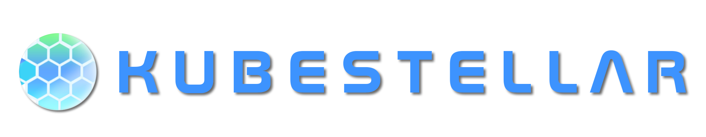

# KubeStellar Documentation

<p align="center">
  
</p>

<h2 align="center">Multi-cluster Configuration Management for Edge, Multi-Cloud, and Hybrid Cloud</h2>

<p align="center">
  Official documentation website for <strong><a href="https://kubestellar.io" target="_blank">KubeStellar</a></strong>, 
  a CNCF Sandbox Project enabling seamless multi-cluster configuration management 
  for edge, multi-cloud and hybrid cloud environments.
</p>

<p align="center">
  <a href="https://cloud-native.slack.com/archives/C097094RZ3M" target="_blank">
    
  </a>
  &nbsp;
  <a href="https://deepwiki.com/kubestellar/ui" target="_blank">
    
  </a>
  &nbsp;
  <a href="https://github.com/kubestellar/docs/blob/main/LICENSE" target="_blank">
    
  </a>
</p>

---

## 🌐 Live Sites

- **Production**: [http://prod.previews.kubestellar.io/en](http://prod.previews.kubestellar.io/en)
- **PR Previews**: `https://PR-{number}.previews.kubestellar.io/en`

<p align="center">
  
</p>

---

## 📖 Overview

This repository powers the **KubeStellar documentation website** — a modern, multi-lingual documentation platform built with **Next.js 15**, **Nextra**, and **Tailwind CSS 4**. It provides comprehensive documentation, interactive examples, and community resources for KubeStellar users and contributors.

### ✨ Key Features

- **🌍 Multi-language Support** — 10 languages including English, Hindi, Japanese, Spanish, German, French, Italian, Chinese (Simplified & Traditional), and Portuguese
- **📚 Nextra-Powered Docs** — Advanced documentation framework with MDX support, syntax highlighting, and LaTeX rendering
- **🎨 Modern UI/UX** — Beautiful, responsive design with dark mode, animated components, and 3D visualizations
- **🔍 Advanced Search** — Fast, client-side search with code block support
- **🌟 Interactive Components** — Globe animations, particle effects, and dynamic visualizations
- **📱 Mobile-First** — Fully responsive design optimized for all devices
- **⚡ Performance Optimized** — Built with Next.js 15 Turbopack for lightning-fast development and builds

### 📄 Documentation Content

- **Getting Started** — Installation guides for various platforms (AWS EKS, GKE, Azure AKS, etc.)
- **User & Operator Guides** — Comprehensive operational documentation
- **Architecture & Design** — Technical specifications and system architecture
- **API Reference** — Complete API documentation
- **Community Resources** — Contribution ladder, handbook, and community programs
- **Marketplace** — Plugin ecosystem and integrations
- **Use Cases & Examples** — Real-world implementations and tutorials

---

## 🚀 Tech Stack

This project leverages cutting-edge web technologies:

| Technology | Version | Purpose |
|------------|---------|---------|
| **Next.js** | 15.3.6 | React framework with Turbopack |
| **React** | 19.2.0 | UI library |
| **Nextra** | 4.6.0 | Documentation framework |
| **nextra-theme-docs** | 4.6.0 | Documentation theme |
| **next-intl** | 4.3.12 | Internationalization (i18n) |
| **Tailwind CSS** | 4.0 | Utility-first CSS framework |
| **TypeScript** | 5.0 | Type-safe development |
| **Three.js** | 0.180.0 | 3D graphics and animations |
| **@react-three/fiber** | 9.4.0 | React renderer for Three.js |
| **Framer Motion** | 12.23.22 | Animation library |
| **Mermaid** | 11.12.1 | Diagram rendering |
| **Lucide React** | 0.545.0 | Icon library |

---

## 💻 Local Development

### Prerequisites

Ensure you have the following installed:

- **Node.js** v18.0.0 or higher ([Download](https://nodejs.org/))
- **npm** (comes with Node.js) or **yarn**
- **Git** for version control

**Verify installation:**

```bash
node --version  # Should show v18.0.0 or higher
npm --version   # Should show 8.0.0 or higher
```

### Quick Start

1. **Clone the repository:**

   ```bash
   git clone https://github.com/kubestellar/docs.git
   cd docs
   ```

2. **Install dependencies:**

   ```bash
   npm install
   # or
   yarn install
   ```

3. **Start development server with Turbopack:**

   ```bash
   npm run dev
   # or
   yarn dev
   ```

   🎉 **Your site is now running at** `http://localhost:3000`
   
   Turbopack provides lightning-fast hot module replacement (HMR) for instant feedback.

### Available Scripts

```bash
# Development
npm run dev              # Start dev server with Turbopack
npm run build            # Build for production
npm start                # Start production server
npm run export           # Export static site

# Code Quality
npm run lint             # Run ESLint
npm run lint:fix         # Fix ESLint issues automatically
npm run type-check       # Run TypeScript type checking
npm run format           # Format code with Prettier
npm run format:check     # Check code formatting

# Maintenance
npm run clean            # Remove .next and out directories
npm run audit            # Run security audit
npm run update-deps      # Update dependencies
npm run analyze          # Analyze bundle size
```

### Project Structure

```
docs/
├── src/
│   ├── app/
│   │   ├── [locale]/              # Internationalized pages
│   │   │   ├── ladder/            # Contribution ladder
│   │   │   ├── marketplace/       # Plugin marketplace
│   │   │   ├── partners/          # Partner integrations
│   │   │   ├── products/          # Product showcase
│   │   │   ├── programs/          # Community programs
│   │   │   └── contribute-handbook/ # Contributor guide
│   │   ├── api/                   # API routes
│   │   │   └── search/            # Search endpoint
│   │   └── docs/                  # Documentation pages (Nextra)
│   ├── components/
│   │   ├── animations/            # 3D and motion components
│   │   │   ├── globe/             # Globe animation
│   │   │   ├── GridLines.tsx
│   │   │   └── StarField.tsx
│   │   ├── docs/                  # Documentation components
│   │   ├── master-page/           # Landing page sections
│   │   ├── Footer.tsx
│   │   ├── Navbar.tsx
│   │   └── LanguageSwitcher.tsx
│   ├── i18n/                      # Internationalization config
│   │   ├── settings.ts            # Locale settings
│   │   ├── navigation.ts          # i18n navigation
│   │   └── request.ts             # i18n request handler
│   ├── lib/                       # Utilities
│   │   ├── Mermaid.tsx            # Mermaid diagram support
│   │   └── transformMdx.ts        # MDX transformations
│   └── middleware.ts              # Next.js middleware
├── messages/                      # i18n translations (10 languages)
├── public/                        # Static assets
├── cluster-objects/               # Kubernetes manifests
├── next.config.ts                 # Next.js configuration
├── tailwind.config.ts             # Tailwind CSS configuration
├── tsconfig.json                  # TypeScript configuration
└── package.json                   # Dependencies and scripts
```

### Environment Configuration

The site works out of the box with no environment variables required for local development. For production deployments, configure:

```bash
# Optional: Custom base path or domain
NEXT_PUBLIC_BASE_URL=https://kubestellar.io

# Optional: Analytics or monitoring
NEXT_PUBLIC_ANALYTICS_ID=your-analytics-id
```

---

## 🌍 Internationalization (i18n)

We support **10 languages** to make KubeStellar accessible globally:

| Language | Code | Native Name |
|----------|------|-------------|
| English | `en` | English |
| Hindi | `hi` | हिन्दी |
| Japanese | `ja` | 日本語 |
| Spanish | `es` | Español |
| German | `de` | Deutsch |
| French | `fr` | Français |
| Italian | `it` | Italiano |
| Chinese (Simplified) | `SC` | 简体中文 |
| Chinese (Traditional) | `zh-TW` | 繁體中文 |
| Portuguese | `pt` | Português |

### Adding a New Language

1. Add the locale to `src/i18n/settings.ts`:
   ```typescript
   export const locales = ["en", "hi", "ja", "es", "de", "fr", "it", "SC", "zh-TW", "pt", "YOUR_LOCALE"] as const;
   export const localeNames: Record<Locale, string> = {
     // ... existing locales
     YOUR_LOCALE: "Native Name",
   };
   ```

2. Create translation file: `messages/YOUR_LOCALE.json`
   ```json
   {
     "navigation": { ... },
     "homepage": { ... },
     // Copy structure from messages/en.json
   }
   ```

3. Test your translation:
   ```bash
   npm run dev
   # Visit http://localhost:3000/YOUR_LOCALE
   ```

---

## 🎨 Customization

### Theming

The site uses Tailwind CSS 4 with custom theming. Modify `tailwind.config.ts` to customize colors, fonts, and animations.

### Components

All reusable components are in `src/components/`:
- **Animations**: `GridLines`, `StarField`, `GlobeAnimation`
- **Navigation**: `Navbar`, `Footer`, `LanguageSwitcher`
- **Documentation**: Located in `src/components/docs/`

### Adding a New Page

1. Create page in `src/app/[locale]/your-page/page.tsx`:
   ```typescript
   import { useTranslations } from "next-intl";
   
   export default function YourPage() {
     const t = useTranslations("yourPage");
     return <div>{t("title")}</div>;
   }
   ```

2. Add translations to all language files in `messages/`:
   ```json
   {
     "yourPage": {
       "title": "Your Page Title"
     }
   }
   ```

### Adding Documentation (Nextra)

Documentation lives in `src/app/docs/`. Add new `.mdx` files and update `page-map.ts` for navigation.

---

## 🤝 Contributing

We welcome contributions of all kinds! Here's how you can help:

### Ways to Contribute

- 📝 **Documentation**: Improve guides, fix typos, add examples
- 🌐 **Translation**: Help translate to new languages or improve existing translations
- 🎨 **Design**: Enhance UI/UX, create graphics, improve accessibility
- 🐛 **Bug Reports**: Report issues with detailed reproduction steps
- ✨ **Features**: Propose and implement new features
- 🧪 **Testing**: Test features and provide feedback

### Getting Started

1. **Read the Contributing Guide**: [CONTRIBUTING.md](CONTRIBUTING.md)
2. **Check for Issues**: Browse [open issues](https://github.com/kubestellar/docs/issues)
3. **Fork & Clone**: Make your own copy of the repository
4. **Create a Branch**: `git checkout -b feature/your-feature-name`
5. **Make Changes**: Develop your feature or fix
6. **Test Thoroughly**: Run `npm run build` and test locally
7. **Submit PR**: Create a pull request with clear description

### Development Workflow

```bash
# Create a feature branch
git checkout -b feature/amazing-feature

# Make your changes and test
npm run dev
npm run type-check
npm run lint

# Commit with meaningful messages
git commit -m "feat: add amazing feature"

# Push to your fork
git push origin feature/amazing-feature

# Open a Pull Request on GitHub
```

### Code Standards

- ✅ **TypeScript**: Use strict typing, avoid `any`
- ✅ **ESLint**: Follow the configured linting rules
- ✅ **Prettier**: Format code with `npm run format`
- ✅ **Commits**: Use [Conventional Commits](https://www.conventionalcommits.org/)
- ✅ **Testing**: Ensure the site builds without errors

---

## 👥 Community & Support

Join our vibrant community and get help when you need it!

### 💬 Communication Channels

- **Slack**: [#kubestellar-dev](https://cloud-native.slack.com/archives/C097094RZ3M) on [CNCF Slack](https://communityinviter.com/apps/cloud-native/cncf)
- **Mailing Lists**:
  - [kubestellar-dev](https://groups.google.com/g/kubestellar-dev) — Development & technical discussions
  - [kubestellar-users](https://groups.google.com/g/kubestellar-users) — User questions & support
- **Community Meetings**: 
  - Subscribe via [kubestellar-dev](https://groups.google.com/g/kubestellar-dev) mailing list
  - View [community calendar](https://calendar.google.com/calendar/event?action=TEMPLATE&tmeid=MWM4a2loZDZrOWwzZWQzZ29xanZwa3NuMWdfMjAyMzA1MThUMTQwMDAwWiBiM2Q2NWM5MmJlZDdhOTg4NGVmN2ZlOWUzZjZjOGZlZDE2ZjZmYjJmODExZjU3NTBmNTQ3NTY3YTVkZDU4ZmVkQGc&tmsrc=b3d65c92bed7a9884ef7fe9e3f6c8fed16f6fb2f811f5750f547567a5dd58fed%40group.calendar.google.com&scp=ALL)
- **YouTube**: Watch [meeting recordings](https://www.youtube.com/@kubestellar)
- **Meeting Notes**: [Upcoming](https://github.com/kubestellar/kubestellar/issues?q=is%3Aissue+is%3Aopen+label%3Acommunity-meeting) & [past](https://github.com/kubestellar/kubestellar/issues?q=is%3Aissue+is%3Aclosed+label%3Acommunity-meeting) agendas

### 📚 Resources

- **Google Drive**: [Shared documents](https://drive.google.com/drive/folders/1p68MwkX0sYdTvtup0DcnAEsnXElobFLS) for design docs and planning
- **Blog**: Latest updates on [Medium](https://medium.com/@kubestellar/list/predefined:e785a0675051:READING_LIST)
- **LinkedIn**: Follow [#kubestellar](https://www.linkedin.com/feed/hashtag/?keywords=kubestellar)
- **DeepWiki**: Ask questions at [deepwiki.com/kubestellar](https://deepwiki.com/kubestellar/ui)

---

## 🚢 Deployment

### Docker

Build and run with Docker:

```bash
# Build the Docker image
docker build -t kubestellar-docs .

# Run the container
docker run -p 3000:3000 kubestellar-docs
```

### Netlify

The site is configured for Netlify deployment with `netlify.toml`:

```toml
[build]
  command = "npm run build"
  publish = ".next"

[[redirects]]
  from = "/*"
  to = "/index.html"
  status = 200
```

**Deploy to Netlify:**
1. Connect your GitHub repository
2. Configure build settings (uses `netlify.toml`)
3. Deploy automatically on push to main

### Kubernetes

Deploy to Kubernetes using the manifests in `cluster-objects/`:

```bash
# Apply Kubernetes resources
kubectl apply -f cluster-objects/

# Available manifests:
# - deployment.yaml       # Main deployment
# - rbac.yaml            # RBAC configuration
# - job.yaml             # Job definitions
# - pr-job.yaml          # PR preview jobs
```

---

## 🐛 Troubleshooting

### Common Issues

**Port 3000 already in use:**
```bash
# Kill the process using port 3000
lsof -ti:3000 | xargs kill -9

# Or use a different port
PORT=3001 npm run dev
```

**Build errors:**
```bash
# Clean and reinstall
npm run clean
rm -rf node_modules package-lock.json
npm install
npm run build
```

**TypeScript errors:**
```bash
# Run type checking
npm run type-check

# Check specific file
npx tsc --noEmit src/path/to/file.ts
```

**Internationalization issues:**
```bash
# Verify locale files exist
ls messages/*.json

# Check locale configuration
cat src/i18n/settings.ts
```

---

## 📊 Project Statistics

- **Languages**: 10 (English, Hindi, Japanese, Spanish, German, French, Italian, Chinese x2, Portuguese)
- **Pages**: 15+ main pages, extensive documentation
- **Components**: 30+ reusable React components
- **Translations**: 1000+ translation keys across all languages
- **Dependencies**: 20+ production packages
- **Development Tools**: ESLint, Prettier, TypeScript, Turbopack

---

## 📜 License

This project is licensed under the **Apache License 2.0**. See the [LICENSE](LICENSE) file for details.

```
Copyright 2024 The KubeStellar Authors

Licensed under the Apache License, Version 2.0 (the "License");
you may not use this file except in compliance with the License.
You may obtain a copy of the License at

    http://www.apache.org/licenses/LICENSE-2.0

Unless required by applicable law or agreed to in writing, software
distributed under the License is distributed on an "AS IS" BASIS,
WITHOUT WARRANTIES OR CONDITIONS OF ANY KIND, either express or implied.
See the License for the specific language governing permissions and
limitations under the License.
```

---

<h2 align="center">
  
  Contributors
</h2>

<p align="center">
  <a href="https://github.com/kubestellar/docs/graphs/contributors">
    
  </a>
</p>

<p align="center">
  <strong>Thank you to all our amazing contributors!</strong>
</p>

---

## 🌟 CNCF Sandbox Project

<p align="center">
  
</p>

<p align="center">
  KubeStellar is a <a href="https://cncf.io" target="_blank">Cloud Native Computing Foundation</a> Sandbox project.<br>
  We are part of the broader cloud native ecosystem working to make cloud native computing universal and sustainable.
</p>

---

## 🔗 Quick Links

| Resource | Link |
|----------|------|
| 🌐 **Website** | [kubestellar.io](https://kubestellar.io) |
| 📖 **Documentation** | [prod.previews.kubestellar.io](http://prod.previews.kubestellar.io/en) |
| 💻 **Main Repository** | [github.com/kubestellar/kubestellar](https://github.com/kubestellar/kubestellar) |
| 💬 **Slack** | [#kubestellar-dev](https://cloud-native.slack.com/archives/C097094RZ3M) |
| 📧 **Mailing List** | [kubestellar-dev](https://groups.google.com/g/kubestellar-dev) |
| 🎥 **YouTube** | [@kubestellar](https://www.youtube.com/@kubestellar) |
| 📝 **Blog** | [Medium](https://medium.com/@kubestellar/list/predefined:e785a0675051:READING_LIST) |
| 🤖 **AI Assistant** | [DeepWiki](https://deepwiki.com/kubestellar/ui) |

---

<p align="center">
  <strong>Built with ❤️ by the KubeStellar community</strong><br>
  <sub>Star ⭐ this repo if you find it helpful!</sub>
</p>
