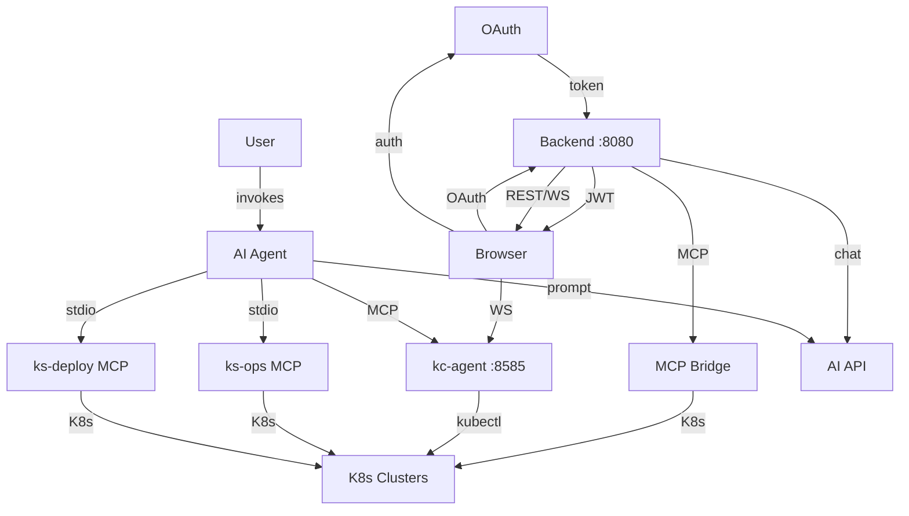

```mermaid
graph TB
    User["User"]
    GitHub["OAuth"]
    Backend["Backend :8080"]
    Browser["Browser"]
    MCP["MCP Bridge"]
    K8s["K8s Clusters"]
    Agent["kc-agent :8585"]
    CLI["AI Agent"]
    OpsStdio["ks-ops MCP"]
    DeployStdio["ks-deploy MCP"]
    AI["AI API"]

    User -- invokes --> CLI
    Browser -- OAuth --> Backend
    Browser -- auth --> GitHub
    GitHub -- token --> Backend
    Backend -- JWT --> Browser
    Backend -- REST/WS --> Browser
    Browser -- WS --> Agent
    Backend -- MCP --> MCP
    MCP -- K8s --> K8s
    Agent -- kubectl --> K8s
    OpsStdio -- K8s --> K8s
    DeployStdio -- K8s --> K8s
    CLI -- stdio --> OpsStdio
    CLI -- stdio --> DeployStdio
    CLI -- MCP --> Agent
    Backend -- chat --> AI
    CLI -- prompt --> AI
```
