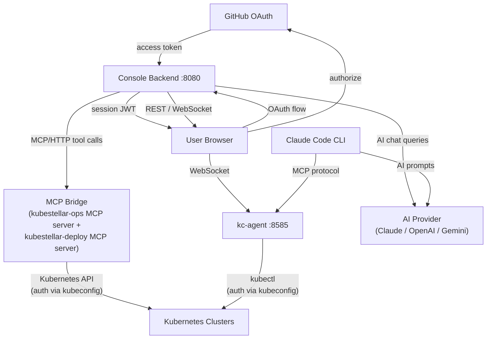

```mermaid
graph TB
    GitHub["GitHub OAuth"]
    Backend["Console Backend :8080"]
    Browser["User Browser"]
    MCP["MCP Bridge<br/>(kubestellar-ops MCP server +<br/>kubestellar-deploy MCP server)"]
    K8s["Kubernetes Clusters"]
    Agent["kc-agent :8585"]
    CLI["Claude Code CLI"]
    AI["AI Provider<br/>(Claude / OpenAI / Gemini)"]

    Browser -- "OAuth flow" --> Backend
    Browser -- "authorize" --> GitHub
    GitHub -- "access token" --> Backend
    Backend -- "session JWT" --> Browser
    Backend -- "REST / WebSocket" --> Browser
    Browser -- "WebSocket" --> Agent
    Backend -- "MCP/HTTP tool calls" --> MCP
    MCP -- "Kubernetes API<br/>(auth via kubeconfig)" --> K8s
    Agent -- "kubectl<br/>(auth via kubeconfig)" --> K8s
    CLI -- "MCP protocol" --> Agent
    Backend -- "AI chat queries" --> AI
    CLI -- "AI prompts" --> AI
```
