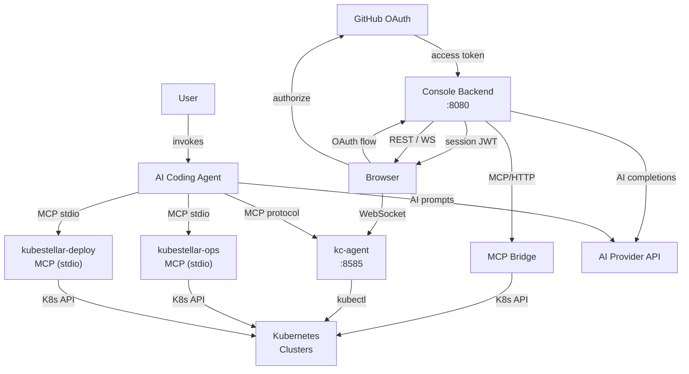

```mermaid
graph TB
    User["User"]
    GitHub["GitHub OAuth"]
    Backend["Console Backend\n:8080"]
    Browser["Browser"]
    MCP["MCP Bridge"]
    K8s["Kubernetes\nClusters"]
    Agent["kc-agent\n:8585"]
    CLI["AI Coding Agent"]
    OpsStdio["kubestellar-ops\nMCP (stdio)"]
    DeployStdio["kubestellar-deploy\nMCP (stdio)"]
    AI["AI Provider API"]

    User -- invokes --> CLI
    Browser -- OAuth flow --> Backend
    Browser -- authorize --> GitHub
    GitHub -- access token --> Backend
    Backend -- session JWT --> Browser
    Backend -- REST / WS --> Browser
    Browser -- WebSocket --> Agent
    Backend -- MCP/HTTP --> MCP
    MCP -- K8s API --> K8s
    Agent -- kubectl --> K8s
    OpsStdio -- K8s API --> K8s
    DeployStdio -- K8s API --> K8s
    CLI -- MCP stdio --> OpsStdio
    CLI -- MCP stdio --> DeployStdio
    CLI -- MCP protocol --> Agent
    Backend -- AI completions --> AI
    CLI -- AI prompts --> AI
```
