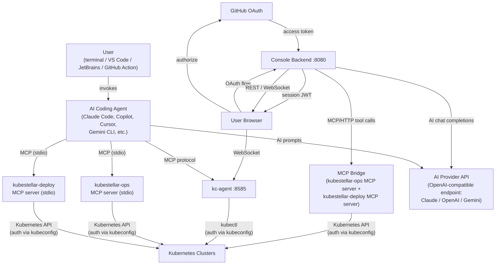

```mermaid
graph TB
    User["User<br/>(terminal / VS Code / JetBrains / GitHub Action)"]
    GitHub["GitHub OAuth"]
    Backend["Console Backend :8080"]
    Browser["User Browser"]
    MCP["MCP Bridge<br/>(kubestellar-ops MCP server +<br/>kubestellar-deploy MCP server)"]
    K8s["Kubernetes Clusters"]
    Agent["kc-agent :8585"]
    CLI["AI Coding Agent<br/>(Claude Code, Copilot, Cursor,<br/>Gemini CLI, etc.)"]
    OpsStdio["kubestellar-ops<br/>MCP server (stdio)"]
    DeployStdio["kubestellar-deploy<br/>MCP server (stdio)"]
    AI["AI Provider API<br/>(OpenAI-compatible endpoint:<br/>Claude / OpenAI / Gemini)"]

    User -- "invokes" --> CLI
    Browser -- "OAuth flow" --> Backend
    Browser -- "authorize" --> GitHub
    GitHub -- "access token" --> Backend
    Backend -- "session JWT" --> Browser
    Backend -- "REST / WebSocket" --> Browser
    Browser -- "WebSocket" --> Agent
    Backend -- "MCP/HTTP tool calls" --> MCP
    MCP -- "Kubernetes API<br/>(auth via kubeconfig)" --> K8s
    Agent -- "kubectl<br/>(auth via kubeconfig)" --> K8s
    OpsStdio -- "Kubernetes API<br/>(auth via kubeconfig)" --> K8s
    DeployStdio -- "Kubernetes API<br/>(auth via kubeconfig)" --> K8s
    CLI -- "MCP (stdio)" --> OpsStdio
    CLI -- "MCP (stdio)" --> DeployStdio
    CLI -- "MCP protocol" --> Agent
    Backend -- "AI chat completions" --> AI
    CLI -- "AI prompts" --> AI
```
