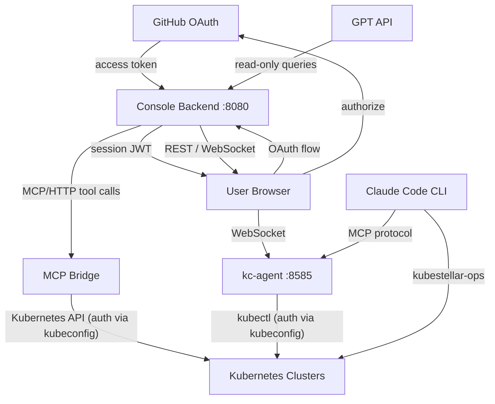

```mermaid
graph TB
    GitHub["GitHub OAuth"]
    Backend["Console Backend :8080"]
    Browser["User Browser"]
    MCP["MCP Bridge"]
    K8s["Kubernetes Clusters"]
    Agent["kc-agent :8585"]
    CLI["Claude Code CLI"]
    API["GPT API"]

    Browser -- "OAuth flow" --> Backend
    Browser -- "authorize" --> GitHub
    GitHub -- "access token" --> Backend
    Backend -- "session JWT" --> Browser
    Backend -- "REST / WebSocket" --> Browser
    Browser -- "WebSocket" --> Agent
    Backend -- "MCP/HTTP tool calls" --> MCP
    MCP -- "Kubernetes API (auth via kubeconfig)" --> K8s
    Agent -- "kubectl (auth via kubeconfig)" --> K8s
    CLI -- "MCP protocol" --> Agent
    CLI -- "kubestellar-ops" --> K8s
    API -- "read-only queries" --> Backend
```
