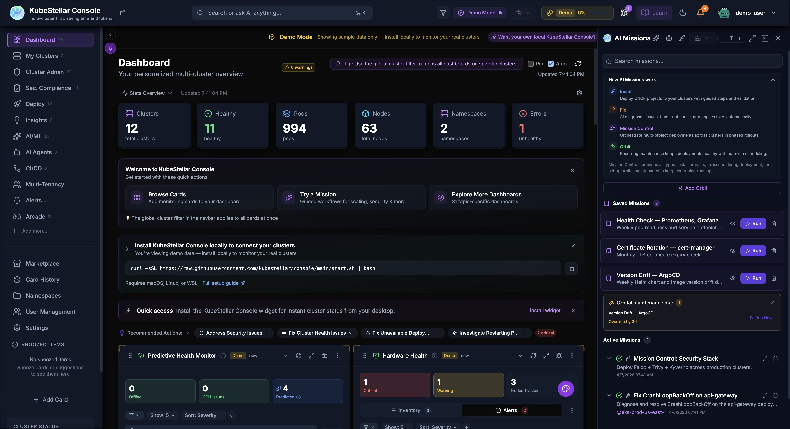
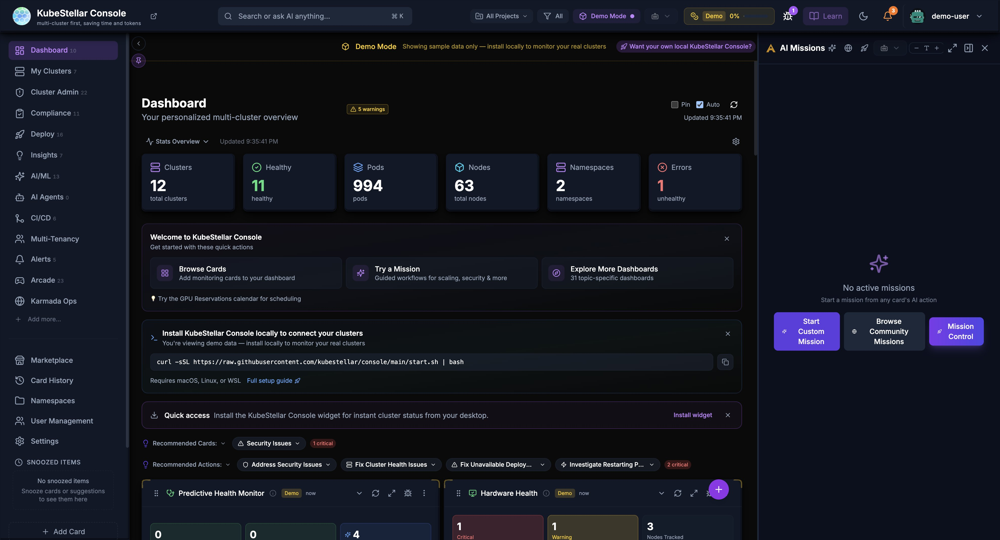
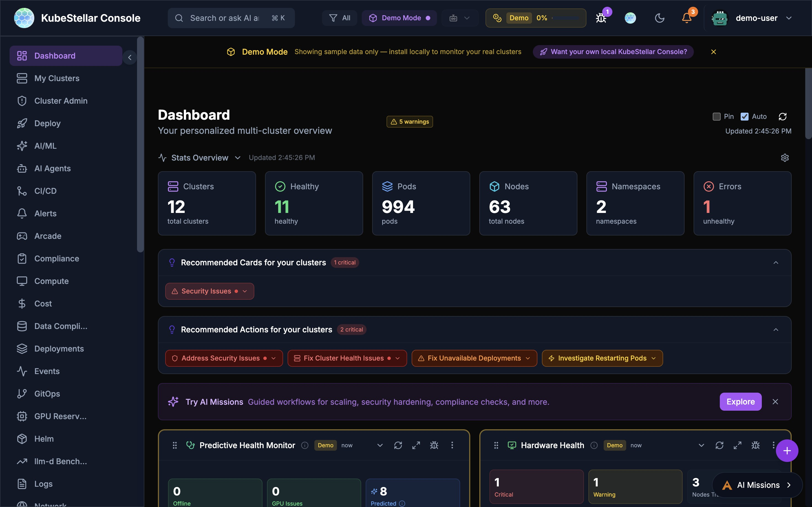
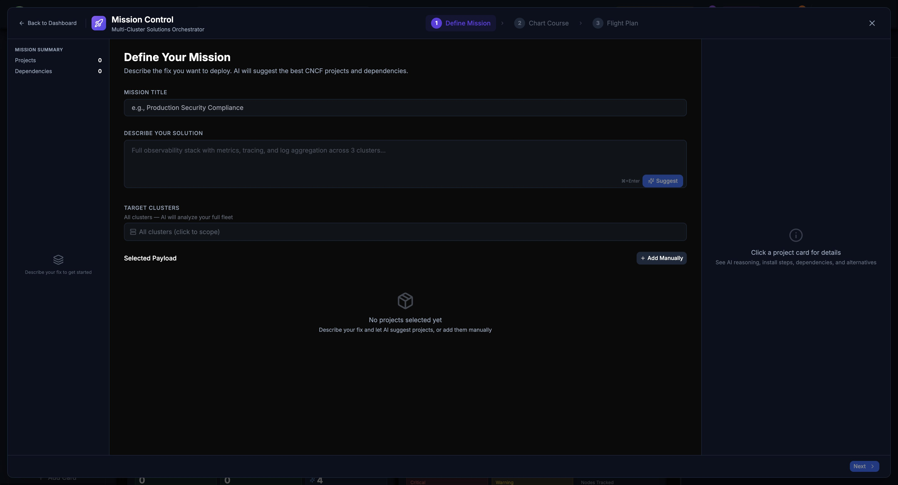
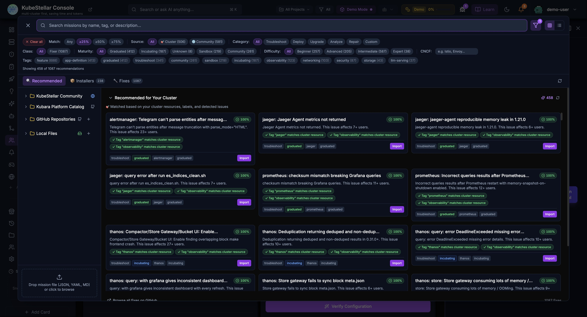
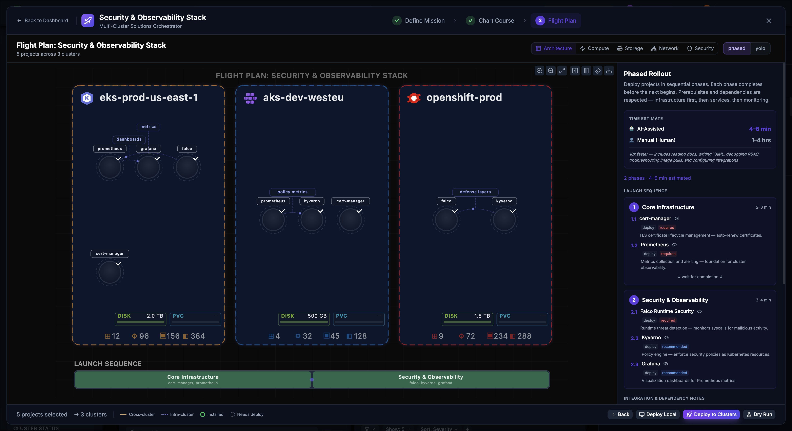

# AI Features — Multi-Cluster Kubernetes Operations Powered by AI

KubeStellar Console uses AI Missions to automate multi-cluster Kubernetes operations. Think of it as having an expert Kubernetes engineer who knows every CNCF project and can troubleshoot, deploy, and repair across your entire fleet — saving you time and tokens.



> **Getting started?** See the [AI Missions Setup](ai-missions-setup.md) guide for step-by-step instructions on configuring API keys, selecting a model, and running your first mission.

---

## AI Missions

AI Missions are conversations with AI to solve problems. You can start a mission from two places:

- The **AI Missions** button in the top navigation bar (desktop and overflow menu on narrow viewports)
- The **Agent** button in the top nav (renamed from "AI" in Apr 2026 for kc-agent connection clarity — PR #8209)
- The **AI Missions** floating button at the bottom right



The navbar button shows an attention badge when missions need your input. For complex multi-project deployments, use the **Mission Control** wizard (accessible from the AI Missions panel).

> **Note (Apr 2026):** The top-level navbar button was renamed from "AI" to "Agent" to clarify that it connects to kc-agent (the local agent bridging your kubeconfig), not a cloud AI service. Existing screenshots may still show the old label.

### What Can You Do?

| Mission Type | What it does |
|--------------|--------------|
| **Troubleshoot** | Find out why something is broken |
| **Analyze** | Understand what's happening |
| **Repair** | Fix problems automatically |
| **Upgrade** | Plan and execute upgrades |
| **Deploy** | Help deploy applications |
| **Orbit** | Recurring maintenance (health checks, cert rotation, version drift) |
| **Mission Control** | Multi-project deployment orchestration with Flight Plan blueprint |

### How It Works

1. Click **"AI Missions"** button in the top navigation bar (or the floating button at bottom right)
2. Choose a mission type, describe your problem, or open **Mission Control** for guided multi-step missions
3. AI asks questions to understand the issue
4. AI runs commands and analyzes results
5. AI suggests fixes or takes action
6. You approve or reject the suggestions

### Example: Troubleshooting a Crash

**You:** "Why is my nginx pod crashing?"

**AI:** "Let me check. I found the pod `nginx-abc123` in namespace `default` is in CrashLoopBackOff. Looking at the logs...

The container is failing because it can't bind to port 80. There's already a process using that port.

**Suggestion:** Change the container port to 8080 or remove the conflicting service."

### Chat Input Features

The AI Missions chat input supports multiple input methods:

- **Text input** — Type your question or command directly
- **Microphone input** — Click the microphone button to dictate your mission using speech recognition (requires browser support)
- **File attachment** — Click the attachment button to attach files (logs, YAML manifests, screenshots) for the AI to analyze
- **History navigation** — Use arrow keys to navigate through previous messages

### Mission Panel Features

- **Full screen** - Expand for more space
- **Minimize** - Hide while AI works
- **Collapse** - Show just the title
- **Multiple missions** - Run several at once
- **Token tracking** - See how many tokens used
- **Recently deleted** - Restore accidentally deleted mission drafts

---

## AI Diagnose

Every card has an "Ask AI" button. Click it to get AI analysis of that specific data.

### How to Use

1. Look at any card
2. Click the **AI icon** (brain/sparkle)
3. AI analyzes the card data
4. Get insights and suggestions

### What AI Can Tell You

- Why metrics look unusual
- What's causing issues
- How to fix problems
- What to watch out for
- Historical context

### Example

**Card:** Cluster Health showing 2 clusters offline

**AI:** "I see 2 clusters are offline. Let me check...

- `cluster-1`: Network timeout - likely a firewall issue
- `cluster-2`: Certificate expired 2 hours ago

**Suggestions:**
1. Check VPN connection for cluster-1
2. Renew certificate for cluster-2 with `kubectl certificate approve`"

---

## AI Repair

When AI diagnoses a problem, it can often fix it automatically.

### How Repair Works

1. AI identifies the problem
2. AI creates a fix
3. You review the fix
4. You approve or reject
5. AI applies the fix

### Safety First

- AI **always asks** before making changes
- You see exactly what will change
- You can reject any action
- Changes are logged

### What AI Can Repair

- **Pod issues** - Restart stuck pods, fix resource limits
- **Certificate problems** - Approve pending certificates
- **Configuration errors** - Fix ConfigMaps and Secrets
- **Scaling issues** - Adjust replica counts
- **Resource quotas** - Suggest adjustments

---

## Custom AI Missions

You can create your own AI missions to investigate any problem or perform any task.

### Starting a Custom Mission

1. Click **"AI Missions"** button (bottom right)
2. Click **"Start Custom Mission"**
3. Type your question or task in plain English
4. Press **Cmd+Enter** to submit



### Example Custom Missions

- "Find pods with high memory usage and suggest optimization"
- "Check why my deployment is failing on cluster-2"
- "Analyze network policies across all namespaces"
- "Help me set up GPU reservations for my ML team"

### Search-Based Missions

You can also start missions from the global search bar:
1. Press **Cmd/Ctrl + K** to open search
2. Type your question
3. Select "Start AI Mission" from the results

---

## Resolution History

AI missions automatically save their problem/solution pairs so you can reuse them later. This saves tokens and time by avoiding repeated analysis of the same issues.

### How It Works

1. When an AI mission diagnoses and resolves a problem, the resolution is saved
2. The resolution includes the problem description, root cause, and solution steps
3. Future missions can reference past resolutions for similar issues

### Viewing Resolution History

- Navigate to the **Deploy** dashboard to see **Deployment Missions** with resolution status
- Each resolution shows whether it's been applied ("In Orbit" for deployed fixes)
- Click any resolution to see the full problem/solution details

### Resolution Tabs

Resolutions are organized by status:
- **All** - Every resolution recorded
- **Applied** - Fixes that were successfully deployed
- **Pending** - Suggested fixes awaiting approval
- **Archived** - Past resolutions for reference

### Sharing Resolutions

Resolutions are stored with the console and available to all users, enabling team knowledge sharing. When a team member solves a problem, the solution is available for everyone.

---

## Predictive Failure Detection

AI-powered prediction system that detects potential node and GPU failures before they happen.


### How It Works

1. AI continuously analyzes cluster health data (CPU, memory, disk, network patterns)
2. Detects anomalous patterns that correlate with past failures
3. Generates predictions with confidence levels
4. Alerts you before failures occur

### Configuration

Configure in **Settings > AI & Intelligence > Predictions**:

- **AI Predictions** - Toggle prediction analysis on/off
- **Analysis Interval** - How often to run (15 min to 2 hours, default 30 min)
- **Minimum Confidence** - Threshold for showing predictions (50% to 90%, default 60%)
- **Multi-Provider Consensus** - Run analysis on multiple AI providers for higher confidence

### Prediction Cards

The **Predictive Health Monitor** card on the Clusters dashboard shows:
- **Offline** count - Currently offline nodes
- **GPU Issues** count - GPU nodes with problems
- **Predicted** count - Nodes predicted to have issues soon
- Issue list with severity, confidence, cluster, and correlated patterns

### Root Cause Analysis (RCA)

When the AI detects an issue or predicts a failure, it provides root cause analysis:
- **Pattern correlation** - Links symptoms to likely causes (e.g., "restart pattern detected - crashes correlate with traffic spikes")
- **Resource trending** - "Memory usage trending upward, may hit limits in ~2 hours"
- **Historical comparison** - Compares current patterns to past incidents

### Heuristic Thresholds

Fine-tune detection sensitivity with heuristic thresholds for:
- Memory pressure
- CPU saturation
- Disk I/O anomalies
- Network connectivity patterns
- Pod restart frequency

---

## Smart Suggestions

AI watches how you use the console and suggests improvements.

### Card Swap Suggestions

When AI notices you're focusing on different things:

1. AI detects focus change
2. Shows a suggestion with countdown
3. You can:
   - **Accept** - Swap to the new card
   - **Snooze** - Hide for 1 hour
   - **Keep** - Stay with current card
   - **Cancel** - Dismiss suggestion

### What Triggers Suggestions?

- Spending time on a specific card
- Clicking into details repeatedly
- Issues appearing in your clusters
- Changes in cluster state

### Example

*You've been looking at pod issues for 5 minutes*

**AI Suggestion:** "I notice you're focused on pod issues. Would you like to swap the Cluster Metrics card for a Pod Health Trend card?"

---

## AI Card Creation

You can create brand new cards just by describing what you want. This is the Card Factory feature.

### How to Create a Card with AI

1. Open the **Card Factory** (from the add card menu)
2. Choose **"Describe with AI"**
3. Type what you want in plain English
4. AI builds the card
5. Preview it and add to your dashboard

### Example

**You type:** "Show me a card that displays the top 5 pods by memory usage with a bar chart"

**AI creates:** A custom bar chart card showing your top pods ranked by memory, updating in real time.

### What You Can Create

- Custom metric views for your specific needs
- Charts and tables with your own filters
- Cards that combine data from multiple sources
- Specialized views for your team's workflow

### Other Ways to Create Cards

If you prefer code, the Card Factory also accepts:
- **JSON definitions** - Declarative card configuration
- **TSX code** - Full React components (compiled at runtime)

---

## Provider Health Monitoring

The Provider Health card shows you the status of AI services and cloud providers your console depends on.

### What It Shows

- **Claude** (Anthropic) - Status and availability
- **OpenAI** - Status and availability
- **Gemini** (Google) - Status and availability
- **Cloud providers** - AWS, Azure, GCP status

### Why It Matters

If AI features stop working or respond slowly, check the Provider Health card first. It tells you whether the issue is on your side or the provider's side.

---

## AI Mode Levels

Control how much AI assistance you get:

### Low Mode (~10% tokens)

- AI only responds when you ask
- Direct kubectl commands
- Best for: Cost control

### Medium Mode (~50% tokens)

- AI analyzes on request
- Summaries and insights
- Best for: Balanced usage

### High Mode (~100% tokens)

- Proactive suggestions
- Auto-analysis of issues
- Card swap recommendations
- Best for: Maximum assistance

### Changing AI Mode

1. Go to **Settings** (`/settings`)
2. Find "AI Mode"
3. Select your preferred level
4. Changes apply immediately

---

## Token Usage

AI features use tokens, which may have costs. The console tracks usage.

### Viewing Token Usage

- **Header bar** - Shows percentage used
- **Settings page** - Detailed breakdown
- **Mission panel** - Per-mission tracking

### Token Limits

You can set limits to control costs:

```yaml
ai:
  tokenLimits:
    enabled: true
    monthlyLimit: 100000
    warningThreshold: 80   # Warn at 80%
    criticalThreshold: 95  # Restrict at 95%
```

When you hit the warning threshold, you'll see a notification. At the critical threshold, some AI features are restricted.

### Tips for Saving Tokens

- Use Low or Medium mode for routine work
- Switch to High mode only when troubleshooting
- Use direct kubectl for simple queries
- Review mission history to avoid duplicates

---

## Privacy & Safety

### What AI Sees

- Cluster names and namespaces
- Pod and deployment names
- Resource metrics
- Event messages
- Log snippets (when you share them)

### What AI Doesn't See

- Your kubeconfig credentials
- Secrets or sensitive data
- Personal information
- Data from other users

### Data Handling

- AI analysis happens through Anthropic's API
- According to Anthropic's data usage policy, data sent via their API is not used to train Anthropic models by default. For details, see [Anthropic's privacy and data usage documentation](https://www.anthropic.com/legal/privacy).
- Conversations are stored locally
- You can delete mission history anytime

---

## Mission Sharing & Security Scanning (New in March 2026)

AI missions can now be shared with team members and the community, with automatic security scanning.

### Sharing Missions

- **Generate share link**: Click the share icon on any mission to create a shareable URL
- **Embedded configuration**: Share links include the mission configuration, target clusters, and parameters
- **Deep-link support**: Share links preserve query parameters through OAuth login flows
- **Import from link**: Recipients can import shared missions with one click

### Security Scanning

When importing missions from external sources:

- Missions are scanned for potentially dangerous operations (e.g., `kubectl delete`, privilege escalation)
- Security scan results are displayed before import with severity ratings
- Users must acknowledge security findings before proceeding
- Scans check for: resource deletion, RBAC escalation, host path mounts, privileged containers

---

## Mission Control Enhancements (New in April 2026)

### Target Cluster Selector

Mission Control now lets you scope missions to specific clusters instead of always targeting the full fleet. In the "Define Mission" step, a **Target Clusters** field lets you click to select individual clusters or leave it on "All clusters" to analyze your full fleet.



When specific clusters are selected, AI prompts are automatically scoped to those clusters, reducing token usage and focusing the analysis.

### Dry-Run Mode

The Flight Plan step now includes a **Dry Run** button that performs server-side validation (`--dry-run=server`) without creating actual resources. Dry-run missions are visually marked with a `[DRY RUN]` prefix and a yellow badge. Server-side dry runs catch issues that client-side validation misses, including missing CRDs, RBAC denials, and quota violations.

### Edit Before Running

You can now edit a mission's description and steps before executing it. The description and step fields are editable in the mission detail view. Press **Cmd/Ctrl+Enter** to save and run the edited mission immediately.

### Cancellation State

Cancelling a running mission now shows a "Cancelling..." intermediate state with visual feedback, rather than immediately removing the mission.

### Kubara Platform Catalog

The Mission Browser now includes **Kubara Platform Catalog** as a source alongside KubeStellar Community, GitHub Repositories, and Local Files. Kubara is a curated catalog of platform engineering missions covering common operational patterns.



### Fixer Missions (Renamed from Solutions)

The mission type previously called "Solution" has been renamed to **Fixer**. The knowledge base path changed from `solutions/` to `fixes/`, and all related analytics events now use the `ksc_fixer_*` prefix. The concept of "Resolutions" (saved outcomes) is unchanged.

### Flight Plan Blueprint Visualization

Mission Control now renders a full SVG **Flight Plan Blueprint** that maps your deployment across clusters:



The blueprint shows:

- **Cluster zones** with health status indicators (EKS, AKS, OpenShift, etc.)
- **Project icons** using GitHub avatar images with colored letter-initial fallback
- **Cross-cluster dependency edges** rendered as dashed lines between cluster zones (e.g., falco -> prometheus for metrics, kyverno -> cert-manager for TLS)
- **Intra-cluster dependency edges** as solid lines within cluster zones
- **Per-cluster resource stats** (DISK, PVC, CPU, MEM) at the bottom of each cluster
- **Launch Sequence** phases with progress indicators (e.g., "Core Infrastructure" then "Security & Observability")
- **Phased Rollout** sidebar showing deployment phases with time estimates and manual/AI-assisted modes

Click the **Flight Plan** tab in Mission Control to see this view. In demo mode, the blueprint is pre-populated with a Security & Observability Stack deployment (Prometheus, Grafana, Falco, Kyverno, cert-manager across 3 clusters).

### Heartbeat for Long-Running Tool Calls

The backend now sends periodic heartbeat events during mission execution (every 30 seconds). Previously, long-running tool calls that only produced progress events would trigger a false "Agent Not Responding" timeout after 90 seconds. Progress events now also reset the stream-inactivity timer on the frontend.

---

## Orbital Maintenance Missions (New in April 2026)

After deploying applications, you need ongoing maintenance. **Orbital Maintenance** is the mission class that handles recurring health checks, certificate rotations, version drift scans, and more.


### The Full Lifecycle: Launch, Orbit, Ground Control

1. **Launch** (Install/Deploy mission) -- Deploy a CNCF project or multi-project stack
2. **Orbit** (Maintenance mission) -- Schedule recurring checks to keep it healthy
3. **Ground Control** (Auto-generated dashboard) -- Monitor the deployed stack from a dedicated dashboard

### Orbit Mission Types

| Type | What it checks |
|------|---------------|
| **Health Check** | Overall application health, pod status, readiness |
| **Cert Rotation** | TLS certificate expiry, auto-renewal status |
| **Version Drift** | Whether deployed versions match desired versions |
| **Resource Quota** | Quota utilization, approaching limits |
| **Backup Verification** | Backup freshness and restore readiness |

### Setting Up Orbit Maintenance

After an install or deploy mission completes successfully, the console offers an **OrbitSetupOffer** at the bottom of the mission chat:

1. Choose an orbit type (health-check, cert-rotation, version-drift, resource-quota, backup-verification)
2. Set cadence (daily, weekly, or monthly)
3. Toggle **auto-run** (opt-in, off by default)
4. Select target clusters

You can also create standalone orbit missions from the **Add Orbit** button in the mission sidebar without needing a prior install mission.

### Auto-Run

When auto-run is enabled for an orbit mission:

- The console checks every 60 seconds for overdue missions
- Due missions are started automatically when the console is open
- A toast notification appears when an auto-run mission starts
- Session deduplication prevents re-triggering the same mission twice per session

### Orbit Reminders

A reminder banner appears in the sidebar header when orbit missions are due or overdue:

- **Amber** -- Mission is overdue (past its cadence schedule)
- **Purple** -- Mission is upcoming (within the next period)
- **Run Now** and **Dismiss** actions are available directly from the banner
- Multiple reminders are grouped to save space

### Orbit Status on Deploy Dashboard

The Deploy dashboard's Deployment Missions card shows orbit status for deployed applications:

- Orbit icon with cadence label (daily/weekly/monthly)
- Last run result (success, warning, or failure)
- "Overdue" flag when maintenance is past due

### Backend Orbit Scheduler

Four API endpoints manage orbit missions behind JWT authentication:

| Endpoint | Method | Description |
|----------|--------|-------------|
| `/api/orbit/missions` | GET | List all orbit missions |
| `/api/orbit/missions` | POST | Create a new orbit mission |
| `/api/orbit/missions/:id/run` | POST | Trigger an orbit mission run |
| `/api/orbit/schedule` | GET | View the orbit schedule |

A background scheduler goroutine checks every 60 seconds for auto-run missions past their cadence and marks them as executed. Missions are persisted to `orbit_missions.json` in the data directory.

### Ground Control Dashboards

When an orbit mission is created for a project, the console auto-generates a **Ground Control dashboard** with cards relevant to that project's orbit type. A small purple **Satellite** icon appears next to Ground Control dashboard names in the sidebar.

---

## Mission Type Explainer (New in April 2026)

On console.kubestellar.io (demo mode), the AI Missions sidebar includes a collapsible **"How AI Missions work"** section that explains all four mission types:

- **Install** (blue rocket) -- Deploy CNCF projects with guided steps
- **Fix** (orange wrench) -- AI root cause analysis and auto-fix
- **Mission Control** (purple sparkles) -- Multi-project, multi-cluster deployment orchestration
- **Orbit** (satellite) -- Recurring maintenance automation

This section is visible only in demo mode to help new users understand the mission system.

---

## AI Agent On/Off Toggle (New in March 2026)


The AI Agent system now includes fine-grained control over agent activation:

### Toggle Control

- **On**: Agent is active and processing cluster data
- **Off**: Agent is paused but retains its memory and configuration
- **None**: All agents disabled with a clean dashboard view

### Agent Memory

- Agents now maintain persistent memory across sessions
- Memory includes past diagnoses, resolutions, and cluster-specific context
- Memory is used to improve future responses and avoid repeated analysis
- Memory can be cleared per-agent from the Agent Fleet card

### Live Indicator

- A **"Live"** badge appears next to active agents in the header
- The badge pulses when the agent is actively processing a request
- Click the badge to jump to the AI Agents dashboard
