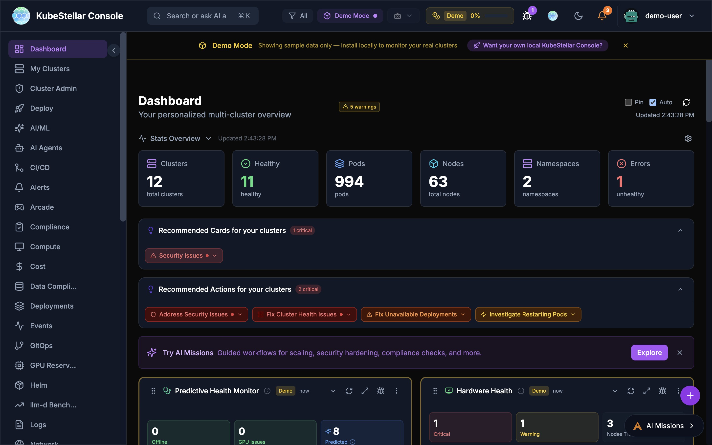
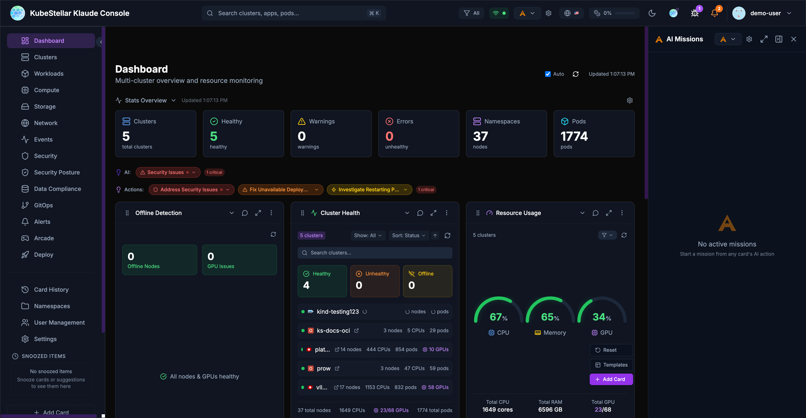
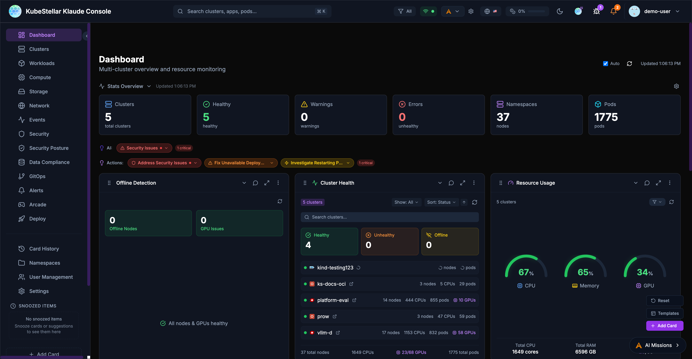
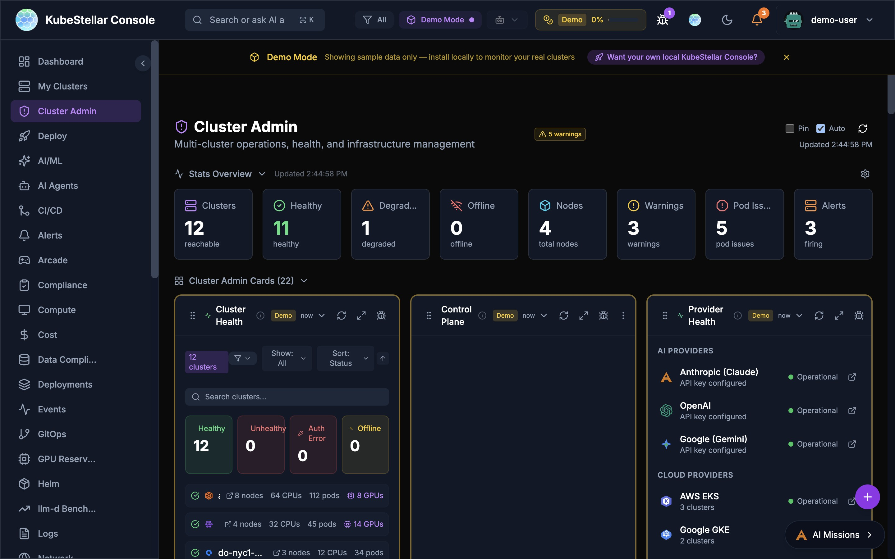
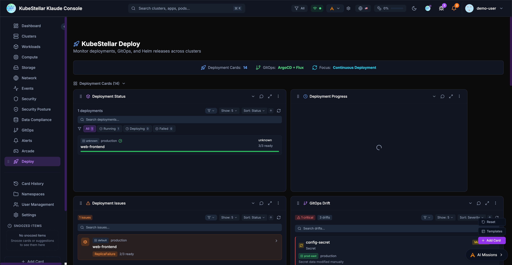
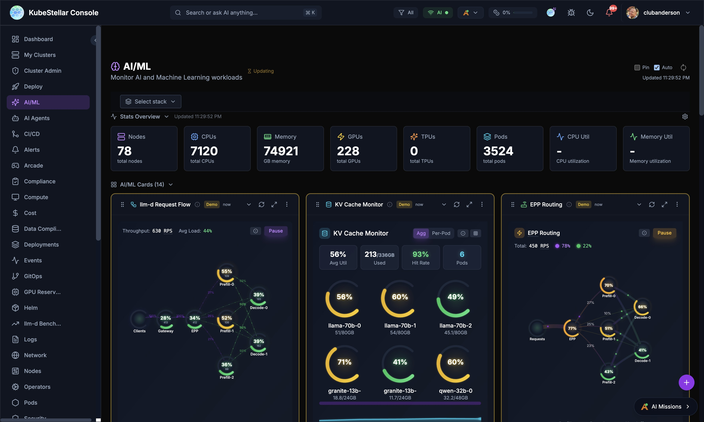

# KubeStellar Console Features

This guide covers the main features of the KubeStellar Console.

## Dashboard

The main dashboard provides a customizable view of your multi-cluster environment.

### Stats Overview

The stats bar at the top of the dashboard displays key metrics with auto-scaling number formatting:

- **Clusters**: Total cluster count and health status
- **Healthy**: Number of healthy clusters
- **Pods**: Total pod count (auto-scales to `3.5K` for large counts)
- **Nodes**: Total nodes across all clusters
- **Namespaces**: Total namespace count
- **Errors**: Count of unhealthy resources with drill-down links

### Dashboard Cards

Cards are the building blocks of the dashboard. Each card displays specific information about your clusters:

- Drag cards to reorder them
- Resize cards by adjusting their width
- Collapse cards to save space
- Use the AI button to get insights about card data

### Dashboard Templates

Pre-configured dashboard layouts for common use cases:

- **Operations**: Cluster health, deployments, events
- **GPU Monitoring**: GPU utilization, workloads, trends
- **Security**: OPA policies, alerts, vulnerabilities
- **GitOps**: Helm releases, drift detection, sync status

## Settings

The settings page allows you to configure all aspects of the console.

### AI Usage Mode

Control how much AI assistance you receive:

- **Low**: Direct kubectl commands, minimal token usage
- **Medium**: AI for analysis and suggestions
- **High**: Full AI assistance for all operations

### Local Agent

Connect to your local kubeconfig and Claude Code:

- View agent version and connection status
- See connected clusters
- Monitor token usage (session, daily, monthly)

### Update Channels

Choose your release channel:

- **Stable (Weekly)**: Tested releases every week
- **Nightly**: Latest features, updated daily

### Appearance

Customize the look and feel:

- Multiple themes: KubeStellar, Batman, Dracula, Nord, Tokyo Night, Cyberpunk, Matrix
- Visual effects: star field, glow effects, gradients
- Accessibility: color blind mode, reduce motion, high contrast

### Token Usage

Monitor and limit AI token consumption:

- Set monthly token limits
- Configure warning and critical thresholds
- Reset usage counters

## Navigation

The sidebar provides access to all major sections:

### Primary Navigation

- **Dashboard**: Main multi-cluster overview
- **Clusters**: Detailed cluster management
- **Workloads**: Deployments, pods, and jobs
- **Compute**: CPU, memory, and GPU resources
- **Storage**: Persistent volumes and claims
- **Network**: Services, ingresses, and network policies
- **Events**: Kubernetes event stream
- **Security**: Security posture and alerts
- **GitOps**: Helm, Kustomize, and ArgoCD

### Secondary Navigation

- **Card History**: Previously viewed cards
- **Namespaces**: Namespace-specific views
- **User Management**: RBAC and access control
- **Settings**: Console configuration

### Special Sections

- **Arcade**: Games and entertainment
- **Deploy**: Multi-cluster deployment tools

## Search

The global search bar (`Cmd/Ctrl + K`) enables quick navigation:

- Search clusters by name
- Find applications and pods
- Navigate to specific namespaces
- Filter by resource type

## Alerts

The alert system keeps you informed:

- Real-time notifications for critical events
- Configurable alert rules
- Integration with external notification systems
- Alert history and acknowledgment

## AI Missions

AI-powered automation for common tasks:

### Starting a Mission

Missions can be started from:

- **Card AI buttons**: Click the AI icon on any card
- **Stats bar actions**: Click "Address Security Issues" or similar action buttons
- **Keyboard shortcut**: Press `M` to open the missions panel

### Mission Types

- **Security Analysis**: Investigate security issues and vulnerabilities
- **Performance Investigation**: Analyze slow pods or resource constraints
- **Troubleshooting**: Debug failing deployments or pods
- **Remediation**: Apply fixes for common problems

### AI Provider Configuration

The console supports multiple AI backends:

- **Claude (Anthropic)**: Primary AI backend with API access
- **Claude Code (Local)**: Uses your local Claude Code installation for missions
- **GPT-4 (OpenAI)**: Alternative LLM backend
- **Gemini (Google)**: Alternative LLM backend

Configure API keys in Settings > AI Provider Keys or click the key icon in the header.

## Offline Detection & Predictive Health

The console includes both reactive offline detection and AI-powered predictive failure detection.

### Node Offline Detection

- **Node Monitoring**: Detects nodes with NotReady status
- **GPU Tracking**: Identifies GPU nodes reporting 0 available GPUs
- **Health Summary**: Shows count of offline nodes and GPU issues
- **AI Analysis**: Click "Analyze Issues" to start an AI mission investigating problems

### Predictive Failure Detection

AI analyzes cluster data to predict failures before they happen:

- **Pattern Recognition**: Detects anomalous CPU, memory, disk, and network patterns
- **Confidence Levels**: Each prediction shows a confidence percentage
- **Root Cause Analysis (RCA)**: AI explains why a failure is likely, correlating symptoms with known patterns
- **Configurable Thresholds**: Adjust analysis interval (15 min - 2 hours) and minimum confidence (50% - 90%)
- **Multi-Provider Consensus**: Optionally run predictions across multiple AI providers for higher accuracy

Configure in **Settings > AI & Intelligence > Predictions**.

### Hardware Health

The Hardware Health card provides IPMI-style monitoring for GPU and accelerator nodes:

- **Alert Summary**: Critical and warning counts at a glance
- **Device Inventory**: Searchable list of all GPU/accelerator nodes
- **Disappearance Tracking**: Detects when devices go missing (e.g., "2 → 1 (1 disappeared)")
- **Per-Device Status**: Shows environment labels (e.g., staging, production) and per-device alerts

### Status Indicators

- **All Healthy**: Green status when no issues detected
- **Issues Found**: Red/orange status with counts of affected resources
- **Predicted**: Yellow bubble for AI-predicted future failures
- **Drill-Down**: Click counts to navigate to affected resources

## Deploy Page

The Deploy page provides tools for managing deployments across clusters.

### Deployment Cards

- **Deployment Status**: Overview of all deployments
- **Deployment Progress**: Track rollout progress
- **Deployment Issues**: View failing deployments

### GitOps Integration

- **GitOps Drift**: Detect configuration drift from Git
- **ArgoCD Applications**: Manage ArgoCD apps across clusters
- **ArgoCD Sync Status**: Monitor sync state
- **ArgoCD Health**: Application health dashboard

### Helm Management

- **Helm Release Status**: View deployed releases
- **Helm History**: Track release revisions
- **Helm Chart Versions**: Monitor chart updates

### Kustomize

- **Kustomization Status**: Monitor Flux kustomizations
- **Overlay Comparison**: Compare environment overlays

### Workload Deployment

Deploy workloads across clusters with drag-and-drop:

1. Select a workload type (Deployment, StatefulSet, Job)
2. Drag to target clusters on the world map
3. Configure namespace and replicas
4. Preview changes before applying

## Marketplace

The Marketplace is a community hub for sharing dashboards, card presets, and themes.

### What's Available

- **Dashboards** - Pre-built dashboard layouts for specific use cases
- **Card Presets** - Curated sets of cards for common monitoring scenarios
- **Themes** - Visual themes for the console
- **CNCF Projects** - Cards and dashboards for 68 CNCF projects (graduated, incubating, sandbox)

### CNCF Project Coverage

The Marketplace tracks coverage of CNCF projects:
- **35 Graduated** projects with dashboard support
- **33 Incubating** projects with monitoring cards
- **57 Help Wanted** issues for community contributions

### Installing from Marketplace

1. Navigate to **Marketplace** in the sidebar
2. Browse or search for what you need
3. Filter by tags (graduated, helm, security, monitoring, etc.)
4. Click **Install** to add to your console
5. Installed dashboards appear in the sidebar with vanity URLs

### Contributing

The Marketplace includes a **Contributor Guide** and links to **Help Wanted** issues for anyone who wants to create new dashboards or cards for the community.

---

## Real-Time SSE Streaming

The console uses Server-Sent Events (SSE) for real-time data streaming, replacing polling-based REST calls for many resources.

### Streamed Resources

The following resources are streamed in real-time via SSE:
- **Pods, Deployments, Services** - Core workload status
- **Jobs, ConfigMaps, Secrets** - Job lifecycle and configuration changes
- **Operators and Subscriptions** - OLM operator status and available upgrades
- **Helm Releases** - Release status across clusters
- **Benchmark Data** - Live benchmark results from Google Drive
- **NVIDIA Operators** - GPU operator status and health

### How It Works

1. The Go backend opens long-lived connections to each cluster
2. Data is streamed to the frontend as JSON events
3. The frontend updates cards instantly without full-page refresh
4. Automatic reconnection on connection loss
5. Fallback to REST polling if SSE is unavailable

### Benefits

- **Instant updates**: No more waiting for refresh intervals
- **Lower resource usage**: Single connection per resource type instead of repeated polls
- **Better UX**: Cards update in real-time as cluster state changes

---

## Performance Optimizations

Recent optimizations have dramatically improved console load times:

- **17x faster warm start**: Card data loads near-instantly on subsequent visits
- **3.6x faster cold start**: First-time page loads reduced from ~8s to ~2.2s
- **Instant card rendering**: Cards render immediately with cached data, then update in background
- **Vite warmup**: Dashboard pages are pre-warmed to eliminate navigation lag
- **In-memory operator caching**: Operator and subscription data is cached server-side with TTL, avoiding repeated kubectl calls
- **Permanent error caching**: Clusters without OLM are cached as permanent errors to skip future probes
- **Demo data instant display**: Cards configured with `demoWhenEmpty` show demo data immediately while real data loads
- **SSE response caching**: Backend caches SSE responses for 15 seconds, reducing re-navigation latency from seconds to near-instant
- **Per-cluster adaptive timeouts**: Slow clusters are automatically tracked and given shorter timeouts (10s vs 60s) to prevent blocking
- **Smart chunk prefetching**: When `ENABLED_DASHBOARDS` is configured, only JavaScript chunks for enabled dashboards are prefetched, reducing initial network requests by ~80%
- **SSE deduplication**: Frontend prevents duplicate concurrent SSE requests during rapid navigation

---

## Local Cluster Creation

Create and manage local Kubernetes clusters directly from the console Settings page.

### Supported Tools

The console auto-detects installed cluster creation tools:
- **kind** - Kubernetes in Docker
- **k3d** - Lightweight k3s in Docker
- **minikube** - Local Kubernetes with multiple drivers

### Creating a Cluster

1. Go to **Settings > Utilities > Local Clusters**
2. Select a tool from the dropdown
3. Enter a cluster name
4. Click **Create**
5. The cluster appears in your cluster list and is immediately available for monitoring

### Managing Clusters

The Local Clusters page shows all local clusters with:
- Cluster name and creation tool
- Running status
- Delete button to remove clusters

---

## llm-d Inference Monitoring

The AI/ML dashboard includes specialized cards for monitoring llm-d inference serving stacks.

### Stack Discovery

The console automatically discovers llm-d stacks across your clusters:
- Scans all namespaces for llm-d deployments
- Detects vLLM, TGI, llm-d, and Triton inference servers
- Shows stack health with component status

### Key Cards

- **Request Flow** - Animated visualization of requests flowing through the inference pipeline
- **KV Cache Monitor** - Real-time KV cache utilization with per-pod breakdowns
- **EPP Routing** - Endpoint Picker routing decisions, RPS, and distribution
- **P/D Disaggregation** - Separate prefill and decode server metrics including load, queue depth, throughput, TPOT, and GPU memory
- **Benchmarks** - Compare stacks with TTFT, throughput, and latency charts
- **Configurator** - Configure inference strategies (Intelligent Scheduling, P/D Disaggregation, Wide Expert Parallelism, Variant Autoscaling)

### Real Prometheus Metrics

The four LLM-d visualization cards (Request Flow, KV Cache Monitor, EPP Routing, P/D Disaggregation) display **real per-pod Prometheus metrics** from vLLM when available:

- A Prometheus query proxy routes queries through the Kubernetes API server's service proxy — no port-forwarding or extra configuration needed
- Six vLLM metrics are polled every 5 seconds: request throughput, KV cache utilization, time-to-first-token, inter-token latency, batch size, and queue depth
- Cards gracefully fall back to simulated data when Prometheus is unavailable
- Per-pod views show individual vLLM instance metrics with color-coded health indicators

### llm-d AI Insights

The AI Insights card provides automated analysis of your inference stack configuration, identifying:
- Balanced vs imbalanced prefill-to-decode ratios
- Optimization opportunities
- Configuration recommendations

---

## PROW CI Monitoring

The CI/CD dashboard includes PROW CI integration for monitoring Kubernetes-style CI/CD.

### PROW Status Card

Shows overall PROW health:
- Success rate percentage
- Job counts in the last hour
- Running, pending, and failed job breakdown
- Link to your PROW dashboard

### PROW Jobs Card

Filterable list of PROW jobs:
- Filter by **job type** (presubmit, postsubmit, periodic, batch)
- Filter by **state** (all states, triggered, pending, running, succeeded, failed)
- Each job shows PR number, duration, and age
- Click to open the job in your PROW instance

### PROW History Card

Revision history showing pass/fail trends over time.

---

## Kagenti AI Agents

The AI Agents dashboard provides a management plane for Kagenti AI agents deployed across clusters.

### Overview

- **Agent Count**: Total agents and their readiness state
- **MCP Tools**: Number of Model Context Protocol tools available
- **Builds**: Active and recent build status
- **Clusters**: Clusters with Kagenti installed
- **SPIFFE Coverage**: Identity and security coverage percentage

### Agent Fleet

Searchable list of all deployed agents showing:
- Agent name and cluster placement
- Framework (LangGraph, CrewAI, AG2)
- Replica count and status (Running, Pending)
- Per-agent actions (diagnose, repair, logs)

### Diagnose & Repair

Every card in the console has AI-powered Diagnose and Repair buttons:
- **Diagnose** - Opens an AI mission to analyze the card's data
- **Repair** - Opens an AI mission to fix detected issues
- Available as compact icon buttons on every card's toolbar

---

## Nightly E2E Test Monitoring

The CI/CD dashboard includes a Nightly E2E Tests card that monitors end-to-end test results across llm-d infrastructure guides.

### GPU Failure Detection

The card distinguishes between actual test failures and GPU unavailability:

- **Red dots** indicate genuine test failures
- **Amber dots** indicate GPU unavailability failures (e.g., insufficient GPU quota)
- **Green dots** indicate successful runs
- **Flashing blue dots** indicate currently running or queued jobs

The backend classifies failures by inspecting GitHub Actions job steps to determine whether a failure was caused by missing GPU resources or an actual test regression.

### Per-Run Metadata

Hovering over individual run dots in the detail panel reveals infrastructure information:

- **Model**: Which LLM model was tested (e.g., `granite-3.3-2b-instruct`)
- **GPU type**: GPU accelerator used (e.g., `NVIDIA L40S`)
- **GPU count**: Number of GPUs allocated
- **Duration**: How long the run took
- **Run number**: GitHub Actions run identifier

### Log and Artifact Links

Hovering over failed (red) or GPU-unavailable (amber) run dots shows a popup with:

- Clickable **View Logs** link to the GitHub Actions run
- Clickable **Artifacts** link to retained pod logs (available for 7 days)
- Failure type classification (test failure vs GPU unavailability)

---

## CoreWeave Cluster Support

CoreWeave is recognized as a cloud provider with automatic detection:

- Clusters are identified via `.coreweave.com` URL patterns or `coreweave` in the cluster name
- CoreWeave clusters display a branded icon with the double-wave mark
- Cluster detail modals include a direct link to the CoreWeave console
- CoreWeave-specific color scheme is applied to cluster cards

---

## Data Freshness Indicators

Eight core cards now display real-time data freshness information:

- **"Updated Xs ago"** timestamp shows when data was last refreshed
- A **spinning icon** appears during background data refresh
- An **amber warning icon** appears when data is stale (older than 5 minutes)

Affected cards: EventStream, EventsTimeline, TopPods, NamespaceOverview, ProwJobs, LLMInference, LLMModels, and ResourceCapacity.

---

## Auto-Scaling Number Formatting

Stat blocks in the Stats Overview bar automatically format large numbers to prevent overflow:

- Values **10,000+** display as compact format (e.g., `7.1K` instead of `7120`)
- Values **1,000,000+** display as millions (e.g., `1.2M`)
- Values under 10,000 display as full numbers
- Memory values auto-scale through MB, GB, TB, and PB ranges

---

## Improved Modal Safety

Form modals throughout the console have been hardened against accidental data loss:

- **Backdrop click protection**: Form modals (StatsConfig, APIKeySettings, WidgetExport, NamespaceQuotas, CardChat) no longer close when clicking outside, preventing accidental data loss
- **Escape key handling**: Custom dropdowns (AlertBadge, ClusterSelect, FloatingDashboardActions) properly close with the Escape key
- **Error notifications**: Five critical operations (sign-in, OPA policy toggle, policy deletion, role updates, user deletion) now show toast notifications on failure instead of silent console errors

---

## Semantic Color System

Error and status colors have been standardized across the entire console:

| Color | Meaning |
|-------|---------|
| **Red** | Errors, failures, critical issues |
| **Yellow** | Warnings, pending states |
| **Orange** | Warning-level alerts, medium severity |
| **Green** | Healthy, success, running |
| **Blue** | Active, in-progress, informational |
| **Violet/Purple** | AI/ML features and insights |

---

## Crossplane Managed Resources Card

A new community-contributed card displays Crossplane managed resources:

- Shows managed resource count, provider health, and composite resource status
- Displays resource table with name, kind, provider, synced/ready status, and age
- Integrates with the Crossplane operator running in connected clusters

---

## Cloud Native Buildpacks Card

A new community-contributed card monitors Cloud Native Buildpacks:

- Displays build counts, success rates, and active builders
- Shows recent builds with status, duration, and builder information
- Tracks buildpack versions and update availability
