# KubeStellar Console Features

This guide covers the main features of the KubeStellar Console.

## Dashboard

The main dashboard provides a customizable view of your multi-cluster environment.

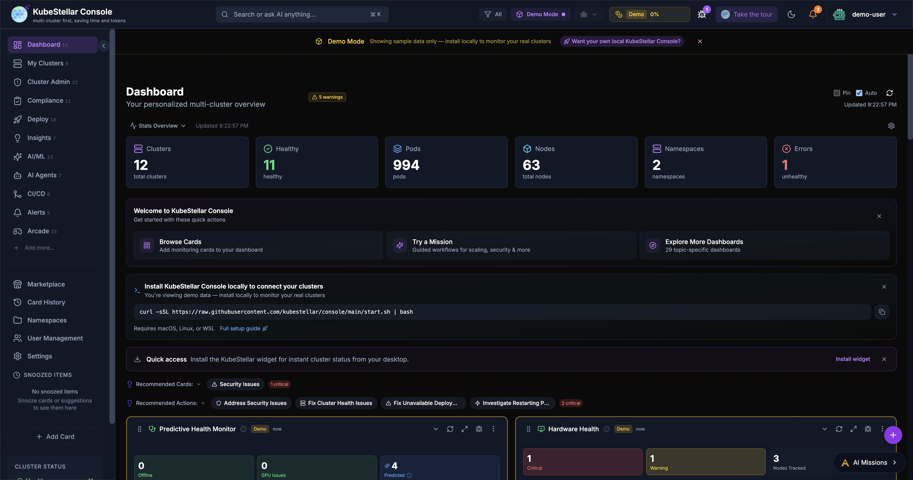

### Stats Overview

The stats bar at the top of the dashboard displays key metrics with auto-scaling number formatting:

- **Clusters**: Total cluster count and health status
- **Healthy**: Number of healthy clusters
- **Pods**: Total pod count (auto-scales to `3.5K` for large counts)
- **Nodes**: Total nodes across all clusters
- **Namespaces**: Total namespace count
- **Errors**: Count of unhealthy resources with drill-down links

### Dashboard Cards

Cards are the building blocks of the dashboard. Each card displays specific information about your clusters:

- Drag cards to reorder them
- Resize cards by adjusting their width
- Collapse cards to save space
- Use the AI button to get insights about card data

### Dashboard Templates

Pre-configured dashboard layouts for common use cases:

- **Operations**: Cluster health, deployments, events
- **GPU Monitoring**: GPU utilization, workloads, trends
- **Security**: OPA policies, alerts, vulnerabilities
- **GitOps**: Helm releases, drift detection, sync status

## Settings

The settings page allows you to configure all aspects of the console.

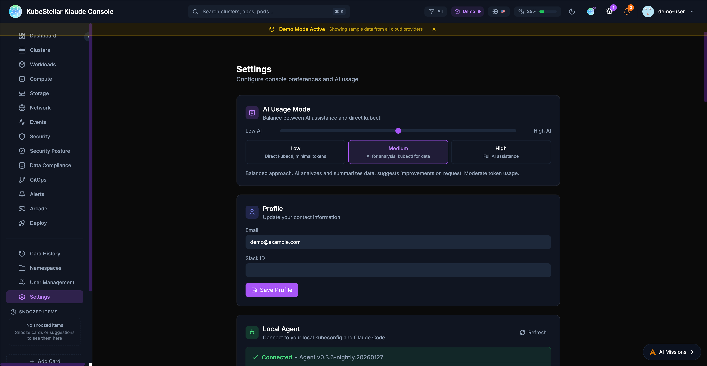

### AI Usage Mode

Control how much AI assistance you receive:

- **Low**: Direct kubectl commands, minimal token usage
- **Medium**: AI for analysis and suggestions
- **High**: Full AI assistance for all operations

### Local Agent

Connect to your local kubeconfig and Claude Code:

- View agent version and connection status
- See connected clusters
- Monitor token usage (session, daily, monthly)

### Update Channels

Choose your release channel:

- **Stable (Weekly)**: Tested releases every week
- **Nightly**: Latest features, updated daily

### Appearance

Customize the look and feel:

- Multiple themes: KubeStellar, Batman, Dracula, Nord, Tokyo Night, Cyberpunk, Matrix
- Visual effects: star field, glow effects, gradients
- Accessibility: color blind mode, reduce motion, high contrast

### Token Usage

Monitor and limit AI token consumption:

- Set monthly token limits
- Configure warning and critical thresholds
- Reset usage counters

## Navigation

The sidebar provides access to all major sections:

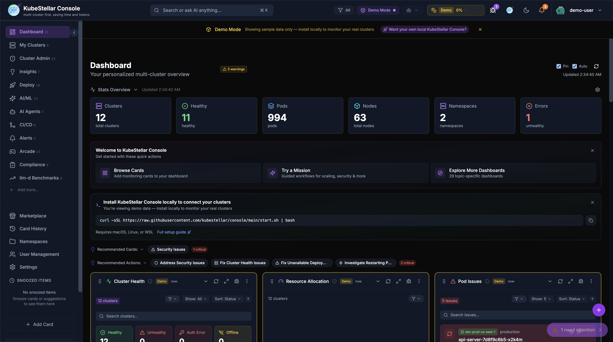

### Sidebar Card Counts

Each sidebar item displays a live count badge showing the number of cards available on that dashboard. For example, "Workloads (12)" means 12 cards are registered for the Workloads dashboard. This helps you understand the depth of monitoring available for each area at a glance.

- Counts update dynamically based on registered cards
- Badges use muted styling to avoid visual clutter
- Collapsed sidebar hides counts but shows them on hover

### Primary Navigation

- **Dashboard**: Main multi-cluster overview
- **Clusters**: Detailed cluster management
- **Workloads**: Deployments, pods, and jobs
- **Compute**: CPU, memory, and GPU resources
- **Storage**: Persistent volumes and claims
- **Network**: Services, ingresses, and network policies
- **Events**: Kubernetes event stream
- **Security**: Security posture and alerts
- **GitOps**: Helm, Kustomize, and ArgoCD

### Secondary Navigation

- **Card History**: Previously viewed cards
- **Namespaces**: Namespace-specific views
- **User Management**: RBAC and access control
- **Settings**: Console configuration

### Special Sections

- **Arcade**: Games and entertainment
- **Deploy**: Multi-cluster deployment tools

## Search

The global search bar (`Cmd/Ctrl + K`) enables quick navigation:

- Search clusters by name
- Find applications and pods
- Navigate to specific namespaces
- Filter by resource type

## Alerts

The alert system keeps you informed:

- Real-time notifications for critical events
- Configurable alert rules
- Integration with external notification systems
- Alert history and acknowledgment

## AI Missions

AI-powered automation for common tasks:

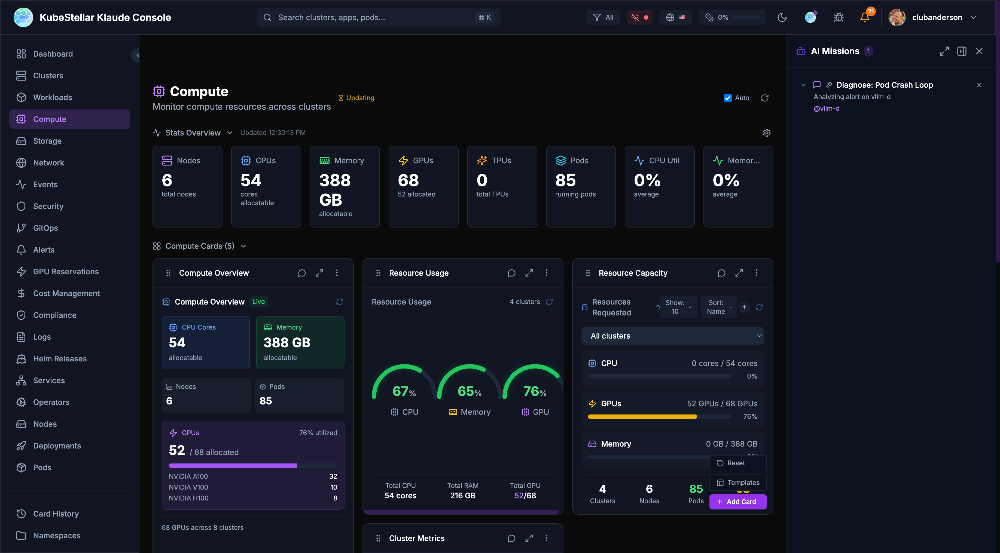

### Starting a Mission

Missions can be started from:

- **Card AI buttons**: Click the AI icon on any card
- **Stats bar actions**: Click "Address Security Issues" or similar action buttons
- **Keyboard shortcut**: Press `M` to open the missions panel

### Mission Types

- **Security Analysis**: Investigate security issues and vulnerabilities
- **Performance Investigation**: Analyze slow pods or resource constraints
- **Troubleshooting**: Debug failing deployments or pods
- **Remediation**: Apply fixes for common problems

### AI Provider Configuration

The console supports multiple AI backends:

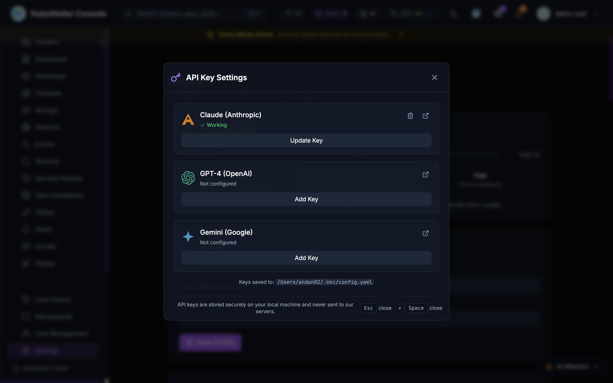

- **Claude (Anthropic)**: Primary AI backend with API access
- **Claude Code (Local)**: Uses your local Claude Code installation for missions
- **GPT-4 (OpenAI)**: Alternative LLM backend
- **Gemini (Google)**: Alternative LLM backend

Configure API keys in Settings > AI Provider Keys or click the key icon in the header.

## Offline Detection & Predictive Health

The console includes both reactive offline detection and AI-powered predictive failure detection.

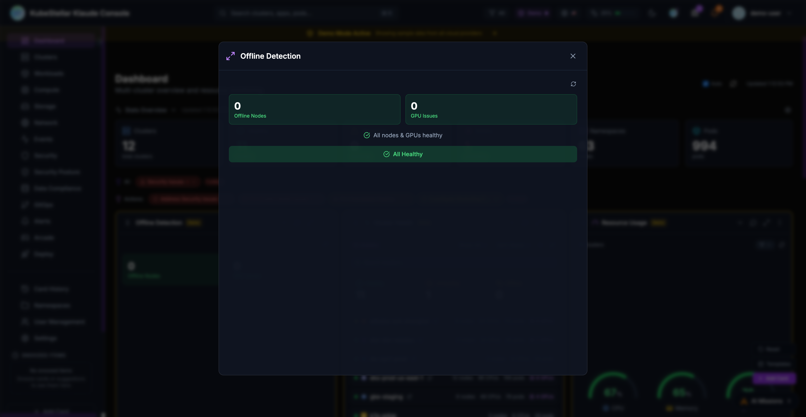

### Node Offline Detection

- **Node Monitoring**: Detects nodes with NotReady status
- **GPU Tracking**: Identifies GPU nodes reporting 0 available GPUs
- **Health Summary**: Shows count of offline nodes and GPU issues
- **AI Analysis**: Click "Analyze Issues" to start an AI mission investigating problems

### Predictive Failure Detection

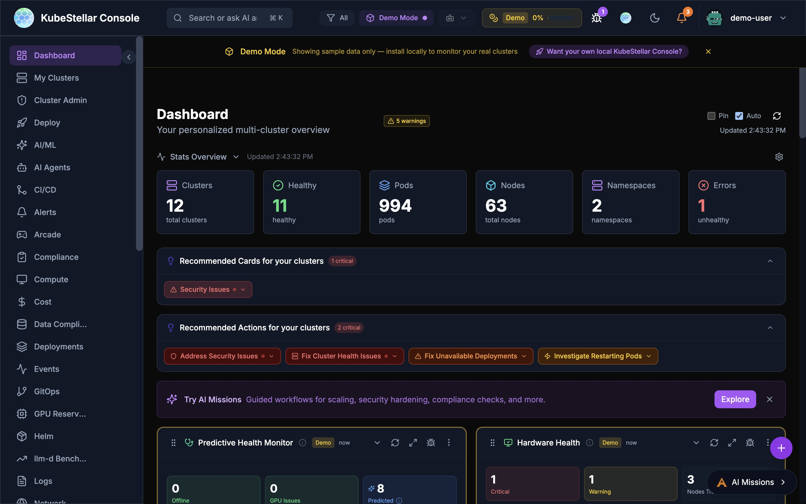

AI analyzes cluster data to predict failures before they happen:

- **Pattern Recognition**: Detects anomalous CPU, memory, disk, and network patterns
- **Confidence Levels**: Each prediction shows a confidence percentage
- **Root Cause Analysis (RCA)**: AI explains why a failure is likely, correlating symptoms with known patterns
- **Configurable Thresholds**: Adjust analysis interval (15 min - 2 hours) and minimum confidence (50% - 90%)
- **Multi-Provider Consensus**: Optionally run predictions across multiple AI providers for higher accuracy

Configure in **Settings > AI & Intelligence > Predictions**.

### Hardware Health

The Hardware Health card provides IPMI-style monitoring for GPU and accelerator nodes:

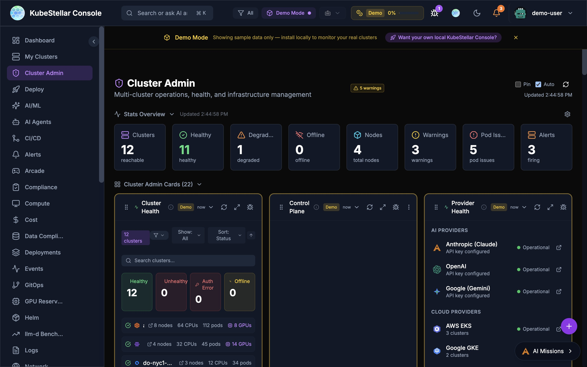

- **Alert Summary**: Critical and warning counts at a glance
- **Device Inventory**: Searchable list of all GPU/accelerator nodes
- **Disappearance Tracking**: Detects when devices go missing (e.g., "2 → 1 (1 disappeared)")
- **Per-Device Status**: Shows environment labels (e.g., staging, production) and per-device alerts

### Status Indicators

- **All Healthy**: Green status when no issues detected
- **Issues Found**: Red/orange status with counts of affected resources
- **Predicted**: Yellow bubble for AI-predicted future failures
- **Drill-Down**: Click counts to navigate to affected resources

## Deploy Page

The Deploy page provides tools for managing deployments across clusters.

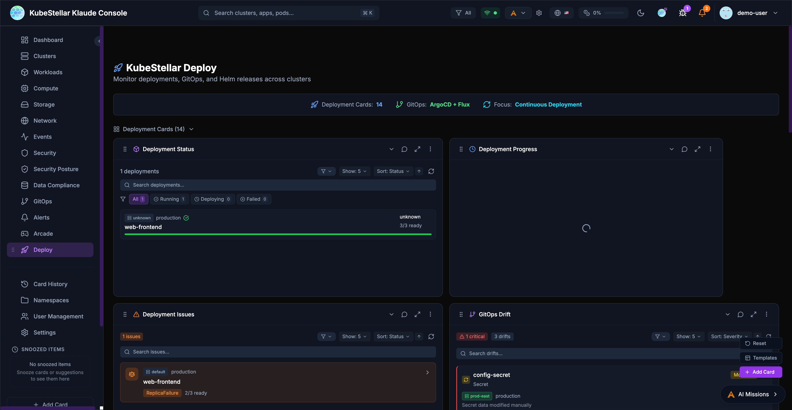

### Deployment Cards

- **Deployment Status**: Overview of all deployments
- **Deployment Progress**: Track rollout progress
- **Deployment Issues**: View failing deployments

### GitOps Integration

- **GitOps Drift**: Detect configuration drift from Git
- **ArgoCD Applications**: Manage ArgoCD apps across clusters
- **ArgoCD Sync Status**: Monitor sync state
- **ArgoCD Health**: Application health dashboard

### Helm Management

- **Helm Release Status**: View deployed releases
- **Helm History**: Track release revisions
- **Helm Chart Versions**: Monitor chart updates

### Kustomize

- **Kustomization Status**: Monitor Flux kustomizations
- **Overlay Comparison**: Compare environment overlays

### Workload Deployment

Deploy workloads across clusters with drag-and-drop:

1. Select a workload type (Deployment, StatefulSet, Job)
2. Drag to target clusters on the world map
3. Configure namespace and replicas
4. Preview changes before applying

## Marketplace


The Marketplace is a community hub for sharing dashboards, card presets, and themes.

### What's Available

- **Dashboards** - Pre-built dashboard layouts for specific use cases
- **Card Presets** - Curated sets of cards for common monitoring scenarios
- **Themes** - Visual themes for the console
- **CNCF Projects** - Cards and dashboards for 68 CNCF projects (graduated, incubating, sandbox)

### CNCF Project Coverage

The Marketplace tracks coverage of CNCF projects:
- **35 Graduated** projects with dashboard support
- **33 Incubating** projects with monitoring cards
- **57 Help Wanted** issues for community contributions

### Installing from Marketplace

1. Navigate to **Marketplace** in the sidebar
2. Browse or search for what you need
3. Filter by tags (graduated, helm, security, monitoring, etc.)
4. Click **Install** to add to your console
5. Installed dashboards appear in the sidebar with vanity URLs

### Contributing

The Marketplace includes a **Contributor Guide** and links to **Help Wanted** issues for anyone who wants to create new dashboards or cards for the community.

---

## Real-Time SSE Streaming

The console uses Server-Sent Events (SSE) for real-time data streaming, replacing polling-based REST calls for many resources.

### Streamed Resources

The following resources are streamed in real-time via SSE:
- **Pods, Deployments, Services** - Core workload status
- **Jobs, ConfigMaps, Secrets** - Job lifecycle and configuration changes
- **Operators and Subscriptions** - OLM operator status and available upgrades
- **Helm Releases** - Release status across clusters
- **Benchmark Data** - Live benchmark results from Google Drive
- **NVIDIA Operators** - GPU operator status and health

### How It Works

1. The Go backend opens long-lived connections to each cluster
2. Data is streamed to the frontend as JSON events
3. The frontend updates cards instantly without full-page refresh
4. Automatic reconnection on connection loss
5. Fallback to REST polling if SSE is unavailable

### Benefits

- **Instant updates**: No more waiting for refresh intervals
- **Lower resource usage**: Single connection per resource type instead of repeated polls
- **Better UX**: Cards update in real-time as cluster state changes

---

## Performance Optimizations

Recent optimizations have dramatically improved console load times:

- **17x faster warm start**: Card data loads near-instantly on subsequent visits
- **3.6x faster cold start**: First-time page loads reduced from ~8s to ~2.2s
- **Instant card rendering**: Cards render immediately with cached data, then update in background
- **Vite warmup**: Dashboard pages are pre-warmed to eliminate navigation lag
- **In-memory operator caching**: Operator and subscription data is cached server-side with TTL, avoiding repeated kubectl calls
- **Permanent error caching**: Clusters without OLM are cached as permanent errors to skip future probes
- **Demo data instant display**: Cards configured with `demoWhenEmpty` show demo data immediately while real data loads
- **SSE response caching**: Backend caches SSE responses for 15 seconds, reducing re-navigation latency from seconds to near-instant
- **Per-cluster adaptive timeouts**: Slow clusters are automatically tracked and given shorter timeouts (10s vs 60s) to prevent blocking
- **Smart chunk prefetching**: When `ENABLED_DASHBOARDS` is configured, only JavaScript chunks for enabled dashboards are prefetched, reducing initial network requests by ~80%
- **SSE deduplication**: Frontend prevents duplicate concurrent SSE requests during rapid navigation

---

## Local Cluster Creation

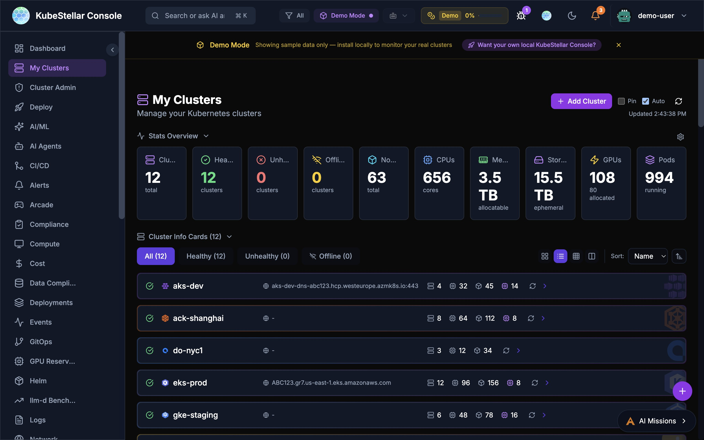

Create and manage local Kubernetes clusters directly from the console Settings page.

### Supported Tools

The console auto-detects installed cluster creation tools:
- **kind** - Kubernetes in Docker
- **k3d** - Lightweight k3s in Docker
- **minikube** - Local Kubernetes with multiple drivers

### Creating a Cluster

1. Go to **Settings > Utilities > Local Clusters**
2. Select a tool from the dropdown
3. Enter a cluster name
4. Click **Create**
5. The cluster appears in your cluster list and is immediately available for monitoring

### Managing Clusters

The Local Clusters page shows all local clusters with:
- Cluster name and creation tool
- Running status
- Delete button to remove clusters

---

## llm-d Inference Monitoring


The AI/ML dashboard includes specialized cards for monitoring llm-d inference serving stacks.

### Stack Discovery

The console automatically discovers llm-d stacks across your clusters:
- Scans all namespaces for llm-d deployments
- Detects vLLM, TGI, llm-d, and Triton inference servers
- Shows stack health with component status

### Key Cards

- **Request Flow** - Animated visualization of requests flowing through the inference pipeline
- **KV Cache Monitor** - Real-time KV cache utilization with per-pod breakdowns
- **EPP Routing** - Endpoint Picker routing decisions, RPS, and distribution
- **P/D Disaggregation** - Separate prefill and decode server metrics including load, queue depth, throughput, TPOT, and GPU memory
- **Benchmarks** - Compare stacks with TTFT, throughput, and latency charts
- **Configurator** - Configure inference strategies (Intelligent Scheduling, P/D Disaggregation, Wide Expert Parallelism, Variant Autoscaling)

### Real Prometheus Metrics

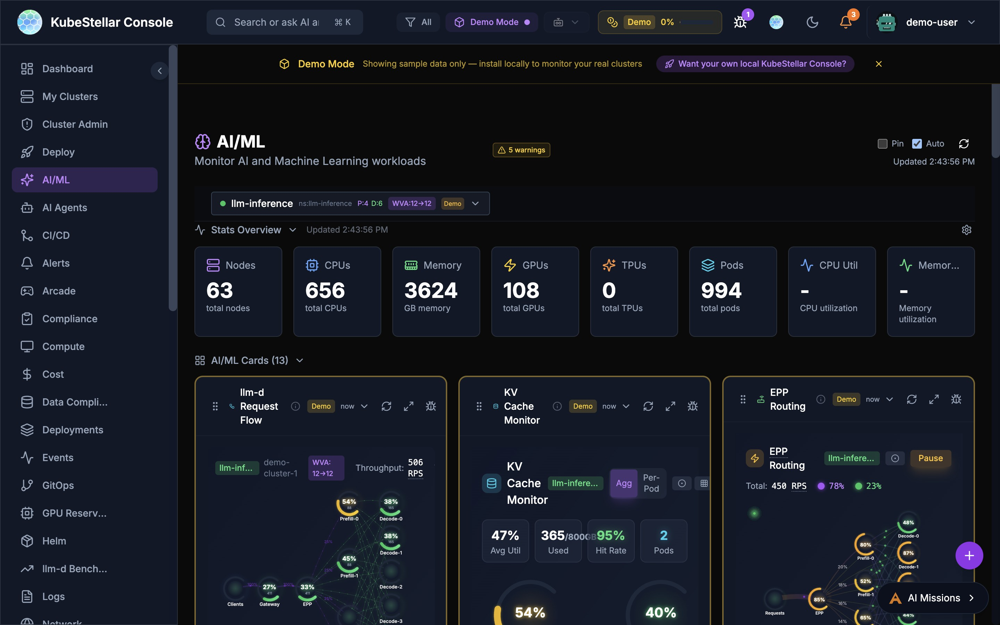

The four LLM-d visualization cards (Request Flow, KV Cache Monitor, EPP Routing, P/D Disaggregation) display **real per-pod Prometheus metrics** from vLLM when available:

- A Prometheus query proxy routes queries through the Kubernetes API server's service proxy — no port-forwarding or extra configuration needed
- Six vLLM metrics are polled every 5 seconds: request throughput, KV cache utilization, time-to-first-token, inter-token latency, batch size, and queue depth
- Cards gracefully fall back to simulated data when Prometheus is unavailable
- Per-pod views show individual vLLM instance metrics with color-coded health indicators

### llm-d AI Insights

The AI Insights card provides automated analysis of your inference stack configuration, identifying:
- Balanced vs imbalanced prefill-to-decode ratios
- Optimization opportunities
- Configuration recommendations

---

## PROW CI Monitoring

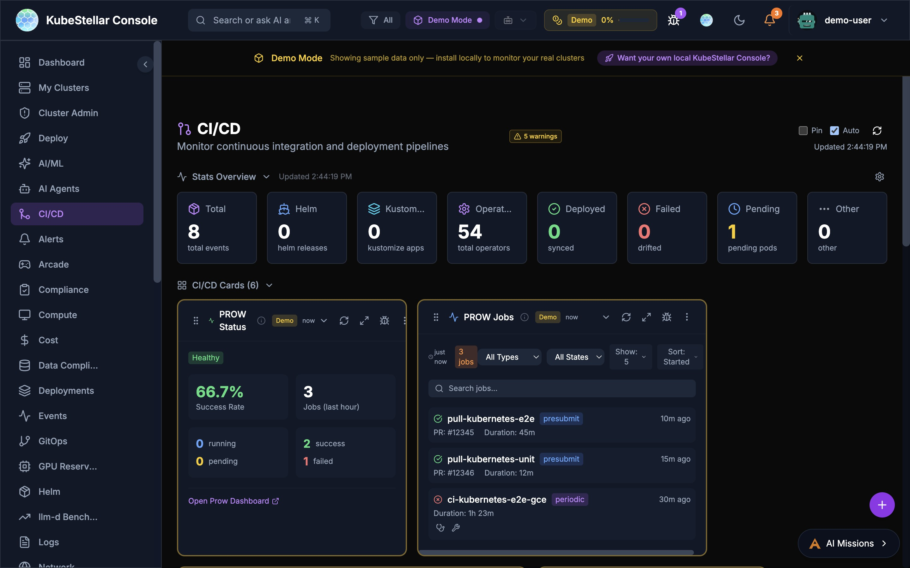

The CI/CD dashboard includes PROW CI integration for monitoring Kubernetes-style CI/CD.

### PROW Status Card

Shows overall PROW health:
- Success rate percentage
- Job counts in the last hour
- Running, pending, and failed job breakdown
- Link to your PROW dashboard

### PROW Jobs Card

Filterable list of PROW jobs:
- Filter by **job type** (presubmit, postsubmit, periodic, batch)
- Filter by **state** (all states, triggered, pending, running, succeeded, failed)
- Each job shows PR number, duration, and age
- Click to open the job in your PROW instance

### PROW History Card

Revision history showing pass/fail trends over time.

---

## Kagenti AI Agents

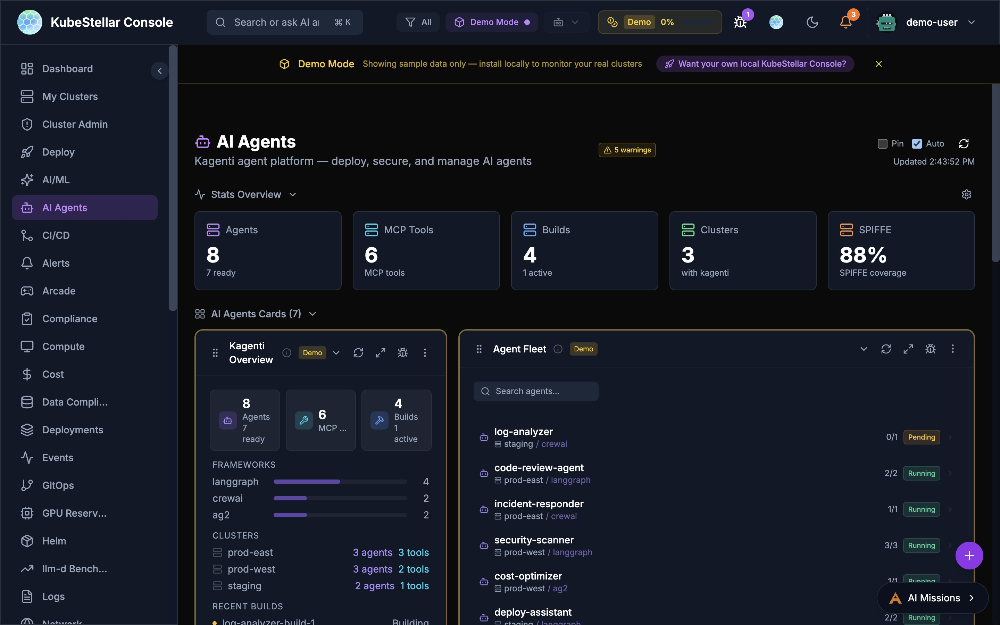

The AI Agents dashboard provides a management plane for Kagenti AI agents deployed across clusters.

### Overview

- **Agent Count**: Total agents and their readiness state
- **MCP Tools**: Number of Model Context Protocol tools available
- **Builds**: Active and recent build status
- **Clusters**: Clusters with Kagenti installed
- **SPIFFE Coverage**: Identity and security coverage percentage

### Agent Fleet

Searchable list of all deployed agents showing:
- Agent name and cluster placement
- Framework (LangGraph, CrewAI, AG2)
- Replica count and status (Running, Pending)
- Per-agent actions (diagnose, repair, logs)

### Diagnose & Repair

Every card in the console has AI-powered Diagnose and Repair buttons:
- **Diagnose** - Opens an AI mission to analyze the card's data
- **Repair** - Opens an AI mission to fix detected issues
- Available as compact icon buttons on every card's toolbar

---

## Nightly E2E Test Monitoring

The CI/CD dashboard includes a Nightly E2E Tests card that monitors end-to-end test results across llm-d infrastructure guides.

### GPU Failure Detection

The card distinguishes between actual test failures and GPU unavailability:

- **Red dots** indicate genuine test failures
- **Amber dots** indicate GPU unavailability failures (e.g., insufficient GPU quota)
- **Green dots** indicate successful runs
- **Flashing blue dots** indicate currently running or queued jobs

The backend classifies failures by inspecting GitHub Actions job steps to determine whether a failure was caused by missing GPU resources or an actual test regression.

### Per-Run Metadata

Hovering over individual run dots in the detail panel reveals infrastructure information:

- **Model**: Which LLM model was tested (e.g., `granite-3.3-2b-instruct`)
- **GPU type**: GPU accelerator used (e.g., `NVIDIA L40S`)
- **GPU count**: Number of GPUs allocated
- **Duration**: How long the run took
- **Run number**: GitHub Actions run identifier

### Log and Artifact Links

Hovering over failed (red) or GPU-unavailable (amber) run dots shows a popup with:

- Clickable **View Logs** link to the GitHub Actions run
- Clickable **Artifacts** link to retained pod logs (available for 7 days)
- Failure type classification (test failure vs GPU unavailability)

---

## CoreWeave Cluster Support

CoreWeave is recognized as a cloud provider with automatic detection:

- Clusters are identified via `.coreweave.com` URL patterns or `coreweave` in the cluster name
- CoreWeave clusters display a branded icon with the double-wave mark
- Cluster detail modals include a direct link to the CoreWeave console
- CoreWeave-specific color scheme is applied to cluster cards

---

## Data Freshness Indicators

Eight core cards now display real-time data freshness information:

- **"Updated Xs ago"** timestamp shows when data was last refreshed
- A **spinning icon** appears during background data refresh
- An **amber warning icon** appears when data is stale (older than 5 minutes)

Affected cards: EventStream, EventsTimeline, TopPods, NamespaceOverview, ProwJobs, LLMInference, LLMModels, and ResourceCapacity.

---

## Auto-Scaling Number Formatting


Stat blocks in the Stats Overview bar automatically format large numbers to prevent overflow:

- Values **10,000+** display as compact format (e.g., `7.1K` instead of `7120`)
- Values **1,000,000+** display as millions (e.g., `1.2M`)
- Values under 10,000 display as full numbers
- Memory values auto-scale through MB, GB, TB, and PB ranges

---

## What's New in April 2026

### Custom Card Data Fetching (useCardFetch)

Tier 2 custom cards can now fetch data from external APIs using the new `useCardFetch(url, options)` hook. The hook proxies requests through the Go backend at `/api/card-proxy` with comprehensive SSRF protection:

- **URL validation**: Only http/https, max 2048 characters
- **Private IP blocking**: DNS resolution blocks RFC 1918, loopback, and link-local addresses
- **Response limits**: 5 MB max response body, 15-second timeout
- **Concurrency**: Max 5 concurrent fetches per card
- `fetch`/`XMLHttpRequest` remain blocked in the sandbox -- `useCardFetch` is the only permitted way for card code to access external data

### Landing Page Performance

Public landing pages (`/from-holmesgpt`, `/from-lens`, `/from-headlamp`, `/welcome`, etc.) now load via a lightweight shell that skips the full authentication and provider stack. This reduces initial JavaScript from ~1.8 MB to ~200 KB and eliminates the "Loading" spinner that previously appeared on `console.kubestellar.io` where the Go backend is unavailable.

### Visit Streak and Rotating Tips

Subtle engagement features added to the dashboard:

- **Visit streak badge**: A flame emoji and day count in the navbar tracks consecutive daily visits (appears only when streak >= 2 days)
- **Rotating tips**: The Getting Started banner shows a "Did you know?" line that cycles through 18 tips without repeating

### Security Improvements

- **JWT HS256 enforcement**: All JWT parsing now uses a centralized `middleware.ParseJWT()` function that restricts token algorithms to HS256 only, preventing algorithm confusion attacks. This was a prerequisite for the CNCF TAG-Security self-assessment.
- **JWT URL leakage fix**: Token data is no longer exposed in URLs or query parameters.
- **Stale build detection**: A `<meta name="app-build-id">` tag and visibility/interval checks automatically reload the page when a newer build is deployed, preventing stale JavaScript chunk errors after deploys.

### CNCF Incubation Readiness

New governance and security documents were added to the console repository:

- **ROADMAP.md** -- Near-term, mid-term, and long-term plans with non-goals
- **ARCHITECTURE.md** -- System diagram, component descriptions, data flows, and security architecture
- **SUPPORT.md** -- Version support policy and platform compatibility matrix
- **COMMUNITY.md** -- Communication channels and meeting schedule
- **SELF-ASSESSMENT.md** -- TAG-Security self-assessment covering actors, actions, and threat model
- Updated OWNERS and SECURITY_CONTACTS

### Mission Explorer UX

The Mission Explorer file browser received several UX improvements:

- **File-type icons**: Orange for YAML, green for Markdown, blue for JSON
- **Resizable sidebar**: Drag the edge to resize between 180--500px
- **Source and PR links**: Click to view or edit files directly on GitHub
- **CNCF project icons**: Files are annotated with CNCF project icons based on API group detection
- **Refresh**: Re-fetches file contents instead of just toggling expand/collapse

### CI Quality Infrastructure

A comprehensive quality assurance infrastructure was introduced:

- **Post-build safety checks**: Detect Vite define corruption, MSW leaks, and bundle size regressions before deploy
- **Post-merge Playwright verification**: Runs Playwright tests against production after merge to catch deployment regressions
- **Coverage suite**: Sharded test coverage running on push to main, with auto-issue creation when coverage drops >5%
- **AI Quality Assurance documentation**: Describes the full CI pipeline from PR gate through coverage suite

---

## Improved Modal Safety

Form modals throughout the console have been hardened against accidental data loss:

- **Backdrop click protection**: Form modals (StatsConfig, APIKeySettings, WidgetExport, NamespaceQuotas, CardChat) no longer close when clicking outside, preventing accidental data loss
- **Escape key handling**: Custom dropdowns (AlertBadge, ClusterSelect, FloatingDashboardActions) properly close with the Escape key
- **Error notifications**: Five critical operations (sign-in, OPA policy toggle, policy deletion, role updates, user deletion) now show toast notifications on failure instead of silent console errors

---

## Semantic Color System

Error and status colors have been standardized across the entire console:

| Color | Meaning |
|-------|---------|
| **Red** | Errors, failures, critical issues |
| **Yellow** | Warnings, pending states |
| **Orange** | Warning-level alerts, medium severity |
| **Green** | Healthy, success, running |
| **Blue** | Active, in-progress, informational |
| **Violet/Purple** | AI/ML features and insights |

---

## Crossplane Managed Resources Card

A new community-contributed card displays Crossplane managed resources:

- Shows managed resource count, provider health, and composite resource status
- Displays resource table with name, kind, provider, synced/ready status, and age
- Integrates with the Crossplane operator running in connected clusters

---

## Cloud Native Buildpacks Card

A new community-contributed card monitors Cloud Native Buildpacks:

- Displays build counts, success rates, and active builders
- Shows recent builds with status, duration, and builder information
- Tracks buildpack versions and update availability

---

## Add Cluster Dialog

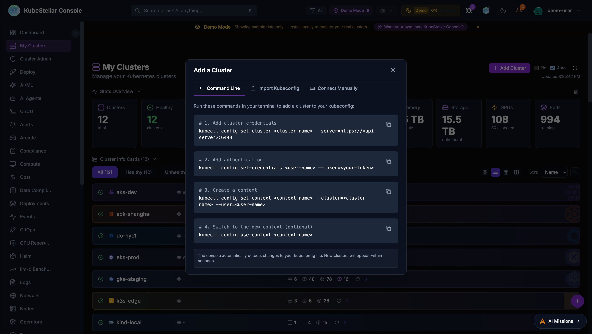

The console now provides a multi-method dialog for adding clusters, accessible from the **Add Cluster** button on the My Clusters page.

### Command Line

Step-by-step kubectl commands with copy buttons:

1. `kubectl config set-cluster` — Add cluster credentials
2. `kubectl config set-credentials` — Add authentication
3. `kubectl config set-context` — Create a context
4. `kubectl config use-context` — Switch to the new context

The console automatically detects kubeconfig changes and displays new clusters within seconds.

### Import Kubeconfig

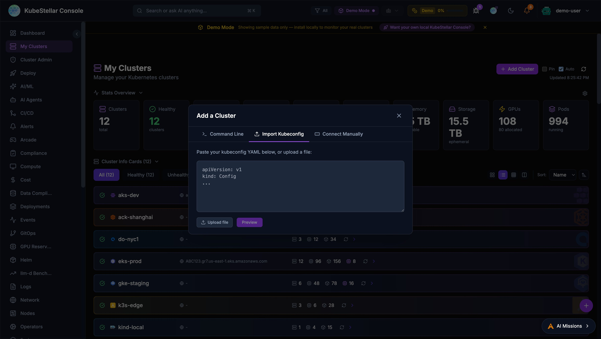

Paste or upload a kubeconfig file to import clusters:

- Preview which contexts are new vs. already existing
- One-click merge into your active kubeconfig
- Automatic backup of your current kubeconfig (`~/.kube/config.bak-<timestamp>`)
- Requires kc-agent to be connected

### Connect Manually

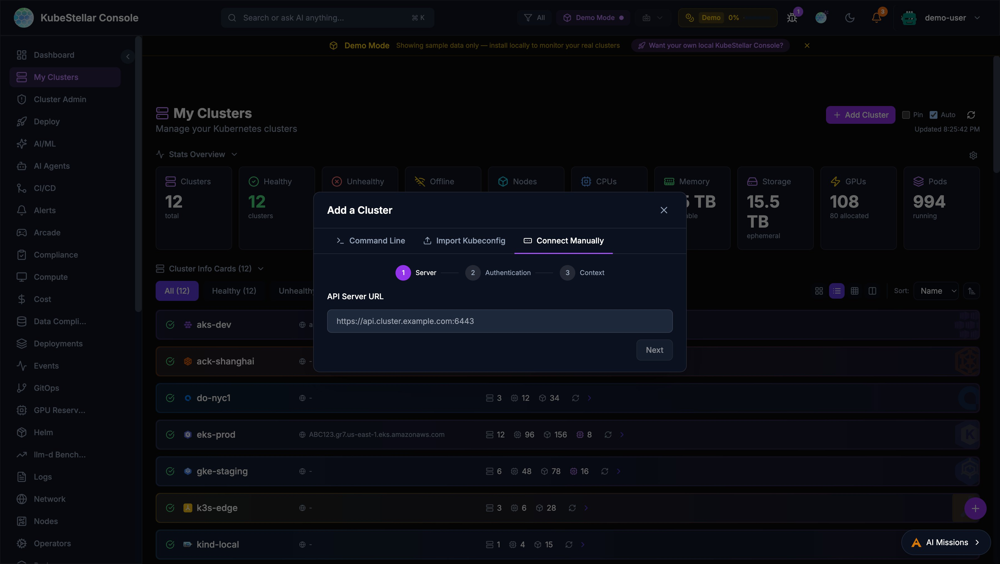

A 3-step wizard for manual cluster connection:

1. **Server URL**: Enter the Kubernetes API server address
2. **Authentication**: Choose between bearer token or client certificate
3. **Context settings**: Name and configure the context

A **Test Connection** button verifies the cluster is reachable before adding it.

---

## GPU Node Health Monitor

A new **Proactive GPU Node Health Monitor** card provides comprehensive health checking for GPU nodes across all connected clusters.

### Health Check Tiers

The monitor runs checks at four configurable tiers:

| Tier | Name | What It Checks |
|------|------|----------------|
| **Tier 1** | Critical | Node ready, cordoned status, stuck pods, NVIDIA operator pods, GPU reset/XID events |
| **Tier 2** | Standard | + Capacity vs allocatable mismatch, pending GPU pods, pressure conditions |
| **Tier 3** | Full | + Zero utilization, MIG drift, RDMA pods, failed jobs, evicted pods |
| **Tier 4** | Deep | + nvidia-smi (ECC errors, temperature), dmesg GPU kernel errors, NVLink status |

### CronJob Management

Install and manage GPU health check CronJobs directly from the card:

- Configure target namespace and cron schedule
- Install/uninstall per cluster
- Results stored in ConfigMaps with version stamps
- RBAC-aware: only authorized users see install/uninstall buttons

### Alert Integration

GPU health issues integrate with the alert system:

- `gpu_health_cronjob` condition type
- Browser notifications with deep-link to affected nodes
- AI Diagnose button for automated troubleshooting

---

## Accessibility (WCAG 2.1 AA)

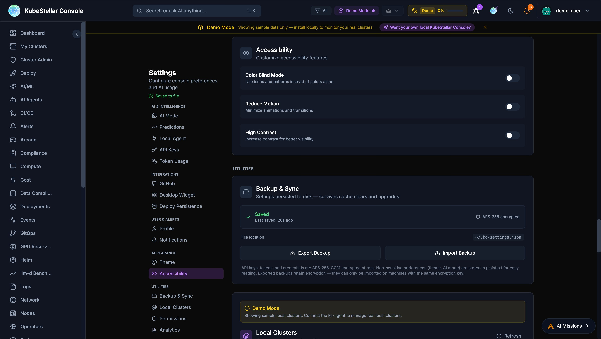

The console now meets WCAG 2.1 AA accessibility standards with three phases of improvements.

### Keyboard Navigation

- **Tab**: Navigate between dashboard cards with visible focus rings
- **Enter/Space**: Open expanded card view
- **Arrow keys**: Navigate the card grid
- **Escape**: Close modals with automatic focus restoration
- **Skip-to-content**: Press Tab on page load to skip navigation

### Screen Reader Support

- ARIA live regions announce dynamic content changes (demo/live badges, failure indicators, refresh status)
- Accessible names on cluster status badges, run dots, and chart containers
- Semantic ARIA landmarks for page regions
- Card menus use `role="menu"` and `role="menuitem"`

### Visual Accessibility

Configure in **Settings > Appearance > Accessibility**:
- Color blind mode
- Reduce motion
- High contrast mode

---

## GA4 Product Telemetry

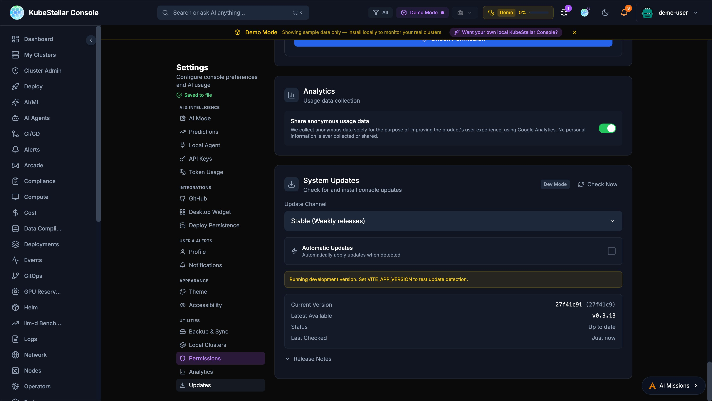

Anonymous Google Analytics 4 telemetry helps improve the product experience.

### What Is Collected

- Page views and navigation patterns
- Card interactions (add, remove, drag, expand, configure)
- AI mission lifecycle events
- Auth events and tour progress
- All events prefixed with `ksc_` — no PII is collected

### Opting Out

Navigate to **Settings > Analytics** and toggle the analytics switch off.

### Admin Configuration

Set the GA4 measurement ID via environment variable:

```bash
VITE_GA_MEASUREMENT_ID=G-XXXXXXXXXX
```

---

## AI Coding Agent Providers

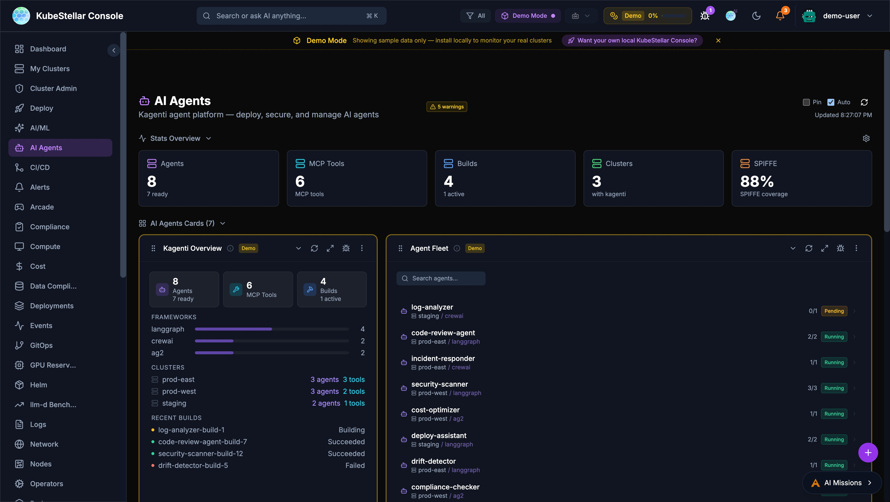

The console now supports 17+ AI coding agent providers with a mixed-mode architecture.

### Supported Providers

| Category | Providers |
|----------|-----------|
| **CLI Agents** | Claude Code, Codex, Gemini CLI, Antigravity, Bob |
| **IDE Agents** | GitHub Copilot, Cursor, VS Code, Windsurf, JetBrains, Zed |
| **API Agents** | Claude Desktop, Open WebUI, Raycast |
| **Frameworks** | Cline, Continue |

### Mixed-Mode Architecture

API agents (thinking) and CLI agents (execution) can work together:
- API agent reasons about the task
- CLI agent executes tools and commands
- API agent analyzes results

Provider capabilities are defined by a bitmask: Chat (1), ToolExec (2), or both (3).

---

## Contribute Dialog

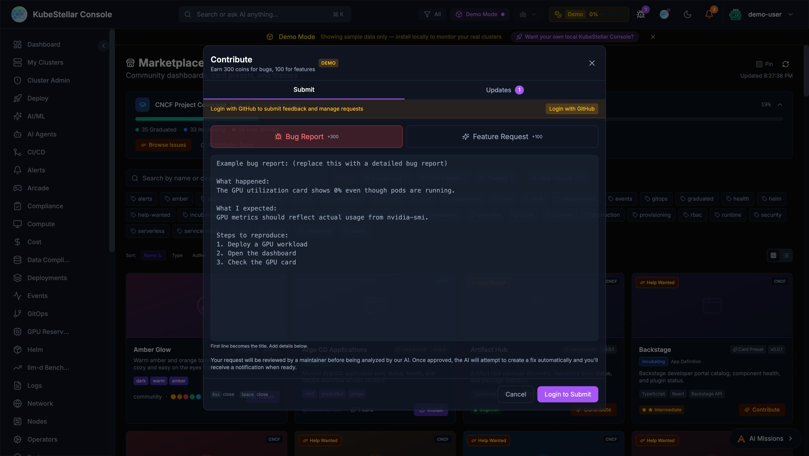

The feedback system has been redesigned as a unified **Contribute** dialog.

### Entry Points

- **Navbar bug icon**: Opens the Contribute dialog
- **Per-card bug button**: Every card toolbar now has a bug report icon that pre-fills context
- **Profile dropdown**: "Contribute" menu item

### Submit Tab

- **Bug Report** (+300 coins) and **Feature Request** (+100 coins)
- First line auto-extracts as title
- Enlarged textarea with example prompts
- Submissions open GitHub issues for tracking

### Updates Tab

Merged view of your requests, notifications, and GitHub contributions in a single scrollable list.

### GitHub Activity Rewards

Earn coins from GitHub activity across kubestellar and llm-d organizations:

| Activity | Coins |
|----------|-------|
| Bug issue opened | 300 |
| Feature issue opened | 100 |
| Other issue opened | 50 |
| PR opened | 200 |
| PR merged | 500 |

---

## Contributor Ladder

An 8-tier progression system rewards sustained community contributions:

| Tier | Level | Coin Threshold |
|------|-------|----------------|
| 1 | Observer | 0 |
| 2 | Participant | 100 |
| 3 | Contributor | 500 |
| 4 | Active Contributor | 1,500 |
| 5 | Reviewer | 5,000 |
| 6 | Maintainer | 15,000 |
| 7 | Lead | 50,000 |
| 8 | Legend | 150,000 |

Your level badge appears in the profile dropdown with a progress bar showing advancement toward the next tier.

---

## Marketplace Author Profiles

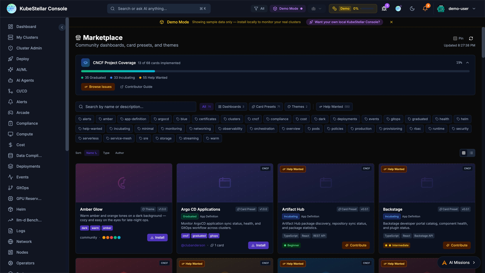

Marketplace items now display author attribution:

- **GitHub handle**: Linked `@handle` with profile URL
- **Hover cards**: Show GitHub avatar, coin count (100 coins per merged PR), and per-repo PR breakdown
- **Grid view**: Full hover card on author name
- **List view**: Compact clickable link

---

## Flatcar Container Linux Card

A new **Flatcar Container Linux Status** card in the Provisioning category:

- Node count running Flatcar Container Linux
- OS version distribution across nodes
- Update status — whether all Flatcar nodes are up to date
- Health indicator based on update currency
- Demo mode with realistic mock data; live mode from Kubernetes Node info

---

## Real-Time Cluster Creation Progress

Creating or deleting clusters now shows phased progress with real-time WebSocket updates:

- **Progress states**: `validating` → `creating`/`deleting` → `done`/`failed`
- Inline progress banner with spinner and progress bar
- **Docker pre-flight check**: Catches missing Docker daemon before kind/k3d creation fails
- Auto-refreshes cluster list on completion
- Auto-dismiss on success

---

## KeepAlive Route Caching

Dashboard navigation is ~18% faster with KeepAlive route caching:

- Previously visited dashboards render instantly without re-mounting or re-fetching
- LRU cache preserves up to 8 route component instances
- No configuration needed — transparent performance improvement

---

## Mission Explorer / Browser (New in March 2026)

The Deploy page now includes a full-featured **Mission Browser** for discovering, sharing, and importing deployment missions across your multi-cluster environment.

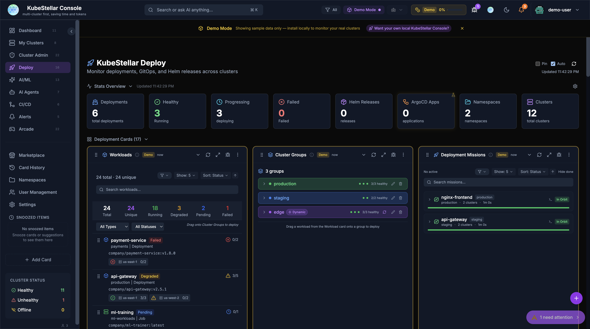

### Mission Discovery

The Mission Browser provides a searchable, filterable catalog of deployment missions:

- **Installer Tab**: Pre-built installer missions for common infrastructure (Helm charts, operators, CNCF projects)
- **Solution Tab**: End-to-end solution missions that combine multiple components
- **Progressive Loading**: Missions load incrementally with shimmer skeleton placeholders for smooth UX
- **Deep-Links**: Every mission has a shareable URL that preserves query parameters through OAuth login flows

### Mission Sharing and Import

- **Share Missions**: Generate shareable links to specific missions with embedded configuration
- **Smart Import Browser**: Browse and import missions from the community with AI-powered recommendations
- **Security Scanning**: Imported missions are automatically scanned for security issues before deployment
- **Saved Missions Panel**: Quick access to previously saved missions from the sidebar

### Mission Detail View

Clicking a mission opens a detail view with:

- Full description and prerequisites
- Step-by-step installation instructions
- Configuration options with sensible defaults
- Target cluster selection with compatibility checks
- Shimmer loading skeleton during data fetch for polished UX

---

## Declarative GitOps Restart (Argo CD Integration)

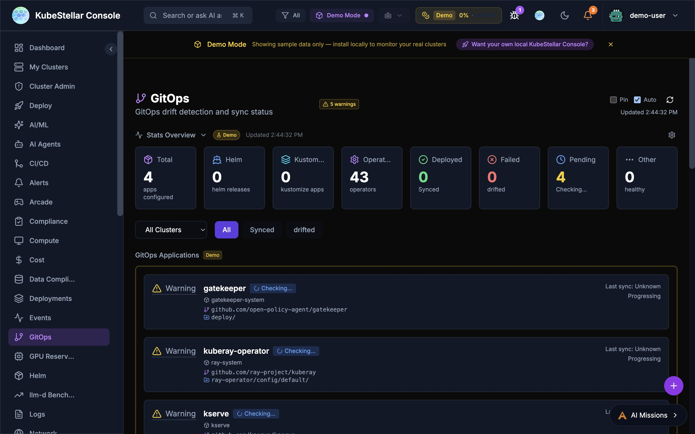

The GitOps dashboard now includes enhanced Argo CD integration with declarative restart capabilities.

### Sync Now Button

The Argo CD card now includes a **Sync Now** button that triggers an immediate sync of ArgoCD applications:

- One-click sync for individual applications
- Bulk sync for all applications in a cluster
- Real-time sync status updates via SSE streaming

### GitOps Restart Tab

A new **GitOps Restart** tab in the Argo CD drilldown view provides:

- Declarative restart of ArgoCD-managed applications
- Rolling restart with configurable strategy (RollingUpdate, Recreate)
- Restart history with timestamps and initiator tracking
- Integration with the alert system for restart failures

---

## Developer Setup Dialog

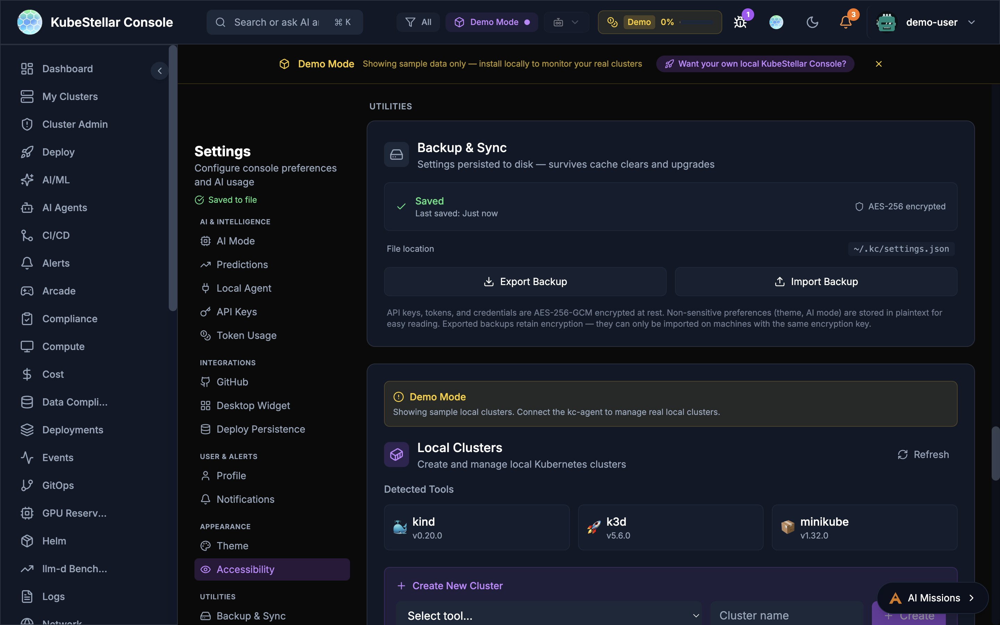

A new **Developer Setup** dialog helps contributors run the console from source with full OAuth integration.

### Environment Prerequisites

The Developer channel in Settings > Updates now shows a comprehensive environment checklist:

- **kc-agent**: Connection status to the local Kubernetes agent
- **Coding agent**: Whether a coding agent (Claude Code, Cursor, etc.) is detected
- **OAuth**: GitHub OAuth configuration status (Detected/Configured/Not Set)
- **GitHub token**: Token status for API access
- **Install mode**: Source (dev) vs binary vs Helm detection
- **Git status**: Uncommitted changes warning

### Source Update Workflow

For developers running from source:

1. **Pull & Build**: One-click command to pull latest code and rebuild
2. **Restart**: Restart all processes (frontend, backend, kc-agent)
3. **Automatic Updates**: Toggle to automatically apply updates when detected
4. **Version tracking**: Shows current commit, latest on main, and commit diff

---

## Contributor Leaderboard

The Updates tab in the Settings page now includes a **Contributor Leaderboard** that ranks community members by their contributions.

### Ranking Criteria

Contributors are ranked by a composite score including:

- Pull requests merged
- Issues opened and resolved
- Code review activity
- Documentation contributions

### Display

- Top contributors shown with GitHub avatars and contribution counts
- Per-repository breakdown of activity
- Historical trend showing contribution velocity

---

## AI Agent Improvements

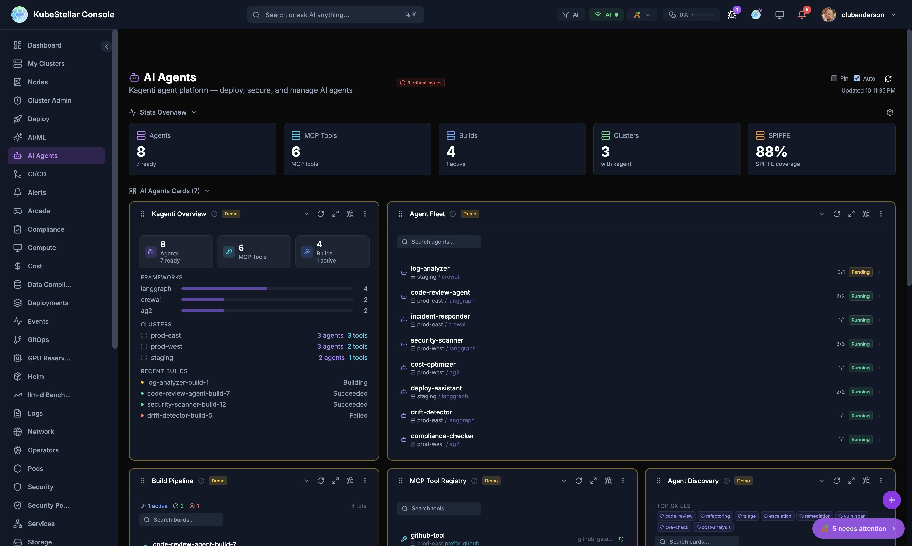

The AI Agents dashboard has received significant usability improvements.

### Agent On/Off Toggle

- New toggle switch to enable/disable individual AI agents
- Agent state persists across sessions with agent memory
- Visual "Live" indicator shows when an agent is actively processing

### None Option

- A new "None" option allows disabling all AI agents while keeping the dashboard visible
- Useful for monitoring agent status without active AI assistance
- The header AI indicator shows the current agent state (AI On/Off/None)

### Agent Fleet Enhancements

The Agent Fleet card now shows:

- Framework information (LangGraph, CrewAI, AG2) per agent
- Build status with recent build history
- MCP Tool Registry with searchable tool listing
- Agent Discovery with skill tags and cost analysis capabilities

---

## New Monitoring Cards

Several new monitoring cards have been added to the card catalog.

### CRI-O Runtime Card

Monitors CRI-O container runtime across clusters:

- Container count and runtime version
- Image pull statistics and cache hit rates
- Runtime health status per node

### Contour Ingress Card

Monitors Contour/Envoy ingress controllers:

- HTTP proxy count and status
- Request throughput and latency metrics
- TLS certificate expiry tracking

### CoreDNS Card

Monitors CoreDNS instances across clusters:

- Query rate and cache hit percentage
- Error rate and SERVFAIL tracking
- Per-zone query distribution

### Thanos Card

Monitors Thanos components for long-term Prometheus storage:

- Store gateway status and block count
- Query frontend cache hit rates
- Compactor progress and retention status

---

## OPA Policy Improvements

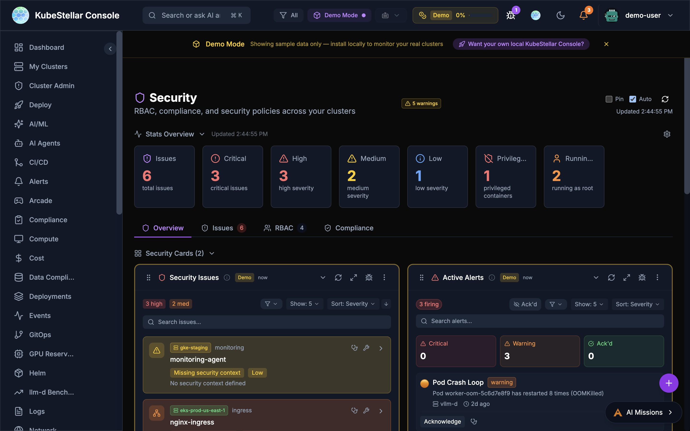

The OPA (Open Policy Agent) integration has been significantly enhanced.

### AI-Driven Create Policy Modal

- New **Create Policy** modal with AI-assisted policy generation
- Describe your policy intent in natural language
- AI generates Rego policy code with proper constraint templates
- Preview and test policies before deployment

### Parallel Cluster Checks

- OPA policy checks now run in parallel across all connected clusters
- Dramatically reduced check times for environments with many clusters
- Progress indicator shows check completion per cluster

### Two-Phase Loading

- Phase 1: Load policy metadata (fast, cached)
- Phase 2: Load violation data (background, per-cluster)
- Cards show policy structure immediately, then populate violation counts

---

## Alert Deduplication

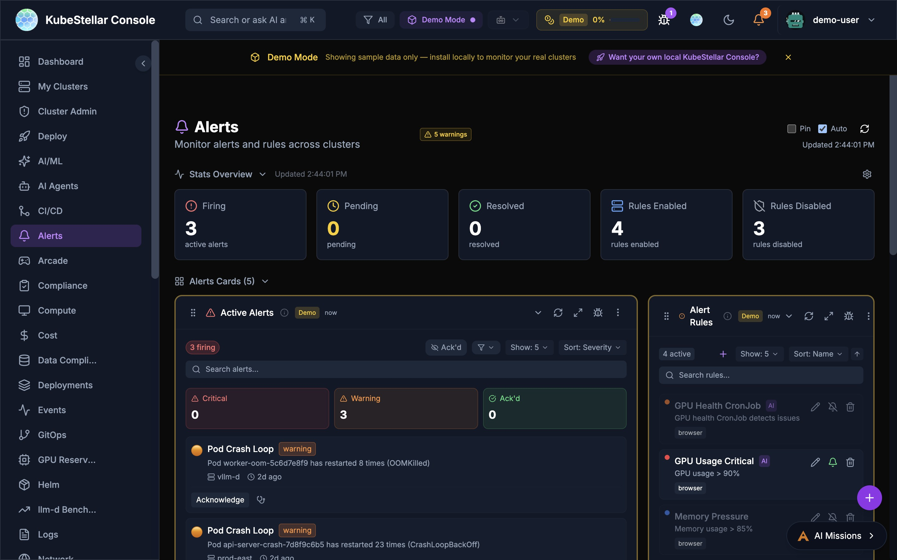

The alert system now includes **type-aware deduplication** to prevent duplicate alerts from cluttering the dashboard.

### How It Works

- Alerts are deduplicated based on a composite key of: alert type, source cluster, affected resource, and severity
- When duplicate alerts arrive, the system increments a count rather than showing separate entries
- The most recent occurrence timestamp is preserved
- Deduplication works across both real-time SSE streams and REST polling

### Benefits

- Cleaner alert view during cluster-wide events (e.g., node failures that trigger many pod alerts)
- Accurate alert counts without inflation from duplicate sources
- Faster alert page rendering with fewer DOM elements

---

## macOS Native Notifications

Console notifications now integrate with macOS native notifications:

- Alerts and critical events trigger native macOS notification banners
- **Clicking a notification opens the console** and navigates to the relevant page
- Notification grouping by severity level
- Configurable in Settings > Notifications

---

## Marketplace Theme Persistence

Marketplace themes now survive localStorage clears:

- Theme selections are backed up to the server-side user profile
- On localStorage clear (e.g., browser cache wipe), themes are restored from the server
- No more losing custom theme selections after clearing browser data

---

## OAuth Status Improvements

The OAuth status indicator in the developer panel has been improved:

- **No more false "not configured" flash** during startup
- OAuth status shows accurate state immediately: Detecting -> Configured/Not Set
- Deep-link query parameters are preserved through the OAuth login flow
- Returning from GitHub OAuth redirects to the original deep-linked page

---

## Performance Improvements

### Vendor Splitting and Compression

- JavaScript bundles are now split by vendor to optimize caching
- Gzip and Brotli compression reduce transfer sizes
- Vendor chunks (React, D3, etc.) are cached separately from application code
- Cache headers ensure vendor chunks survive application updates

### Dashboard Import Suggestions

- Lazy Knowledge Base matching for import suggestions
- Suggestions load progressively as the KB is indexed
- Reduced initial page load by deferring suggestion computation

---

## GA4 Analytics Enhancements

### Campaign Tracking

- UTM parameter support for tracking traffic sources
- Campaign-aware event tagging for marketing attribution
- Referrer tracking for community link sharing

### Engagement Time Fix

- Corrected engagement time calculation for accurate session duration reporting
- Page visibility API integration ensures background tabs don't inflate metrics

---

## Shimmer Loading Skeleton

Mission detail views and other data-heavy pages now use **shimmer loading skeletons** instead of spinners:

- Anatomically correct placeholders that match the final layout
- Smooth shimmer animation for perceived performance
- Progressive content reveal as data arrives
- Applied to mission details, cluster cards, and agent fleet views

---

## Accessibility Improvements

Additional accessibility improvements in this release:

### ARIA Labels

- Comprehensive ARIA labels on all interactive elements
- Screen reader announcements for dynamic state changes
- Improved focus management in modals and dropdowns

### Touch Targets

- All interactive elements now meet the 44px minimum touch target size
- Improved tap accuracy on mobile and tablet devices
- Consistent button sizing across the sidebar and toolbar

### Keyboard Navigation

- Full keyboard navigation support for the mission browser
- Arrow key navigation in card grids
- Escape key handling in all modal and dropdown contexts

---

## Direct Issue Route (New in March 2026)

Navigate to `/issue` in your running console to immediately open the feedback modal. This route can be shared as a direct link for bug reports and feature requests (e.g., `http://localhost:8080/issue`).

- Requires GitHub OAuth to be configured
- The route redirects to the dashboard and opens the Contribute dialog automatically
- Referenced in [CONTRIBUTING.md](https://github.com/kubestellar/console/blob/main/CONTRIBUTING.md) for quick issue filing

---

## Resizable Sidebar (New in March 2026)

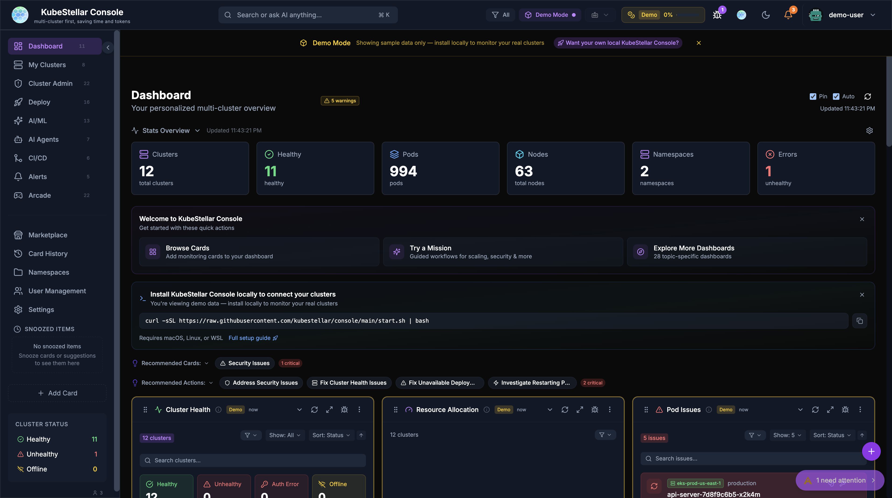

The sidebar is now resizable by dragging its edge:

- Drag to adjust sidebar width to your preference
- Width persists across sessions
- Aligned item counts for cleaner visual hierarchy
- Labels that don't fit show full text on hover via tooltip
- Cluster status section shows healthy/unhealthy/offline counts at a glance

---

## Getting Started Banner (New in March 2026)

The dashboard now features a consolidated **Getting Started** banner that guides new users through setup:

- Context-aware CTAs that progress based on what you've already done
- Install locally via `curl` command, connect clusters, or explore demo mode
- The banner auto-hides once setup is complete
- Replaces the previous scattered mission CTAs for a cleaner onboarding experience

---

## WSL Support (New in March 2026)

WSL (Windows Subsystem for Linux) is now supported across all installation methods:

- Installation CTAs include WSL instructions alongside macOS and Linux
- `start.sh` and `startup-oauth.sh` work inside WSL environments
- Documented in the Getting Started banner and deploy page

---

## Recommendation Panel Improvements (New in March 2026)

Recommendation panels (Recommended Cards, Recommended Actions) have been streamlined:

- Panels auto-collapse by default to reduce visual noise
- Collapse/expand state persists across sessions
- Neutralized panel colors for a less distracting appearance
- SmartCardSuggestions feature removed in favor of the simplified panels

---

## 3D Globe Visualization Refresh (New in March 2026)

The 3D globe on the login page has been polished:

- Updated cluster labels: "Console" replaces "KubeStellar", "AI Cortex" replaces "KubeFlex Core"
- More professional rendering with improved materials and lighting
- Smoother animations and label placement

---

## Design System Standardization (New in March 2026)

A comprehensive design system overhaul improves visual consistency:

- **Color palette consolidated**: Indigo merged into blue, pink merged into purple — fewer colors, more consistent
- **Semantic design tokens**: All hardcoded gray/emerald/rose values replaced with theme-aware tokens
- **StatusBadge component**: 200+ inline badge spans migrated to a shared component for consistent status display
- **Button component**: 88+ inline button elements migrated to a shared component
- **Modal backdrop blur**: Standardized 24px blur across all overlays

---

## Helm Chart Security Defaults (New in March 2026)

The Helm chart now includes production-grade security defaults out of the box:

- **NetworkPolicy**: Restricts ingress/egress traffic
- **PodDisruptionBudget**: Ensures availability during node maintenance
- **securityContext**: Non-root user, read-only filesystem, dropped capabilities
- **Dockerfile hardened**: Non-root user, healthcheck endpoint, `.dockerignore` for smaller images

---

## Lima Card (New in March 2026)

A new monitoring card for [Lima](https://lima-vm.io/) — Linux virtual machine manager:

- Monitors Lima VM instances
- Shows VM status, resource usage, and health
- Available in the card catalog under the Compute category

---

## CI/CD Dashboard Layout (New in March 2026)

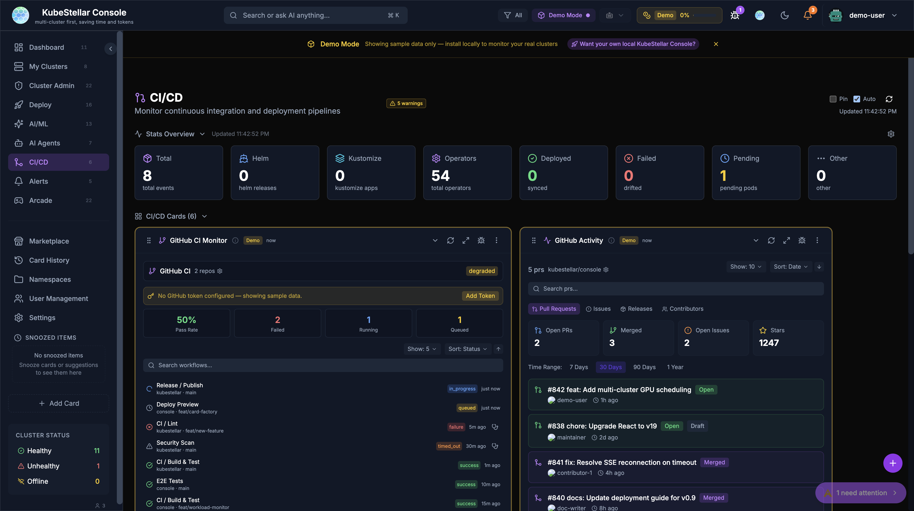

The CI/CD dashboard has been reorganized:

- GitHub-related cards (GitHub CI Monitor, GitHub Activity) moved to the top for better visibility
- Improved card ordering for the most common CI/CD workflows

---

## Cluster Admin Dashboard (New in March 2026)

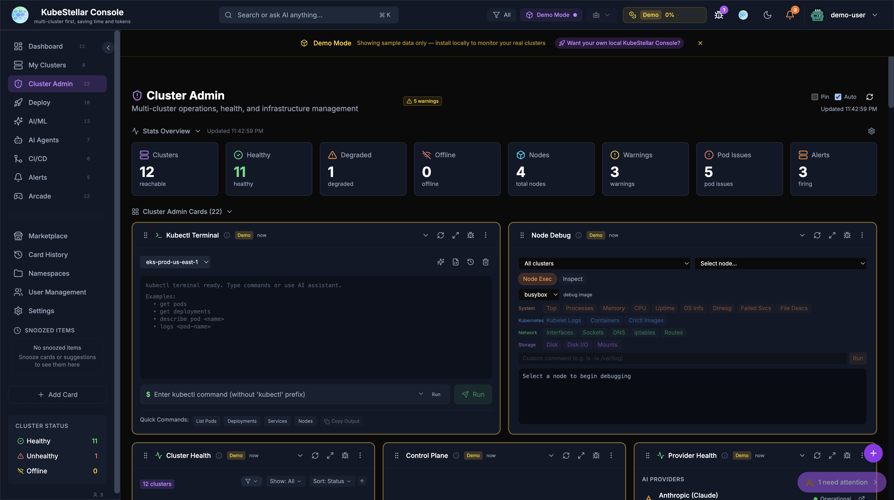

The Cluster Admin dashboard has been reordered for better workflow:

- Most important operational cards prioritized at the top
- Kubectl Terminal and Node Debug prominently placed
- Cluster Health and Control Plane cards in the second row

---

## AI/ML Dashboard Updates (New in March 2026)

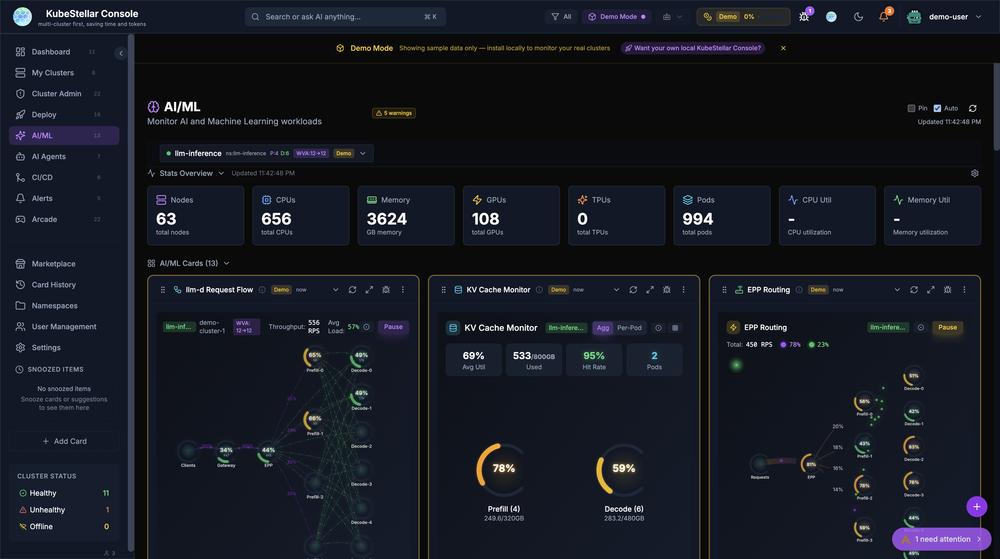

The AI/ML dashboard now properly shows demo data badges on all cards when running in demo mode, ensuring users can distinguish between real and sample data across all 13 AI/ML monitoring cards.

---

## Helm Self-Upgrade (New in March 2026)

The console can now upgrade itself when deployed via Helm — no manual `helm upgrade` required.

### How it works

1. Backend discovers its own Deployment via `app.kubernetes.io/name=kubestellar-console` labels
2. Uses `SelfSubjectAccessReview` to verify the ServiceAccount can patch Deployments
3. When triggered from Settings, applies a JSON patch to update the container image tag
4. Kubernetes rolls the new pod; the console shows a progress UI with restart polling

### Configuration

- Opt-in via `selfUpgrade.enabled=true` in Helm values (enabled by default for new Helm installs)
- JWT-authenticated API endpoint prevents unauthorized upgrades
- Progress bar and restart detection in the Settings page

### Related PRs

- Helm self-upgrade via Deployment image patch (#2318)
- Restart polling and progress UI (#2413)
- JWT auth for self-upgrade API calls (#2334)
- Enable selfUpgrade by default for Helm installs (#2330)

---

## Pod Exec Terminal (New in March 2026)


Interactive shell sessions directly from the console — no need to switch to `kubectl exec`.

### Features

- Full interactive terminal powered by xterm.js
- Accessible as an "Exec" tab in pod drill-down views
- Container picker for multi-container pods
- Auto-reconnect on connection drops
- JWT-authenticated WebSocket connection

### How to use

1. Navigate to a pod (via Workloads dashboard or search)
2. Click the **Exec** tab
3. Select a container (if the pod has multiple)
4. Start typing commands in the terminal

### Related PRs

- Add pod exec terminal (#2213)
- Fix exec WebSocket blocked by middleware (#2250)
- Fix container name extraction (#2247)
- Add JWT authentication to /ws/exec endpoint (#2416)

---

## Helm Write Operations (New in March 2026)

Full Helm release management — not just read-only monitoring:

| Operation | Where | Safety |
|-----------|-------|--------|
| **Rollback** | Revision history row → Rollback button | Confirmation dialog |
| **Uninstall** | Release overview → Danger Zone | Confirmation dialog + release name verification |
| **Upgrade** | Release overview → Upgrade button | Version selection + dry-run preview |

Completes Helm release management feature parity with Lens.

### Related PRs

- Add Helm write operations: rollback, uninstall, upgrade (#2214)

---

## CRD Browser (New in March 2026)

The CRD Browser is now wired to real backend data:

- Lists all CRDs across all connected clusters via the Kubernetes dynamic client
- Shows group, scope, versions, and status conditions (Established/NotEstablished/Terminating)
- Local cache with 5-minute expiry and auto-refresh every 2 minutes
- Falls back to demo data when no clusters are connected

### Related PRs

- Wire CRD browser to real backend API (#2210)

---

## White-Label System (New in March 2026)

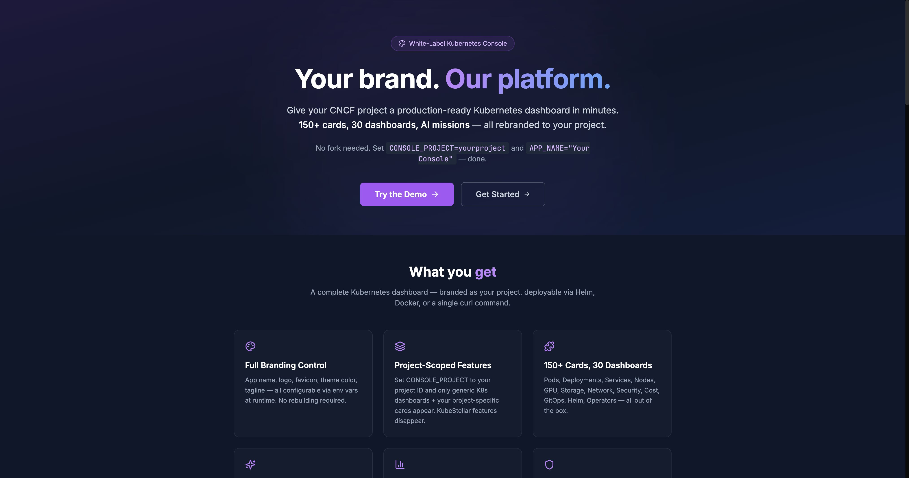

The console can now be deployed as a branded dashboard for any CNCF or open-source project.

### How it works

Set `CONSOLE_PROJECT=crossplane` (or any project name) and the console shows only generic Kubernetes cards — no KubeStellar branding or features.

### Two independent systems

1. **Project system** — `CONSOLE_PROJECT` env var controls which cards, dashboards, and routes are active
2. **Theme system** — Custom colors and branding per project

### Landing page

The `/white-label` page explains the system with:
- Deployment tabs (binary, Helm, Docker)
- Branding env var reference table
- Feature overview and visibility matrix
- Analytics tracking for engagement

### Related PRs

- White-label project system for CNCF adoption (#2520)
- Add /white-label landing page (#2536)

---

## CNCF Ecosystem Cards (New in March 2026)

Five new cards for monitoring popular CNCF projects across your fleet:

### KubeVela Application Delivery

- Shows controller health, OAM application delivery status, workflow progress
- Component and trait counts across clusters
- Category: App Definition

### KEDA Autoscaler Status

- Detects KEDA operator pods via label-filtered query
- Shows operator health, scaled object stats with replica progress bars
- Trigger details (consumer groups, Prometheus queries, etc.)
- Category: Orchestration

### Strimzi Kafka Status

- Detects Kafka broker and operator pods via label matching
- Displays cluster health, broker readiness, topic status
- Consumer group lag monitoring
- Category: Streaming & Messaging

### OpenFeature Status

- Detects flagd/OpenFeature operator pods
- Shows provider health (flagd, LaunchDarkly, Split, etc.)
- Feature flag stats and evaluation counts
- Category: App Definition

### Compliance Trestle (OSCAL)

- Integrates OSCAL-based compliance assessment from the CNCF Sandbox project
- Shows overall compliance score and per-profile breakdowns (NIST 800-53, FedRAMP)
- Per-cluster compliance status
- AI mission prompts for installation and troubleshooting
- Category: Compliance

### Related PRs

- Add KubeVela application delivery status card (#2427)
- Add KEDA autoscaler status card (#2420)
- Add Strimzi Kafka status card (#2419)
- Add OpenFeature status card (#2418)
- Add Compliance Trestle (OSCAL) card (#2553)

---

## Recommended Policies Card (New in March 2026)

AI-powered fleet-wide compliance gap analysis on the compliance dashboard:

- Analyzes policy gaps across the entire fleet
- Identifies which recommended security policies are missing from which clusters
- One-click **"Deploy All"** button triggers an AI mission that deploys missing policies across every eligible cluster
- Individual **"Deploy"** buttons per recommendation for granular control
- Fleet coverage gauge showing overall policy adoption

### Related PRs

- Recommended Policies card — AI-powered fleet-wide compliance gap analysis (#2163)

---

## Compliance Dashboard Streaming (New in March 2026)

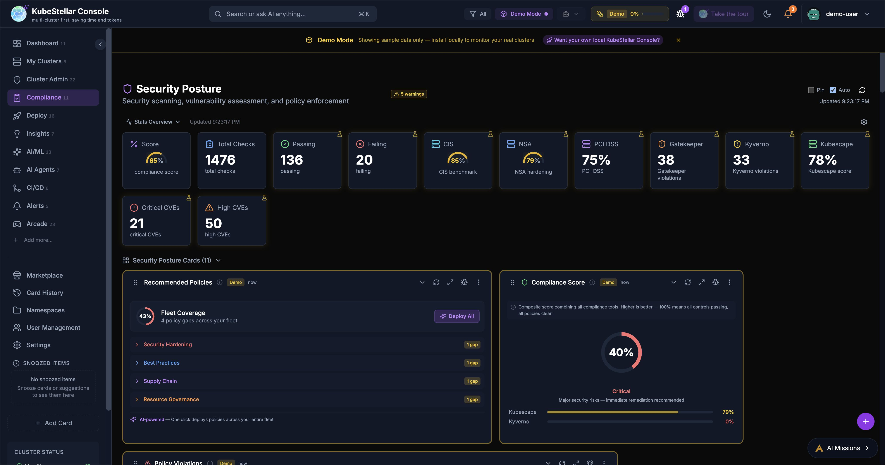

The compliance dashboard now loads data progressively:

- **Progressive streaming** — Cards appear as data arrives from each cluster, rather than waiting for all clusters to respond
- **Progress rings** — Visual indicators show data loading progress per card
- **Framework descriptions** — Each compliance card now includes context about the framework it monitors
- **Cluster badges** — Always visible on compliance cards showing which clusters participate

### Related PRs

- Add progressive streaming to all compliance dashboard cards (#2578)
- Add progress ring to remaining compliance cards (#2585)
- Progressive streaming for compliance hooks (#2167)
- Add framework descriptions and context (#2166)

---

## Stat Block Visualization Modes (New in March 2026)

Stats blocks now support **9 display modes** instead of just numbers:

| Mode | Visual | Best for |
|------|--------|----------|
| **numeric** | Big number (default) | Everything |
| **sparkline** | Mini area chart + number | Trends over time |
| **gauge** | Semicircular arc | Percentages, scores |
| **ring** | Circular progress | Utilization, completion |
| **mini-bar** | Horizontal progress bar | Any bounded value |
| **trend** | Number + ▲/▼ arrow + % change | Issue counts, alerts |
| **stacked-bar** | Segmented horizontal bar | Breakdowns |
| **heatmap** | Background color intensity | Severity (errors, issues) |
| **horseshoe** | 270° arc gauge | Percentages, scores |

### How to switch modes

Hover over any stat block → click the gear icon → select a mode from the dropdown.

### Smart defaults

- Clusters unhealthy/unreachable → **heatmap** (glows red as count increases)
- Workload healthy % → **horseshoe** gauge
- Resource utilization → **ring** progress

### Related PRs

- Add configurable visualization modes for stat blocks (#2561)
- Add trend, stacked-bar, heatmap, and horseshoe stat block modes (#2566)

---

## Undo/Redo for All Dashboards (New in March 2026)

Every dashboard now supports undo and redo:

- Snapshot-based history (max 30 levels)
- Tracks all card mutations: add, remove, configure, resize, reorder, reset
- Keyboard shortcuts: `Ctrl+Z` (undo), `Ctrl+Shift+Z` (redo)
- Also accessible via the FAB (floating action button) menu
- Reset button now always works correctly (compares current layout to defaults)

### Related PRs

- Fix Reset button + add undo/redo for all dashboards (#2252)
- Wire undo/redo into main dashboard + collapse update prereqs (#2261)

---

## Mission Improvements (New in March 2026)

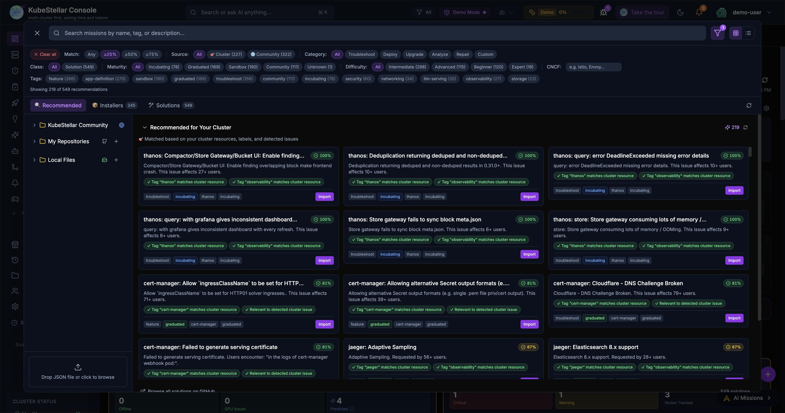

Several improvements to the AI Missions system:

- **YAML export** — Share Mission dialog now includes a YAML export option for mission configurations
- **Inline title rename** — Rename missions directly from the chat header without opening a separate dialog
- **Virtualized browser** — Mission browser uses virtualization for large mission lists (better performance with 100+ missions)
- **AI actions in Trivy modal** — Vulnerability modal now includes AI mission actions for remediation
- **Back button** — All mission conversation states now have a back button for navigation
- **429 quota handling** — Graceful handling when AI provider rate limits are hit, with message size validation
- **Stuck mission fix** — Missions no longer get stuck in Running/Processing state indefinitely

### Related PRs

- Add YAML export option to Share Mission dialog (#2363)
- Add inline mission title rename from chat header (#2628)
- Virtualize MissionBrowser for large mission lists (#2507)
- Add AI Mission actions to Trivy vulnerability modal (#2181)
- Add back button to all mission conversation states (#2304)
- Fix AI Mission 429 quota errors and add message size validation (#2495)
- Fix AI missions remaining in Running/Processing state indefinitely (#2498)

---

## From-Lens Migration Page (New in March 2026)

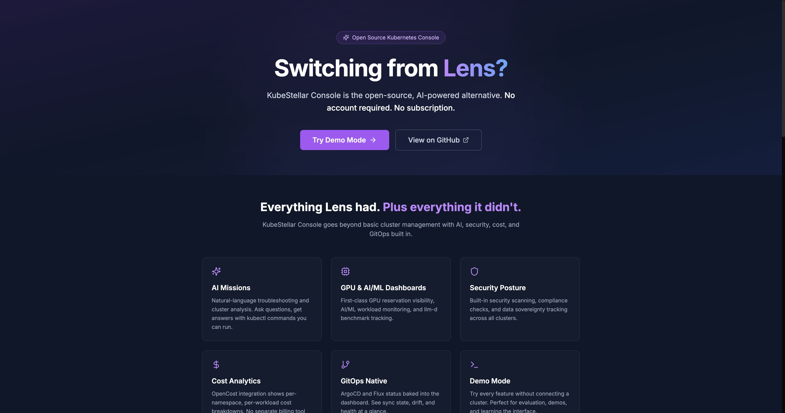

A dedicated landing page at `/from-lens` for users migrating from Lens:

- Step-by-step installation (binary, Helm, Docker)
- Cluster deployment option with Helm ingress template
- Feature comparison positioning Console as a complement, not competitor
- Analytics tracking for tab switches and command copies

### Related PRs

- Wire live backends for topology/ArgoCD cards and add Lens migration page (#2206)
- Fix /from-lens: split commands, remove false claims (#2262)
- Add cluster deployment option to from-lens page (#2321)

---

## From-Headlamp Landing Page (New in March 2026)

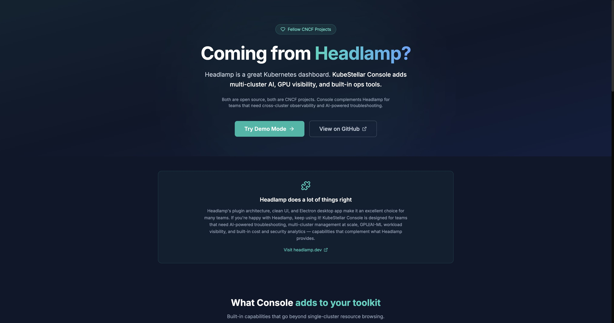

A landing page at `/from-headlamp` for users coming from the Headlamp Kubernetes dashboard:

- Collegial tone — Headlamp is a fellow CNCF Sandbox project
- Positions Console as a complement, not a competitor
- Teal accent color and respectful messaging with link to headlamp.dev
- Same installation structure as the from-lens page

### Related PRs

- Add /from-headlamp landing page (#2475)

---

## In-Cluster Agent Banner (New in March 2026)

When the console is running in-cluster (Helm) without a kc-agent connection:

- Blue **"Agent Not Detected"** banner appears
- Clicking opens a modal with two paths:
  1. **Install the kc-agent** — brew install or build from source
  2. **Already have an agent?** — Configure CORS with `KC_ALLOWED_ORIGINS`
- Collapsible "Why is CORS needed?" section
- Auto-dismisses when agent connects

### Related PRs

- In-cluster agent banner with setup dialog (#2310)

---

## Auto Demo Mode for Helm (New in March 2026)

When deployed via Helm with no OAuth and no kc-agent, the console auto-enables demo mode:

- Same instant-dashboard experience as console.kubestellar.io
- Eliminates login page friction for the `helm install → port-forward → open browser` flow
- When OAuth IS configured, the login page still appears as normal

### Related PRs

- Auto-enable demo mode for Helm installs (#2292)

---

## New User Cluster Prompt (New in March 2026)

New users are now prompted to create or connect a cluster:

- Appears on first visit when no clusters are detected
- Guides users through the setup process
- Reduces time-to-value for new installations

### Related PRs

- Prompt new users to create/connect a cluster (#2315)

---

## DiskPressure & MemoryPressure Alerts (New in March 2026)

New built-in alert evaluators for node resource pressure:

- **DiskPressure** — Fires when nodes report disk pressure condition (critical severity, enabled by default)
- **MemoryPressure** — Fires when nodes report memory pressure condition
- **PIDPressure** — Fires when nodes report PID pressure condition
- Backend detects conditions from cluster health data and reports affected node names
- Browser notifications with deep links to affected nodes
- Auto-resolves when conditions clear

### Related PRs

- Add DiskPressure/MemoryPressure node condition alerts (#2317)

---

## Analytics Dashboard (New in March 2026)

A comprehensive analytics dashboard for understanding console usage:

- **Mission analytics** — Track AI mission creation, completion, and engagement
- **Card analytics** — Per-card error breakdown with sparkline trends
- **Feature analytics** — Usage tracking across features
- **Retention analytics** — User return rates and session depth
- **Error tracking** — GA4-tracked runtime errors with sparkline trends
- **Bot filtering** — Automated/bot traffic is filtered out of analytics
- **Umami dual tracking** — Running alongside GA4 for validation

### Related PRs

- Add mission, card, feature, retention & error analytics sections (#2173)
- Add sparkline trends to analytics error tracking (#2178)
- Add per-card error breakdown (#2179)
- Filter localhost dev traffic (#2195)

---

## GA4 Error Monitor (New in March 2026)

Automated error monitoring that creates GitHub issues from production error spikes:

- Monitors GA4 error events (card_render, uncaught_render, chunk_load)
- Automatically creates GitHub issues when error counts spike
- Reduces manual monitoring overhead

### Related PRs

- Add GA4 error monitor — auto-creates issues from production error spikes (#2570)

---

## Install Conversion Funnel (New in March 2026)

Track the full user journey from page view to agent connection:

- Unified `ksc_install_command_copied` analytics event across all copy buttons
- 6-step funnel: Page View → Login → Command Copied → Agent Connected → Dashboard → Retention
- Daily install conversion rate chart on the analytics dashboard
- Replaced bounce rate KPI with install conversion rate

### Related PRs

- Add install conversion funnel (#2590)
- Add daily install conversion rate line (#2592)

---

## Settings Improvements (New in March 2026)

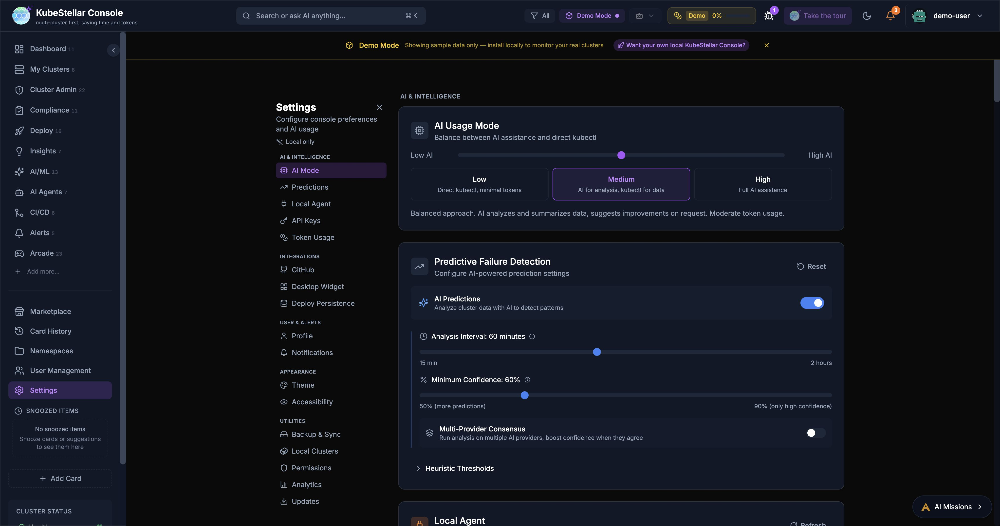

- **Close/back button** — Settings page now has a close button to return to the previous page
- **Feedback GitHub token** — New settings section for configuring the FEEDBACK_GITHUB_TOKEN
- **Sidebar scroll fix** — Sidebar no longer scrolls back to top on navigation click

### Related PRs

- Add close/back button to Settings page (#2625)
- Add feedback GitHub token settings support (#2414)
- Add FEEDBACK_GITHUB_TOKEN status display to Settings (#2511)

---

## Security Hardening Sprint (March 2026)

A comprehensive security hardening effort covering the full stack:

### Authentication & Authorization

- **JWT auth on WebSocket exec** — Pod exec terminal now requires JWT authentication
- **JWT auth for SSE** — Server-sent events use fetch-based delivery instead of EventSource for secure JWT delivery
- **HttpOnly cookies** — JWT auth plumbing for HTTP-only cookie delivery
- **Server-side token revocation** — JTI-based blocklist for revoking tokens
- **Rate limiting** — Auth and API endpoints now have rate limits
- **OAuth scope reduction** — Only requests `user:email` scope (removed `read:user`)
- **TTL expiry for OAuth state** — Prevents stale/replayed OAuth state values

### Input Validation & Sanitization

- **Helm/kubectl param validation** — Input validation for command parameters
- **Path/ref sanitization** — Sanitize path and ref params in mission handlers
- **Repo allowlist** — Validate repo params against an allowlist in nightly E2E handler
- **XSS fix** — RSS parser switched from `innerHTML` to `DOMParser`

### Infrastructure Security

- **Security response headers** — Added to Go backend (CSP, HSTS, X-Frame-Options, etc.)
- **CodeQL analysis** — Automated security scanning workflow
- **Dependabot** — Enabled for Go, npm, and GitHub Actions dependencies
- **Pin CI tools to SHA** — Reusable workflows pinned to commit SHA
- **Sandbox hardening** — Dynamic card sandbox blocks global access and prototype pollution

### Data Protection

- **PAT moved to backend** — GitHub PAT stored in backend-only storage via API proxy
- **Webhook secret required** — Origin validation bypass fixed
- **SQLite data loss prevention** — Prevents data loss during Helm upgrades
- **Ownership verification** — Feedback issue handlers verify resource ownership

### Related PRs

- Add JWT auth to /ws/exec (#2416), self-upgrade API (#2334), SSE (#2449)
- Add security response headers (#2428)
- Add rate limiting (#2448)
- Server-side token revocation (#2451)
- CodeQL analysis (#2454)
- Enable Dependabot (#2421)
- Fix XSS in RSS parser (#2422)
- Harden dynamic card sandbox (#2473)
- HttpOnly cookie for JWT auth (#2474)
- Require webhook secret (#2453)
- Sanitize path and ref params (#2430)
- Add input validation for helm/kubectl params (#2424)
- Pin reusable workflows to SHA (#2426)
- Fix critical script injection in copilot-recovery workflow (#2415)
- Move GitHub PAT to backend-only storage (#2460)
- Remove read:user OAuth scope (#2521)
- Add TTL expiry to OAuth state store (#2557)
- Add ownership verification to feedback handlers (#2556)
- Prevent SQLite data loss during Helm upgrades (#2535)
- Fix undici vulnerability (#2550)

---

## Generic Custom Resources API (New in March 2026)

New backend endpoint for querying any custom resource across clusters:

- `GET /api/custom-resources` with group, version, resource parameters
- Enables the CRD browser to display actual CR instances
- Used by ecosystem cards (KubeVela, KEDA, Strimzi, OpenFeature) for data fetching

### Related PRs

- Add generic custom resources API endpoint (#2455)

---

## Lazy-loaded Event Drill-Down (New in March 2026)

The Events drill-down view is now lazy-loaded for better initial bundle size:

- Reduces the main bundle by deferring event-related code
- Improves initial page load performance
- Transparent to users — loads on first navigation to events

### Related PRs

- Lazy-load EventsDrillDown for better initial bundle size (#2619)

---

## Console Documentation Issue Reporting (New in March 2026)

Users can now report documentation issues directly from the console:

- New option in the feedback/help menu
- Creates a GitHub issue on the docs repository with relevant context
- Streamlines the feedback loop between users and documentation maintainers

### Related PRs

- Add console documentation issue reporting option (#2529)

---

## SEO & Discovery (New in March 2026)

Improved discoverability of the console:

- **29 landing pages** — One for each dashboard route, optimized for Google indexing
- **Full internal link graph** — All landing pages cross-link for crawler discovery
- **Artifact Hub listing** — Helm chart published to Artifact Hub for discovery
- **Helm chart validation CI** — Automated validation of chart metadata

### Related PRs

- SEO: Add landing pages for all 29 dashboard routes (#2202)
- SEO: Add full internal link graph (#2203)
- Add Artifact Hub metadata (#2201)
- Add Helm chart validation CI (#2204)

---

## Trestle Card Streaming (New in March 2026)

The Trestle/OSCAL compliance card uses progressive streaming with parallel cluster checks:

- Race CRD/deployment checks in parallel for instant Trestle detection
- Stream data progressively from each cluster as it arrives
- Significantly faster time-to-first-data on the compliance dashboard

### Related PRs

- Stream Trestle card data progressively with parallel cluster checks (#2564)
- Race CRD/deployment checks in parallel for instant Trestle detection (#2565)
