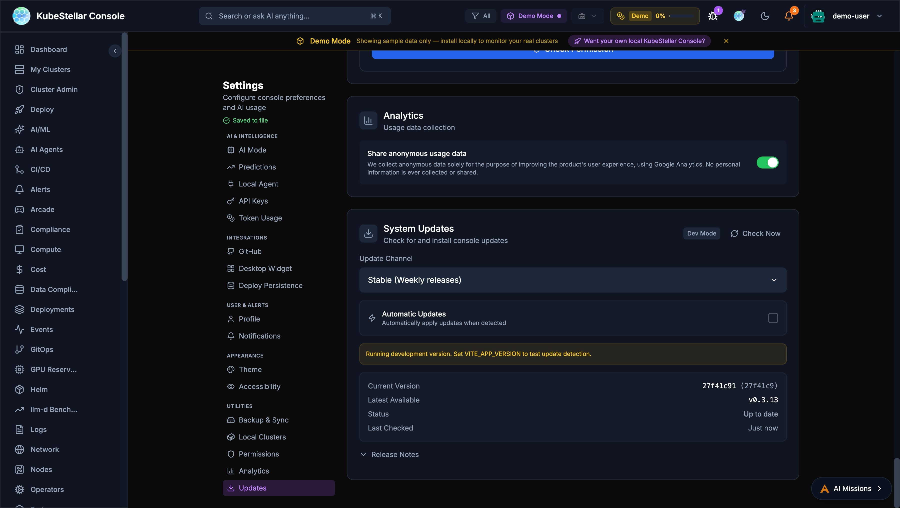

# Updates and Releases

The KubeStellar Console follows a regular release schedule with two update channels.

## Release Channels

### Stable (Weekly)

The stable channel receives tested releases every week:

- **Version format**: `v0.x.y-weekly.YYYYMMDD`
- **Release day**: Every Monday
- **Recommended for**: Production environments

Weekly releases include:
- Bug fixes from the previous week
- Performance improvements
- Security patches
- Tested new features

### Nightly

The nightly channel provides the latest development builds:

- **Version format**: `v0.x.y-nightly.YYYYMMDD`
- **Release frequency**: Daily at midnight UTC
- **Recommended for**: Testing and development

Nightly releases include:
- Latest features and improvements
- Experimental functionality
- May contain bugs or incomplete features

### Developer

The developer channel tracks the `main` branch by commit SHA:

- **Version format**: Tracks latest commit SHA on `main`
- **Release frequency**: Every commit to main
- **Recommended for**: Console developers and contributors

Developer channel features:
- Environment prerequisites checklist (kc-agent, coding agent, OAuth, install mode, git status)
- Collapsible list of recent commits between your build and latest `main` HEAD
- Commit list items link to their GitHub PRs
- 2-step manual update instructions (Pull & Build, then Restart)

### Auto-Update System



The console includes a built-in auto-update system:

- **Automatic Updates toggle**: Enable/disable in Settings > System Updates
- **Update Now button**: Manually trigger an update check and apply
- **Real-time progress**: WebSocket-powered progress banner during updates
- **Safety features**:
  - Uncommitted changes detection before updating
  - Health check after restart
  - Automatic rollback on failure
- **Install method detection**: `dev` (source), `binary` (downloaded), `helm` (in-cluster — auto-update disabled)

#### kc-agent Self-Update

The local agent (kc-agent) can self-update:

1. Pulls latest source from GitHub
2. Rebuilds itself
3. `exec()`s into the new binary seamlessly
4. No manual restart required

## Checking for Updates


### From the Settings Page

1. Navigate to **Settings** in the sidebar
2. Scroll to the **System Updates** section
3. View current version and latest available
4. Click **Check Now** to manually check for updates

The settings page displays:
- **Update Channel**: Current release channel
- **Current Version**: Installed version with commit hash
- **Latest Available**: Newest version in your channel
- **Status**: Whether you're up to date
- **Last Checked**: When updates were last checked

### Automatic Checks

The console automatically checks for updates:
- On startup
- Every 6 hours while running
- When switching release channels

## Switching Channels

To switch between stable and nightly:

1. Go to **Settings** > **System Updates**
2. Click the **Update Channel** button
3. Select your preferred channel
4. The console will check for the latest version in that channel

**Note**: Switching from stable to nightly may introduce newer (potentially unstable) features. Switching from nightly to stable may require waiting for the next weekly release.

## Version Information

The version is displayed in multiple locations:

- **Settings page**: Full version with commit hash
- **Footer**: Abbreviated version
- **About dialog**: Complete version details

Example version: `v0.3.6-nightly.20260127 (71e4039)`

- `v0.3.6`: Semantic version
- `nightly`: Release channel
- `20260127`: Release date (January 27, 2026)
- `71e4039`: Git commit hash

## Update Notifications

When a new version is available:

1. A notification badge appears in the header
2. The settings page shows "Update Available"
3. Release notes are displayed for major changes

## Manual Installation

To manually update or install a specific version:

### Using npm

```bash
# Clone the repository
git clone https://github.com/kubestellar/console.git
cd console/web

# Install dependencies
npm install

# Start in development mode
npm run dev -- --port 5174
```

### Using Docker

```bash
# Pull the latest image
docker pull quay.io/kubestellar/console:latest

# Or a specific version
docker pull quay.io/kubestellar/console:v0.3.6-weekly.20260127
```

## Release Notes

Release notes are published:

- In the console's update notification
- On the [GitHub Releases page](https://github.com/kubestellar/console/releases)
- In the [KubeStellar blog](https://kubestellar.io/blog)

## Rollback

If you encounter issues with a new version:

1. Note your current version
2. Check out the previous tag from Git
3. Rebuild and restart the console

```bash
# List available versions
git tag -l

# Checkout a specific version
git checkout v0.3.5-weekly.20260120

# Rebuild
npm install && npm run build
```

## Support

For update-related issues:

- Check the [console documentation](readme.md)
- Search [GitHub Issues](https://github.com/kubestellar/console/issues)
- Ask in the [KubeStellar Slack](https://kubestellar.io/community)
