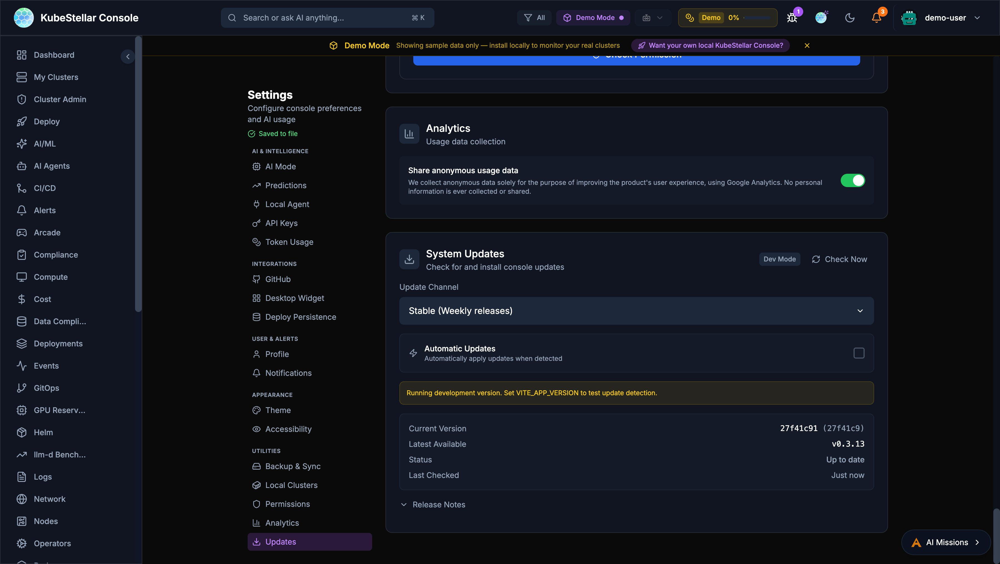
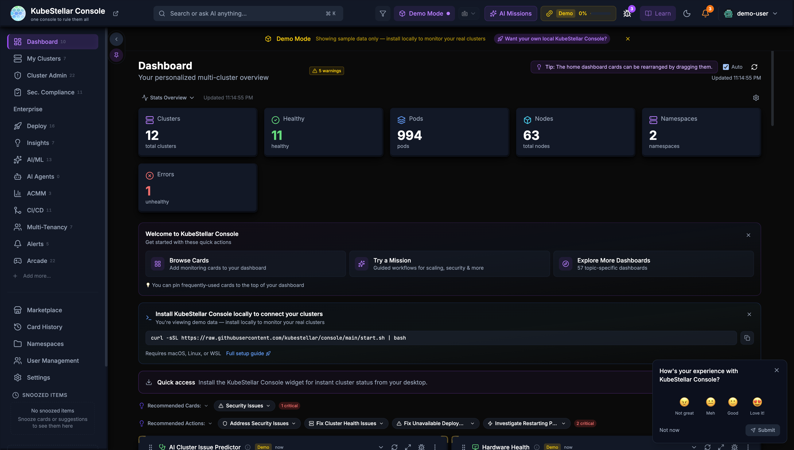
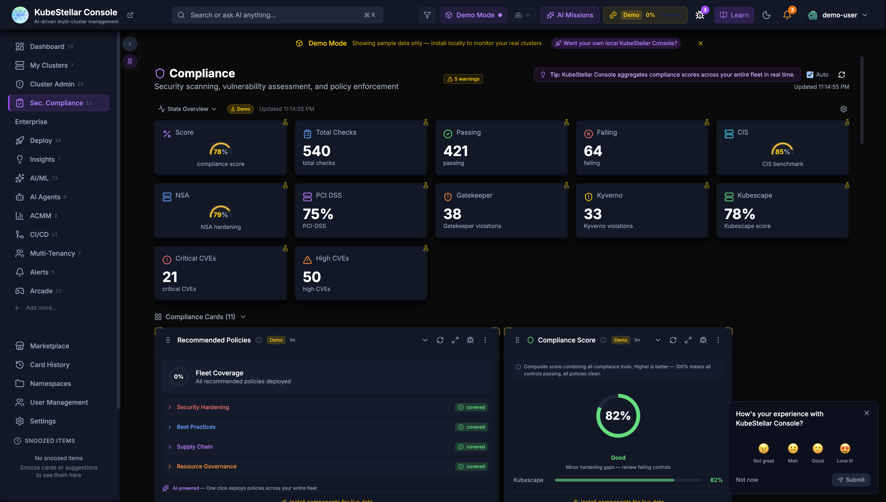
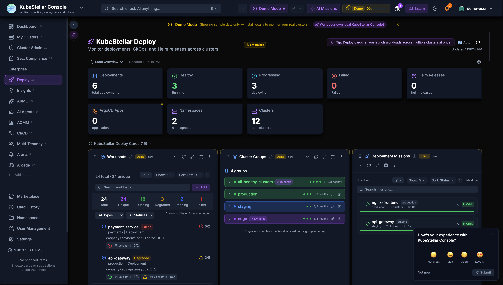
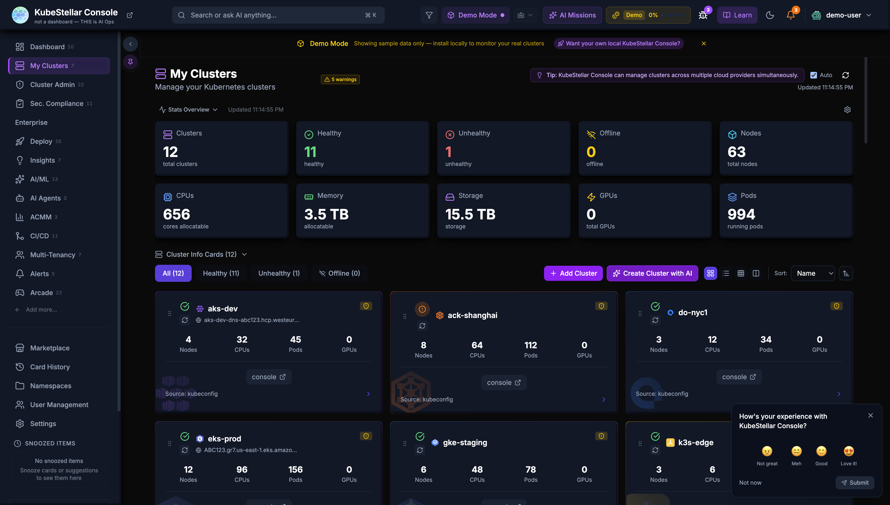

# Updates and Releases

The KubeStellar Console follows a regular release schedule with two update channels.

## Release Channels

### Stable (Weekly)

The stable channel receives tested releases every week:

- **Version format**: `v0.x.y-weekly.YYYYMMDD`
- **Release day**: Every Monday
- **Recommended for**: Production environments

Weekly releases include:
- Bug fixes from the previous week
- Performance improvements
- Security patches
- Tested new features

### Nightly

The nightly channel provides the latest development builds:

- **Version format**: `v0.x.y-nightly.YYYYMMDD`
- **Release frequency**: Daily at midnight UTC
- **Recommended for**: Testing and development

Nightly releases include:
- Latest features and improvements
- Experimental functionality
- May contain bugs or incomplete features

### Developer

The developer channel tracks the `main` branch by commit SHA:

- **Version format**: Tracks latest commit SHA on `main`
- **Release frequency**: Every commit to main
- **Recommended for**: Console developers and contributors

Developer channel features:
- Environment prerequisites checklist (kc-agent, coding agent, OAuth, install mode, git status)
- Collapsible list of recent commits between your build and latest `main` HEAD
- Commit list items link to their GitHub PRs
- 2-step manual update instructions (Pull & Build, then Restart)

### Auto-Update System


The console includes a built-in auto-update system:

- **Automatic Updates toggle**: Enable/disable in Settings > System Updates
- **Update Now button**: Manually trigger an update check and apply
- **Real-time progress**: WebSocket-powered progress banner during updates
- **Safety features**:
  - Uncommitted changes detection before updating
  - Health check after restart with configurable timeout
  - Automatic rollback on failure
  - Graceful shutdown of running processes before update
  - Progress reporting via WebSocket with percentage steps
- **Resilience** (New in March 2026):
  - Retry logic with exponential backoff for git pull and build steps
  - Process cleanup ensures no orphan Go or npm processes after update
  - Health check verifies the backend responds on the expected port before declaring success
  - Detailed error messages when updates fail, with instructions to recover manually
- **Install method detection**: `dev` (source), `binary` (downloaded), `helm` (in-cluster — auto-update disabled)

#### kc-agent Self-Update

The local agent (kc-agent) can self-update:

1. Pulls latest source from GitHub
2. Rebuilds itself
3. `exec()`s into the new binary seamlessly
4. No manual restart required

## Checking for Updates



### From the Settings Page

1. Navigate to **Settings** in the sidebar
2. Scroll to the **System Updates** section
3. View current version and latest available
4. Click **Check Now** to manually check for updates

The settings page displays:
- **Update Channel**: Current release channel
- **Current Version**: Installed version with commit hash
- **Latest Available**: Newest version in your channel
- **Status**: Whether you're up to date
- **Last Checked**: When updates were last checked

### Automatic Checks

The console automatically checks for updates:
- On startup
- Every 6 hours while running
- When switching release channels

## Switching Channels

To switch between stable and nightly:

1. Go to **Settings** > **System Updates**
2. Click the **Update Channel** button
3. Select your preferred channel
4. The console will check for the latest version in that channel

**Note**: Switching from stable to nightly may introduce newer (potentially unstable) features. Switching from nightly to stable may require waiting for the next weekly release.

## Version Information

The version is displayed in multiple locations:

- **Settings page**: Full version with commit hash
- **Footer**: Abbreviated version
- **About dialog**: Complete version details

Example version: `v0.3.6-nightly.20260127 (71e4039)`

- `v0.3.6`: Semantic version
- `nightly`: Release channel
- `20260127`: Release date (January 27, 2026)
- `71e4039`: Git commit hash

## Update Notifications

When a new version is available:

1. A notification badge appears in the header
2. The settings page shows "Update Available"
3. Release notes are displayed for major changes

## Manual Installation

To manually update or install a specific version:

### Using npm

#### Quick Start (Frontend Only)

```bash
# Clone the repository
git clone https://github.com/kubestellar/console.git
cd console/web

# Install dependencies
npm install

# Start in development mode
npm run dev -- --port 5174
```

> **Note**: This starts only the frontend. For full functionality, you also need to run the backend (see below).

#### Complete Setup (Frontend + Backend + Agent)

**Terminal 1 - Backend API Server:**

```bash
# From the repository root
cd console
go build -o bin/console ./cmd/console
./bin/console
```

The backend will start on **http://localhost:8080**.

**Terminal 2 - kc-agent (MCP + WebSocket):**

```bash
# From the repository root
cd console
go build -o bin/kc-agent ./cmd/kc-agent
./bin/kc-agent
```

The agent will start on **http://localhost:8585**.

**Terminal 3 - Frontend Dev Server:**

```bash
# From the repository root
cd console/web
npm install
npm run dev -- --port 5174
```

Open **http://localhost:5174** in your browser.

> **💡 Tip**: For simplified startup, use the provided startup scripts:
> - `./start-dev.sh` for development mode (no OAuth)
> - `./startup-oauth.sh` for GitHub OAuth mode
>
> See the [Local Setup Guide](local-setup.md) for details.
### Using Docker

```bash
# Pull the latest image
docker pull quay.io/kubestellar/console:latest

# Or a specific version
docker pull quay.io/kubestellar/console:v0.3.6-weekly.20260127
```

## Recent Changes (Apr 23–29, 2026)

### New Features

- **One-Click GitHub OAuth Setup** (PR #10931, #10980) — Set up GitHub authentication in a single click using GitHub's App Manifest flow. No manual client ID/secret configuration needed. See [Authentication](authentication.md#one-click-app-manifest-flow).
- **Microphone & File Attachment in AI Missions** (PR #10732) — The AI Missions chat input now includes microphone (speech-to-text) and file attachment buttons for richer interaction.
- **Recently Deleted Drafts with Restore** (PR #10701) — Accidentally deleted mission drafts can now be recovered from a "recently deleted" list.
- **Empty State Handling for Dashboard Cards** (PR #10827) — Dashboard cards display a meaningful empty state instead of blank layouts when no data is available.
- **Confirmation Dialogs for Destructive Actions** (PR #10707) — Delete actions now prompt for confirmation before proceeding.

### Bug Fixes (User-Facing)

- **SSE Streams No Longer Cut Off at 60s** (PR #10868) — Live log tailing and mission updates via server-sent events now persist beyond the previous 60-second write deadline.
- **Compliance Page Header Fixed** (PR #10690) — The Compliance page now correctly shows "Compliance" instead of "Security Posture".
- **Namespace Selector in Logs & Events** (PR #10846) — The namespace dropdown now correctly populates and filters log output.
- **Kagenti Error Messages** (PR #10847) — Agent connection failures now show actionable guidance instead of raw error strings.
- **Marketplace Grid Responsiveness** (PR #10730) — The marketplace card grid no longer overflows when the sidebar panel is open.
- **Settings Token Save Race Condition** (PR #10744, #10834) — Saving API keys or tokens no longer clobbers other settings changed in the same session.
- **Feature Request Cross-Repo Routing** (PR #10819) — Feature requests now correctly route to the intended target repository.
- **Navbar Overflow Labels** (PR #10697) — Navigation items in the overflow menu now display text labels, not just icons.
- **Chat History Navigation** (PR #10789) — Improved keyboard navigation through previous AI Missions messages.

### Security

- **Namespace API Admin Guard** (PR #10839) — Namespace access endpoints are now restricted to admin-role users.
- **Axios CVE-2026-42035 Patched** (PR #10821) — Upgraded axios to 1.15.1+ to address a known vulnerability.
- **12 Missing Netlify API Redirects** (PR #10856) — Production API routes that were returning 404 now correctly proxy to backend handlers.

### Configuration

- **42+ Environment Variables Documented** (PR #10881) — The `.env.example` file now documents over 40 previously undocumented environment variables for self-hosted deployments.

### Screenshots









---

## Release Notes

Release notes are published:

- In the console's update notification
- On the [GitHub Releases page](https://github.com/kubestellar/console/releases)
- In the [KubeStellar blog](https://kubestellar.io/blog)

## Rollback

If you encounter issues with a new version:

1. Note your current version
2. Check out the previous tag from Git
3. Rebuild and restart the console

```bash
# List available versions
git tag -l

# Checkout a specific version
git checkout v0.3.5-weekly.20260120

# Rebuild
npm install && npm run build
```

## Support

For update-related issues:

- Check the [console documentation](readme.md)
- Search [GitHub Issues](https://github.com/kubestellar/console/issues)
- Ask in the [KubeStellar Slack](https://kubestellar.io/community)
