# Dashboards — Multi-Cluster Kubernetes Monitoring

KubeStellar Console has 29+ dashboards for multi-cluster Kubernetes monitoring. Each dashboard gives you fleet-wide visibility into a specific operational area across all your connected clusters.

## Main Dashboard

**Route:** `/`

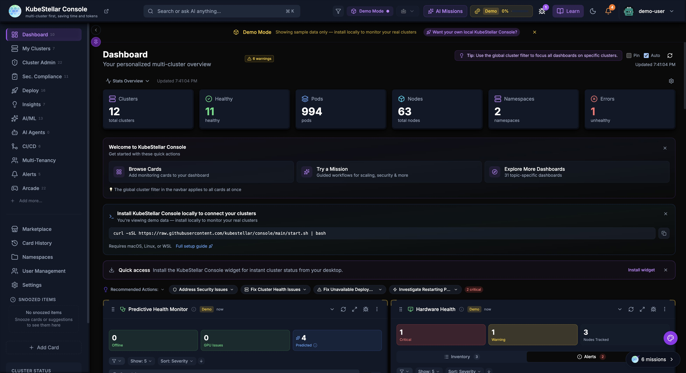

This is your home page. It shows:
- Overview of all your clusters
- Cards you've chosen to see
- Quick stats at the top
- Console Studio access via Cmd/Ctrl+K for card and dashboard customization
- AI suggestions for what to look at

The main dashboard learns what you care about and shows those things first.

---

## Dedicated Dashboards (29)

### Clusters Dashboard

**Route:** `/clusters`

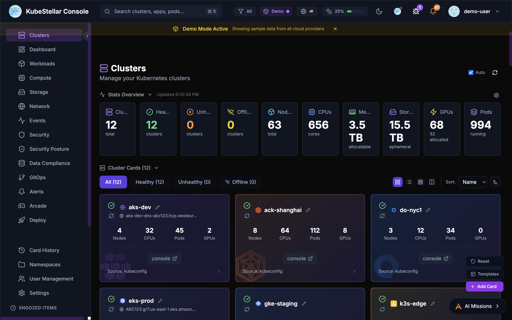

See all your Kubernetes clusters:
- Which clusters are healthy (green)
- Which clusters have problems (red)
- Which clusters are offline (gray)
- Quick links to each cluster's native console

**Best for:** Checking if all your clusters are working

---

### Workloads Dashboard

**Route:** `/workloads`

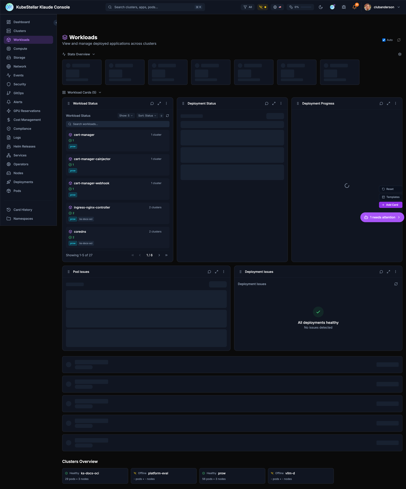

See all your running applications:
- Deployments and their status
- Pods that are having problems
- Which apps are healthy

**Best for:** Making sure your applications are running

---

### Compute Dashboard

**Route:** `/compute`

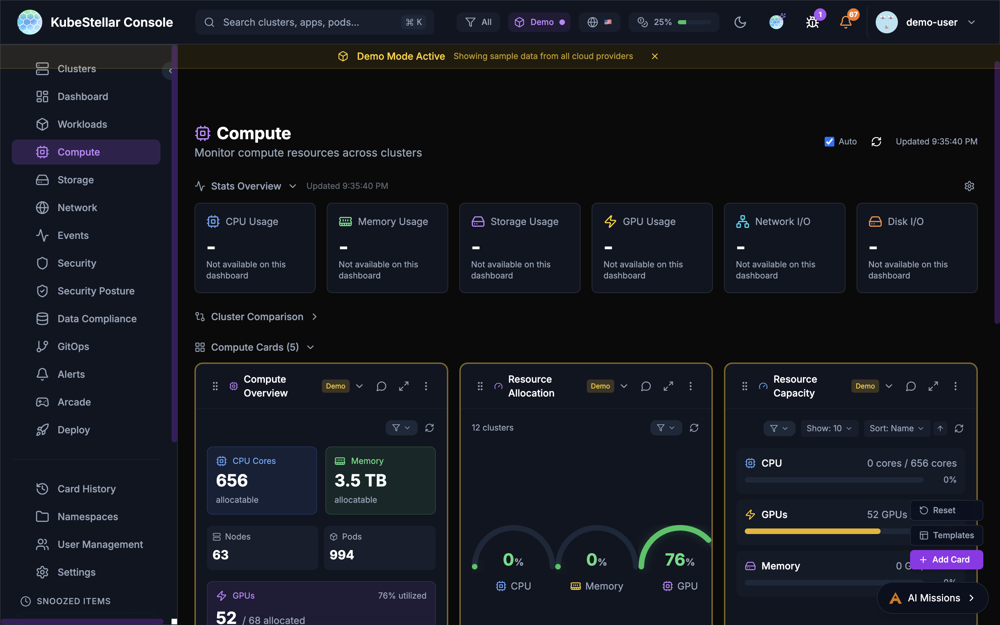

See your compute resources:
- How many CPUs you have
- How much memory is available
- GPU usage (important for AI workloads!)
- Top pods using resources

**Best for:** Checking if you have enough resources

---

### Storage Dashboard

**Route:** `/storage`

See your storage:
- Persistent Volume Claims (PVCs)
- Storage classes
- Which volumes are bound or pending

**Best for:** Managing disk space for your apps

---

### Network Dashboard

**Route:** `/network`

See your networking:
- Services and their types
- LoadBalancers
- Ingresses
- Endpoints

**Best for:** Understanding how traffic flows

---

### Events Dashboard

**Route:** `/events`

See what's happening:
- Recent events from all clusters
- Warnings that need attention
- Normal events
- Filter by time or type

**Best for:** Troubleshooting when something goes wrong

---

### Security Dashboard

**Route:** `/security`

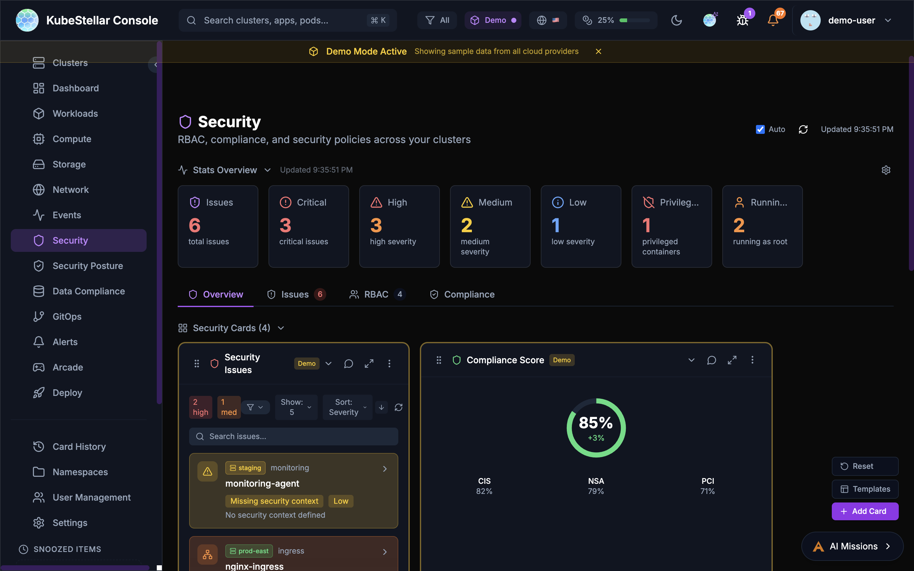

Find security issues:
- Containers running as root
- Privileged containers
- Missing security contexts
- Critical and high severity issues

**Best for:** Keeping your clusters secure

---

### Security Posture Dashboard

**Route:** `/security-posture`

Comprehensive security scanning, vulnerability assessment, and policy enforcement:

- **Compliance Score**: Overall security score across all clusters (e.g., 78%)
- **Total Checks**: Count of all security checks performed (405+)
- **Benchmark Scores**: CIS, NSA, PCI-DSS benchmark compliance percentages
- **Policy Violations**: Real-time violation tracking with severity breakdown
- **OPA Policies**: Create, manage, and enforce OPA Gatekeeper policies with AI-assisted policy generation
- **Kyverno Policies**: Install and manage Kyverno for Kubernetes-native policy management
- **Vulnerability Scanning**: Critical and high CVE tracking across container images
- **Kubescape Integration**: Automated security posture scanning with 80%+ benchmark scores

**New in March 2026:**

- AI-driven **Create Policy** modal for natural language policy generation
- Parallel cluster checks for faster policy evaluation across many clusters
- Two-phase loading: policy metadata loads instantly, violations populate in background

**Best for:** Enterprise security compliance and policy enforcement

---

### GitOps Dashboard

**Route:** `/gitops`

Manage GitOps:
- Helm releases and their status (295 releases)
- Kustomizations
- ArgoCD applications with **Sync Now** button for immediate sync
- **GitOps Restart** tab in ArgoCD drilldown for declarative application restarts
- Drift detection with deployment status tracking (391 deployments)
- Operator sync status (60 operators, 4 pending)

**Best for:** Managing deployments from git

---

### Alerts Dashboard

**Route:** `/alerts`

Manage alerts:
- Firing alerts with type-aware deduplication
- Pending alerts
- Alert rules you've created (4 enabled, 3 disabled)
- Resolved alerts (119 resolved)
- Falco integration for runtime security monitoring
- Warning Events feed
- macOS native notifications with click-to-navigate

**Best for:** Knowing when things need attention

---

### GPU Reservations Dashboard

**Route:** `/gpu-reservations`

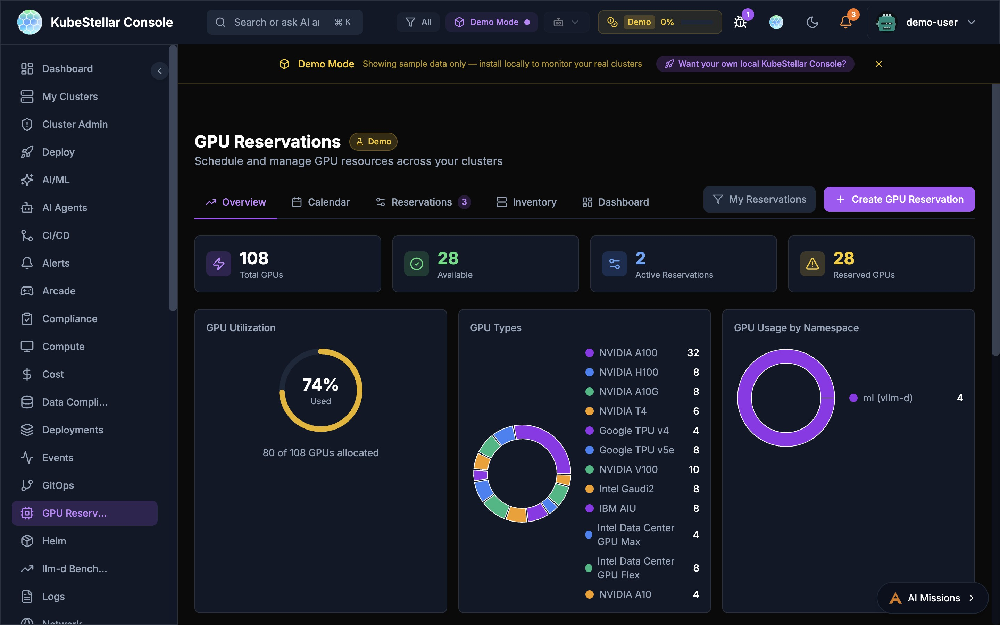

Schedule and manage GPU resources across your clusters with five dedicated tabs:

- **Overview**: Total GPUs, availability, utilization donut chart, GPU types breakdown, allocation by cluster
- **Calendar**: Visual calendar view of GPU reservations and availability windows
- **Reservations**: Active and pending GPU reservations with details
- **Inventory**: Full GPU inventory across all clusters with type, count, and status
- **Dashboard**: Customizable card-based view of GPU metrics

Key features:
- Create GPU reservations with namespace, cluster, and time range
- View GPU usage by namespace with donut chart breakdowns
- Track 12+ GPU types: NVIDIA A100/H100/A10G/V100/T4, Google TPU v4/v5e, Intel Gaudi2/AIU/Data Center GPU Max/Flex, IBM AIU
- GPU Allocation by Cluster bar chart for capacity planning

**Best for:** AI/ML teams sharing GPUs across multi-cloud environments

---

### Cost Management Dashboard

**Route:** `/cost`

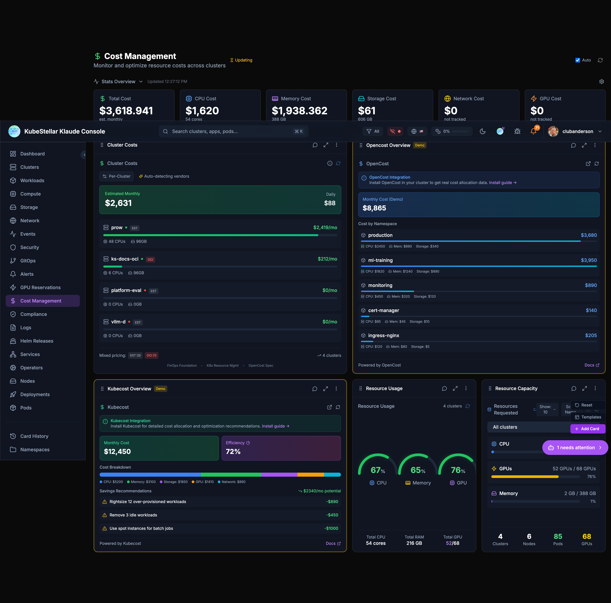

Track your spending:
- Total estimated cost
- Cost per cluster
- Cost by resource type (CPU, memory, storage)
- OpenCost and Kubecost integration

**Best for:** Controlling cloud spending

---

### Compliance Dashboard

**Route:** `/compliance`

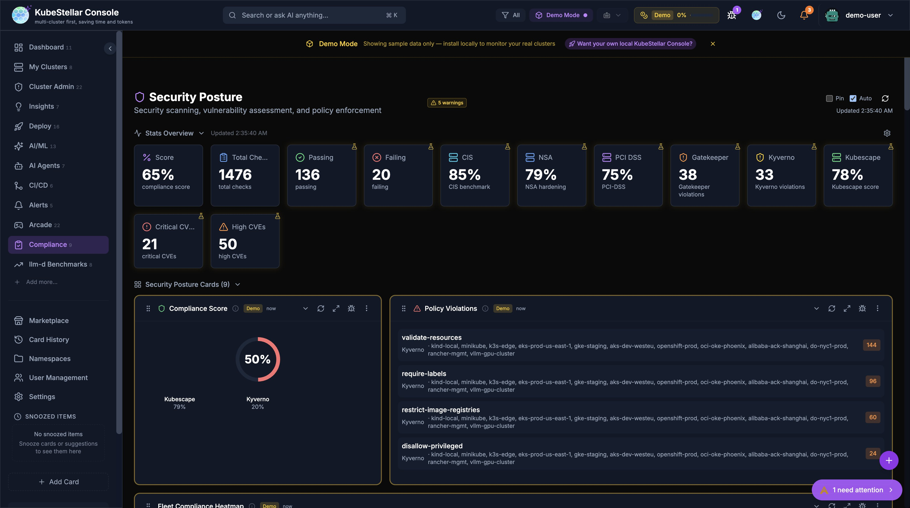

Comprehensive security scanning, vulnerability assessment, and policy enforcement across your entire fleet:

- **Compliance Score**: Composite score computed from OPA Gatekeeper, Kyverno, Kubescape, and Trivy data
- **Stats Overview**: Score, total checks, passing, failing, CIS/NSA/PCI-DSS benchmarks, Gatekeeper violations, Kyverno violations, Kubescape score
- **Policy Violations**: Aggregated violations from OPA + Kyverno with per-policy cluster attribution
- **Fleet Compliance Heatmap**: Clusters × compliance tools grid with color-coded status (green/yellow/red). Shows install CTA icons when Kyverno/Kubescape/Trivy aren't detected, linking to AI Mission install flows
- **Compliance Drift**: Flags clusters deviating >1 standard deviation from fleet baseline compliance scores
- **Cross-Cluster Policy Comparison**: Select up to 4 clusters and compare policy pass/fail in a table sorted by most discrepancies
- **Kyverno Policies**: Live per-cluster policy data via CRD auto-detection
- **Kubescape Scan**: Per-cluster framework scores via API aggregation or CRD check
- **Trivy Scan**: Per-cluster vulnerability counts by severity
- **Cert Manager**: Certificate expiry tracking across clusters

**New in March 2026:**
- All compliance cards rewritten to use live per-cluster data (previously static demo data)
- New `useKyverno`, `useTrivy`, `useKubescape` hooks with CRD auto-detection, localStorage caching, and demo fallback
- 3 new cross-cluster comparison cards (Fleet Compliance Heatmap, Compliance Drift, Cross-Cluster Policy Comparison)
- Install CTA icons in heatmap headers link to AI Missions for one-click tool installation

**Best for:** Enterprise security compliance, fleet-wide posture assessment, and identifying outlier clusters

---

### Logs Dashboard

**Route:** `/logs`

View logs:
- Container logs from any pod
- Filter by namespace or pod
- Search log content

**Best for:** Debugging application issues

---

### Helm Releases Dashboard

**Route:** `/helm`

Manage Helm:
- All Helm releases
- Release history
- Values comparison
- Available upgrades

**Best for:** Managing Helm deployments

---

### Services Dashboard

**Route:** `/services`

See all services:
- ClusterIP services
- LoadBalancer services
- NodePort services
- Endpoints

**Best for:** Understanding service networking

---

### Operators Dashboard

**Route:** `/operators`

Manage operators:
- OLM operators
- Subscriptions
- Available updates

**Best for:** Managing cluster extensions

---

### Nodes Dashboard

**Route:** `/nodes`

See your nodes:
- Node health status
- Resource usage per node
- Node labels and taints

**Best for:** Infrastructure monitoring

---

### Deployments Dashboard

**Route:** `/deployments`

Focus on deployments:
- All deployments across clusters
- Replica counts
- Rollout status

**Best for:** Application deployment status

---

### Pods Dashboard

**Route:** `/pods`

Focus on pods:
- All pods across clusters
- Pod status
- Restart counts
- Resource usage

**Best for:** Detailed pod troubleshooting

---

### AI/ML Dashboard

**Route:** `/ai-ml`

Monitor AI and Machine Learning workloads:
- llm-d inference stack monitoring (Request Flow, KV Cache, EPP Routing)
- Prefill/Decode disaggregation metrics
- llm-d benchmarks and comparisons
- ML Jobs and Notebooks
- GPU Overview with type breakdown
- Hardware Health monitoring
- Node Offline Detection with AI predictions

**Best for:** Managing AI/ML infrastructure and LLM serving stacks

---

### llm-d Benchmarks Dashboard

**Route:** `/llm-d-benchmarks`

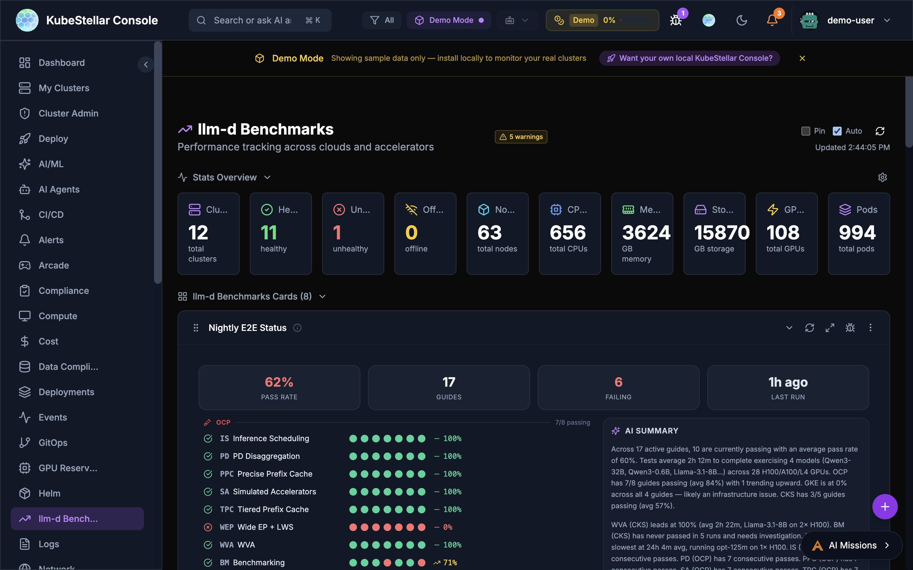

Performance tracking across clouds and accelerators for the llm-d inference stack:

- **Nightly E2E Status**: Real-time pass rates across 16 guides on OCP, GKE, and CKS platforms with per-guide green/red dot matrix and AI-generated summary
- **Pareto Frontier**: Tabbed chart views comparing throughput vs. latency tradeoffs across configurations
- **Leaderboard**: Ranked model/configuration comparison with pagination
- **Benchmark Hero**: Summary metrics from the latest benchmark runs
- **Live Data**: Streams benchmark results from Google Drive via SSE (Server-Sent Events) with automatic fallback to demo data

The Nightly E2E Status card features:
- 89% overall pass rate with 16 active guides
- Per-platform breakdown (OCP, GKE, CKS) with individual pass rates
- Sparkline trend graph showing pass rate over time
- AI summary with duration, model, and GPU information
- Detail panel with per-guide status and last run timestamps

**Best for:** Tracking llm-d inference stack performance and CI health across platforms

---

### AI Agents Dashboard

**Route:** `/ai-agents`

Manage Kagenti AI agents:
- Agent fleet overview across clusters with on/off toggle and "Live" indicator
- MCP Tool Registry with searchable tool listing
- Agent Discovery with skill tags and cost analysis capabilities
- Build Pipeline with recent build history and status
- Framework breakdown (LangGraph, CrewAI, AG2)
- Agent build status and history
- SPIFFE identity coverage
- Per-agent replica status and cluster placement
- Agent memory persistence across sessions

**Best for:** Deploying, securing, and monitoring AI agents

---

### CI/CD Dashboard

**Route:** `/ci-cd`

Monitor continuous integration and deployment:
- PROW CI status and success rates
- PROW Jobs with type/state filtering and pagination
- PROW CI Monitor with success rate tracking
- PROW revision history
- Helm release tracking (295 releases)
- Kustomize and ArgoCD sync status
- Operator deployments (5,412 total, 287 deployed, 4 pending)

**Best for:** Monitoring CI/CD pipelines and PROW test infrastructure

---

### Deploy Dashboard

**Route:** `/deploy`

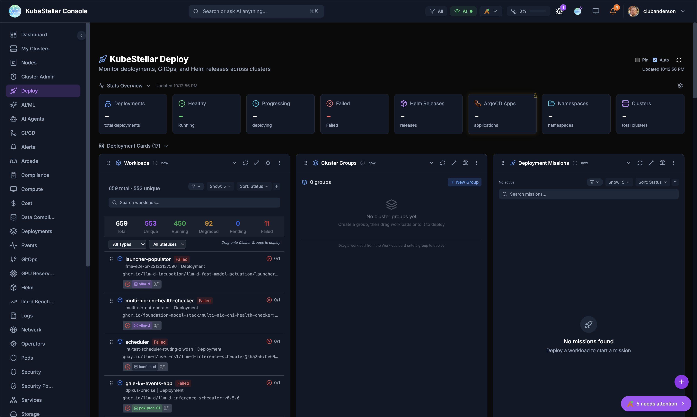

Multi-cluster deployment management:
- Workloads overview with drag-to-deploy (659 total, 553 unique)
- Cluster Groups for targeting deployments
- Deployment Missions with AI-assisted rollouts and Mission Browser
- Mission Browser with Installer and Fixer tabs for discovering pre-built missions
- Deep-linking and sharing for missions with OAuth flow support
- Saved Missions panel for quick access
- Resource Marshall for workload placement
- Deployment history and rollback

**Best for:** Deploying and managing workloads across multiple clusters

---

### Data Compliance Dashboard

**Route:** `/data-compliance`

Monitor data compliance:
- Data classification status
- Compliance checks and violations
- Policy enforcement across clusters

**Best for:** Meeting data governance requirements

---

### Insights Dashboard

**Route:** `/insights`

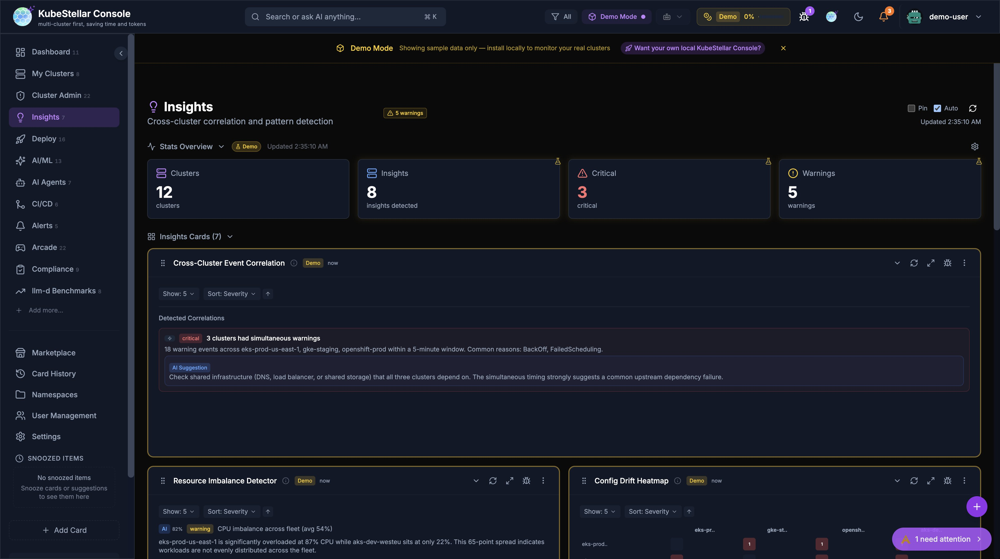

Cross-cluster correlation and pattern detection using heuristic algorithms and optional AI enrichment:

- **Stats Overview**: Clusters, insights detected, critical count, warnings count
- **7 Insight Cards**:
  - **Cross-Cluster Event Correlation**: Detects simultaneous warning events across clusters within a 5-minute window, suggesting common upstream causes
  - **Resource Imbalance Detector**: Identifies CPU/memory imbalances across the fleet (e.g., one cluster at 87% while others sit at 22%)
  - **Config Drift Heatmap**: Visualizes configuration differences between clusters for the same workloads
  - **Cluster Delta Detector**: Tracks changes in cluster state over time, flagging unusual deltas
  - **Restart Correlation Matrix**: Correlates pod restart patterns across clusters
  - **Cascade Impact Map**: Shows how failures in one cluster propagate to dependent services
  - **Deployment Rollout Tracker**: Monitors deployment rollout progress across clusters
- **AI Enrichment**: When kc-agent is connected, heuristic insights are enriched with AI-generated root cause analysis, remediation suggestions, and confidence scores
- **Insight Source Badge**: Each insight shows **(H)** for heuristic or **(AI)** for AI-enriched
- **Remediation Blocks**: AI suggestions appear as blue-highlighted blocks with actionable remediation steps

**New in March 2026:**
- AI enrichment via `useInsightEnrichment` hook with debounced requests, WebSocket broadcast, and TTL cache
- Backend `InsightWorker` with rule-based fallback when no AI provider is connected
- Remediation blocks added to all 7 insight cards
- All cards respect global cluster filters

**Best for:** Identifying cross-cluster patterns that are invisible when monitoring clusters individually

---

### Karmada Ops Dashboard (New in April 2026)

**Route:** `/karmada-ops`

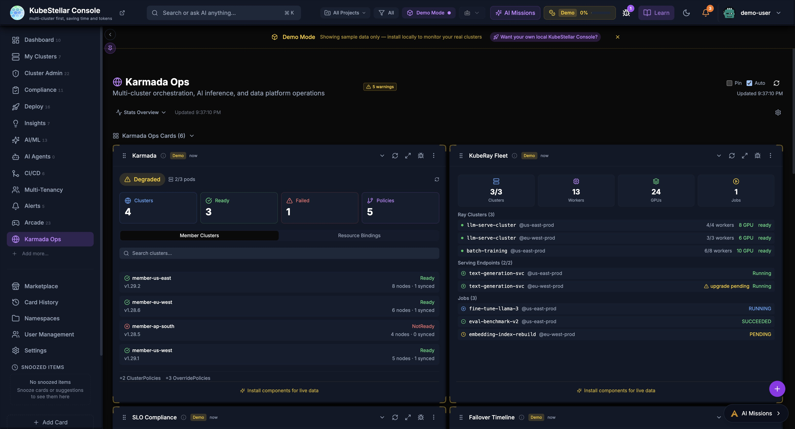

A dedicated dashboard for operating Karmada-based multi-cluster environments, AI inference, and data platform operations:

- **Karmada Status**: Cluster membership, propagation health, and resource bindings
- **KubeRay Fleet**: Ray cluster status across the fleet with upgrade tracking
- **SLO Compliance**: Service level objective monitoring with compliance percentages
- **Failover Timeline**: History of cluster failover events
- **Trino Gateway**: Trino query gateway health and routing status
- **Cluster Health**: Fleet-wide cluster connectivity and readiness

**Best for:** Teams running Karmada for multi-cluster orchestration, KubeRay for distributed computing, or Trino for federated queries

---

### Arcade Dashboard

**Route:** `/arcade`

Take a break with Kubernetes-themed games:
- 21 games including AI Checkers, Kube Chess, Container Tetris, Sudoku
- High scores saved locally
- Multiple themes available

**Best for:** Team building and having fun

---

### Marketplace Dashboard

**Route:** `/marketplace`

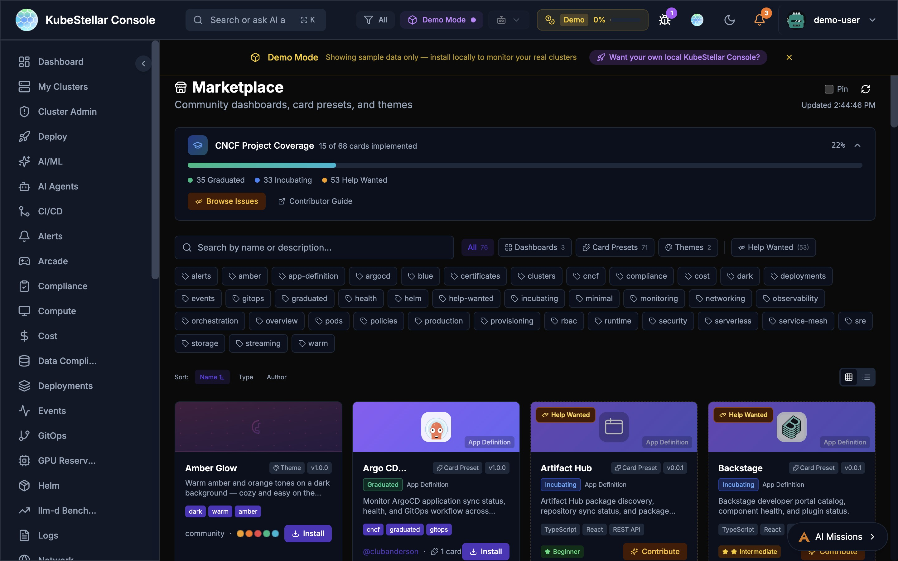

Community dashboards, card presets, and themes:
- Browse and install community-created dashboards (3+ available)
- Card Presets for common use cases (7+ presets)
- Theme marketplace with multiple visual styles (3+ themes)
- CNCF project coverage tracker: 11 of 68 cards implemented (16%), with 35 Graduated, 33 Incubating, and 57 Help Wanted
- Contributor Guide and Browse Issues links for community contribution
- Rich tag-based filtering: alerts, argocd, certificates, clusters, compliance, cncf, cost, deployments, events, gitops, graduated, health, helm, incubating, monitoring, networking, observability, orchestration, pods, policies, production, provisioning, rbac, runtime, security, serverless, service-mesh, sre, storage, streaming, warm
- Sort by Name, Type, or Author
- Grid and list view toggle

**Best for:** Extending your console with community content

---

## Utility Pages

These aren't counted as dashboards but are useful:

| Page | Route | What it does |
|------|-------|--------------|
| Card History | `/history` | See cards you've removed |
| Settings | `/settings` | Configure your preferences |
| User Management | `/users` | Manage users (admin only) |
| Namespaces | `/namespaces` | Manage namespace access |

---

## Multi-Project Selection (New in April 2026)

The **All Projects** button in the top navigation bar lets you organize clusters into projects and filter the entire dashboard by one or more projects at a time.

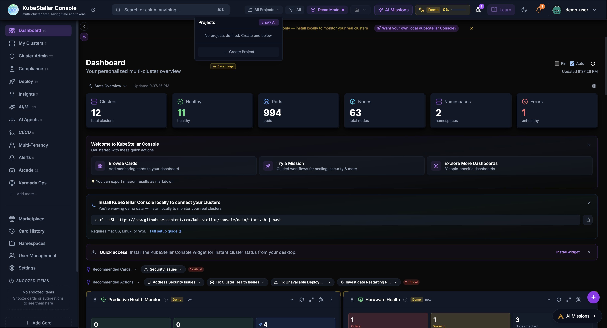

### Creating Projects

1. Click **All Projects** in the navbar
2. Click **Create Project**
3. Name the project and assign a color
4. Add clusters to the project

### Filtering by Project

- Select one or more projects to narrow all dashboard cards, stats, and cluster lists to only clusters in those projects
- The filter applies globally across all dashboards and persists in localStorage
- Deselect all projects to return to the full fleet view

### Project Colors

Each project has an assignable color for quick visual identification in the selector dropdown.

---

## Tips

### Customizing Dashboards

Every dashboard can be customized:
1. Click "Add Card" to add new cards
2. Drag cards to rearrange them
3. Click the menu on any card to configure or remove it
4. Use the reset button to go back to defaults

### Stats Blocks

The stats at the top of each dashboard show the most important numbers. You can configure which stats appear by clicking "Configure stats".

### Auto-Refresh

All dashboards auto-refresh by default. You can:
- Toggle auto-refresh on/off
- Manually refresh with the refresh button
- See when data was last updated
