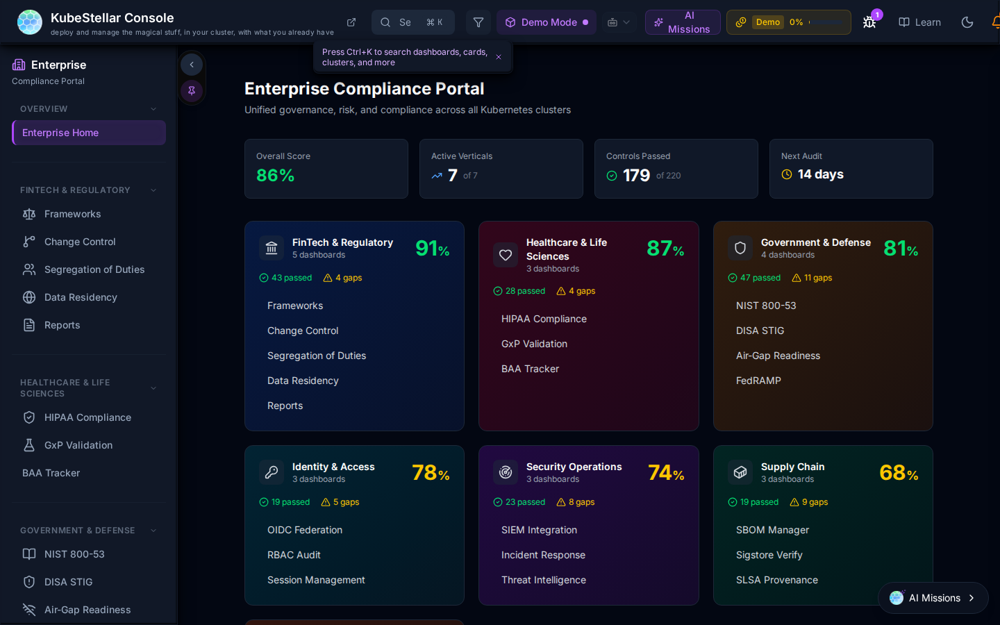
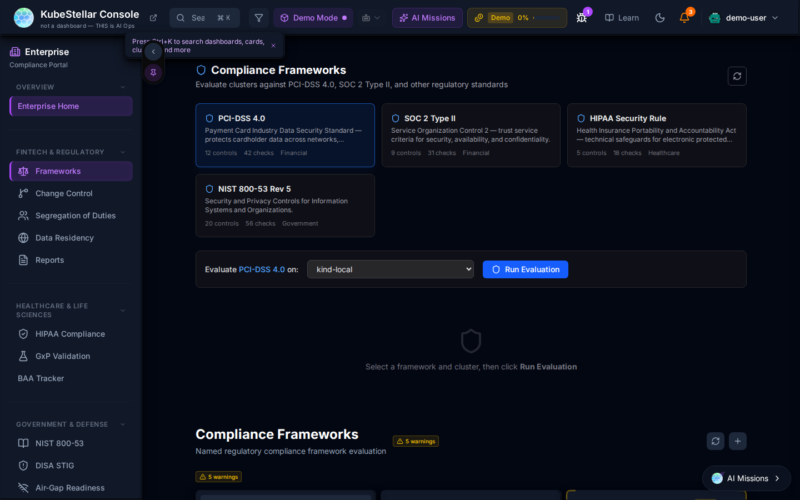
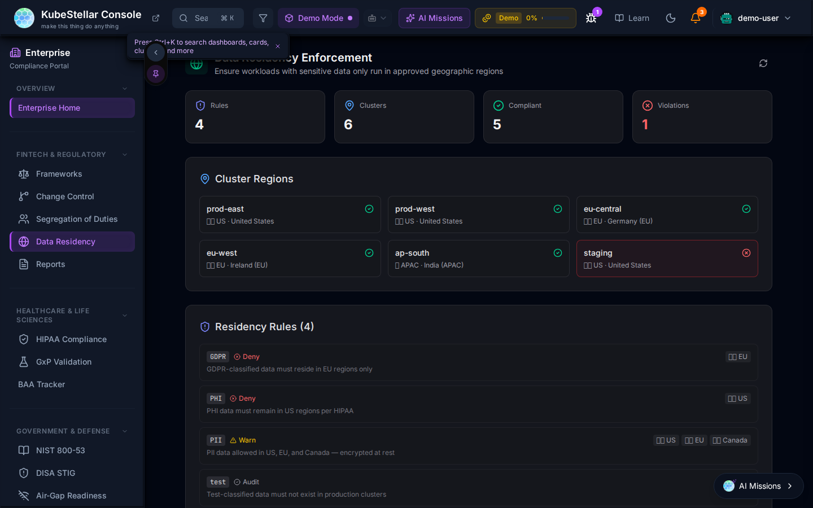
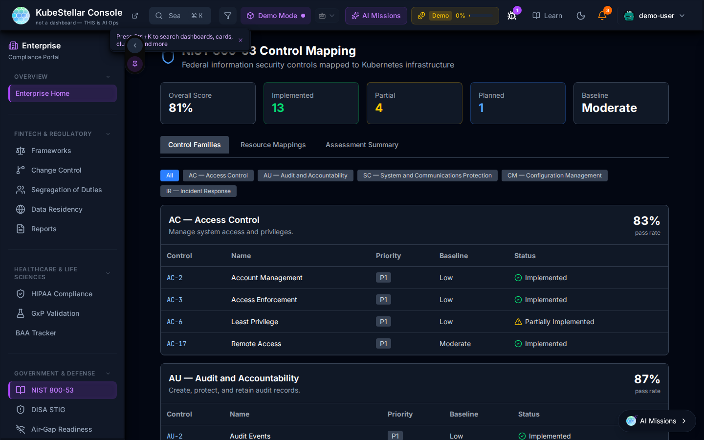
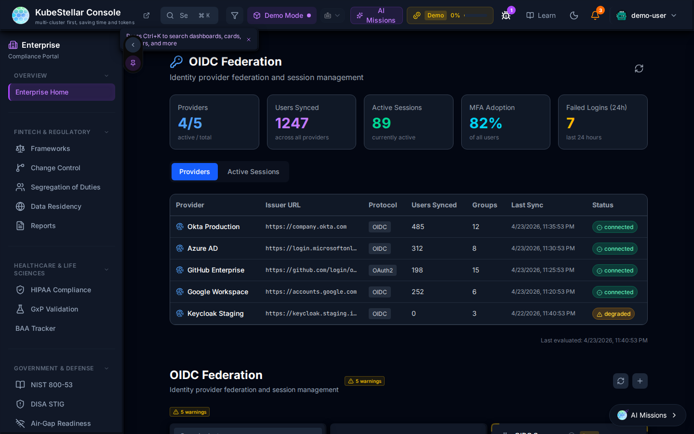
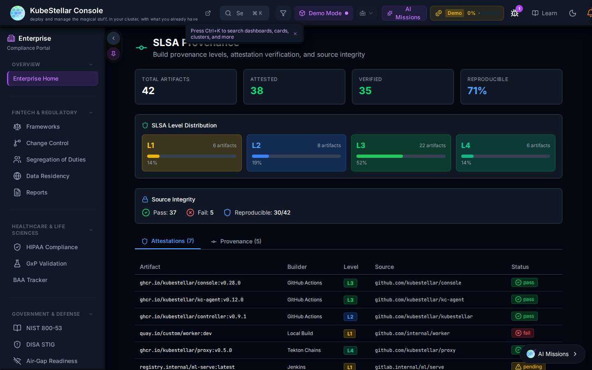
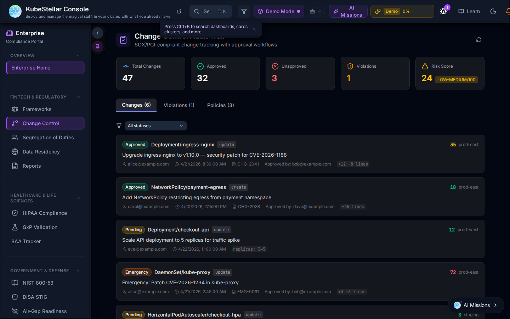

# Enterprise Compliance Portal

The KubeStellar Console includes a built-in **Enterprise Compliance Portal** accessible from the **Enterprise** sidebar item. It provides a unified view of regulatory compliance across all managed clusters, organized into six compliance epics.

## Accessing the Portal

Navigate to **Enterprise → Compliance Portal** in the left sidebar. The portal runs in demo mode when no live cluster is connected, showing representative compliance scenarios so you can evaluate the UI and report format before connecting real clusters.

## Compliance Epics

The portal organizes compliance requirements into six industry verticals, each with its own dashboards and sub-pages:

| Epic | Score | Included Frameworks |
|------|-------|---------------------|
| **Fintech & Regulatory** | 91% | PCI-DSS 4.0, SOC 2 Type II, Change Control, Segregation of Duties, Data Residency |
| **Healthcare & Life Sciences** | 87% | HIPAA Security Rule, GxP Validation (21 CFR Part 11), BAA Tracker |
| **Government & Defense** | 81% | NIST 800-53 Rev 5, DISA STIG, Air-Gap Readiness |
| **Identity & Access** | 78% | OIDC Federation, RBAC Audit, Session Management |
| **Security Operations** | 74% | SIEM Integration, Incident Response, Threat Intelligence |
| **Supply Chain** | 68% | SLSA Levels, Signature Verify, SBOM Manager |

---

## Compliance Frameworks

The **Frameworks** dashboard (`/enterprise/frameworks`) evaluates clusters against specific regulatory standards.

Each framework card shows:
- Number of controls and checks
- Target industry vertical
- An inline evaluation launcher: select a cluster and click **Run Evaluation**

Supported frameworks:

| Framework | Controls | Checks | Vertical |
|-----------|----------|--------|----------|
| PCI-DSS 4.0 | 11 | 42 | Financial |
| SOC 2 Type II | 9 | 31 | Financial |
| HIPAA Security Rule | 9 | 16 | Healthcare |
| NIST 800-53 Rev 5 | 20 | 56 | Government |

---

## Data Residency

The **Data Residency** dashboard (`/enterprise/data-residency`) enforces geographic placement rules for workloads that handle sensitive data.

**Summary metrics:** Rules, Clusters, Compliant, Violations.

**Cluster Regions** shows every managed cluster with its geographic tag (US, EU, APAC). Clusters with a residency violation are highlighted in red.

**Residency Rules** define allowed regions per data classification:

| Tag | Action | Regions | Description |
|-----|--------|---------|-------------|
| GDPR | Deny | EU | GDPR-classified data must reside in EU regions only |
| PHI | Deny | US | PHI data must remain in US regions per HIPAA |
| PII | Warn | US, EU, Canada | PII data allowed in US, EU, and Canada — encrypted at rest |
| test | Audit | — | Test-classified data must not exist in production clusters |

---

## NIST 800-53 Controls

The **NIST 800-53** dashboard maps your cluster's security configuration to NIST 800-53 Rev 5 control families.

**Summary metrics:** Overall score, Implemented controls, Partially Implemented, Non-Compliant, Risk Level.

Controls are organized by family (tabs: Control Family, Resource Mapping, Assessment Summary). Each control shows:
- Control ID and name
- Priority (High/Medium/Low)
- Baseline applicability
- Implementation status (Implemented / Partially Implemented / Not Implemented)

Example families visible: **AC — Access Control** (83%), **AU — Audit and Accountability** (87%).

---

## OIDC Federation

The **OIDC Federation** dashboard provides visibility into identity provider configuration and active sessions across all clusters.

**Summary metrics:** Active rules, Active sessions, OIDC Adoptions (%), Token Expiry.

The **Providers** table lists each identity provider with:
- Issuer URL
- Protocol (OIDC/SAML)
- Users synced, Groups, Last sync time, and Status

Example providers shown: **Okta Production**, **Azure AD**, **GitHub Enterprise**, **Google Workspace**, **Keychain Staging**.

Active sessions are displayed in the **Active Sessions** tab.

---

## SLSA Supply Chain

The **SLSA** dashboard tracks Software Supply Chain Levels for Software Artifacts compliance for workload images and build pipelines.

**Summary metrics:** Total artifacts, Attested, Verified, Reproducible %.

**SLSA Level Distribution** bar chart shows the count of artifacts at each level (L1 through L4+).

**Source Integrity** table lists artifacts with:
- Artifact name and builder
- SLSA level badge
- Source repository link
- Status (Pass / Fail)

---

## Change Control

The **Change Control** dashboard provides a SOX/PCI-DSS compliant audit trail for all cluster changes.

**Summary metrics:** Total changes, Compliant, Open, Violations, Risk Score.

The **Changes** feed shows each change record with:
- Type badge (Approved / Pending / Flagged)
- Deployment or infrastructure change description
- Timestamps and correlation IDs
- Link to related CVE or ticket when applicable

Changes are color-coded by approval status. The dashboard supports an approval workflow: changes require sign-off before being marked compliant.

---

## Navigation

The Enterprise sidebar organizes all dashboards by compliance epic:

**FINTECH & REGULATORY**
- Frameworks
- Change Control
- Segregation of Duties
- Data Residency
- Reports

**HEALTHCARE & LIFE SCIENCES**
- HIPAA Compliance
- GxP Validation
- BAA Tracker

**GOVERNMENT & DEFENSE**
- NIST 800-53
- DISA STIG
- Air-Gap Readiness

---

## Compliance Report Generator

From any compliance dashboard, use the **Generate Report** button to export a PDF or JSON compliance report. Reports include current status per framework, control pass/fail breakdown, remediation recommendations, and audit-ready timestamps.
