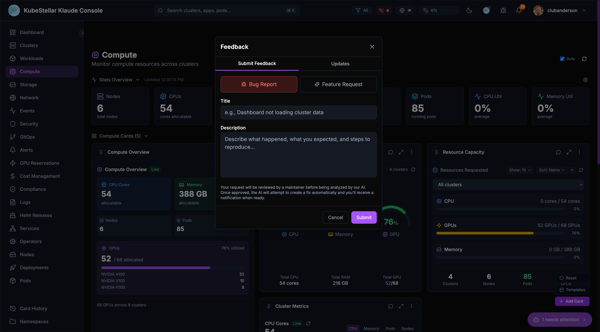
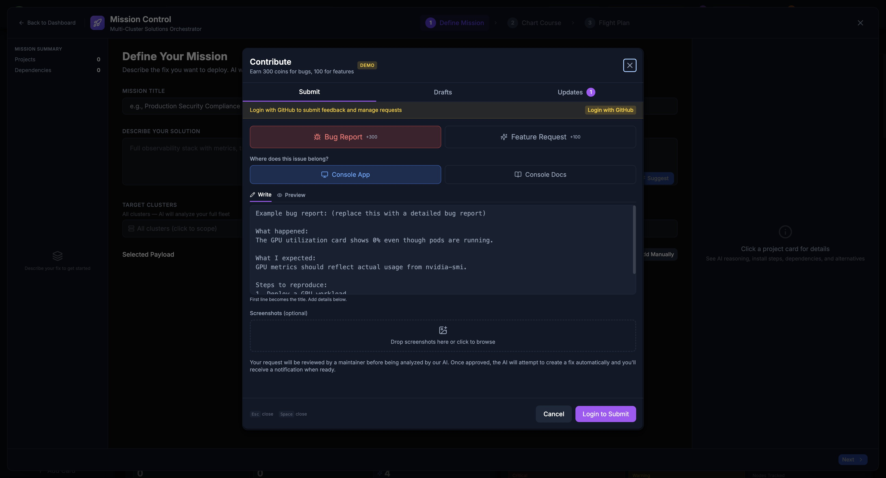

# Feedback System

KubeStellar Console has a unique feedback system. When you report a bug or request a feature, AI helps create the fix automatically!



---

## How It Works

This is a **closed-loop** system:

```text
You report → Maintainer reviews → AI creates fix → You test → Release!
```

### The Process

1. **You submit** - Describe the bug or feature
2. **Maintainer triages** - Reviews and approves
3. **AI analyzes** - Figures out what needs to change
4. **AI creates PR** - Makes the code changes
5. **You get notified** - When a fix is ready
6. **You test** - Try the preview deployment
7. **You approve** - Provide feedback
8. **Release** - Goes into next version

---

## Bug-to-Squash

When something doesn't work right, report it!

### How to Report a Bug

1. Click the **bug icon** in the top navigation bar, or navigate directly to `/issue` or `/feedback` in your browser
2. Select **"Bug Report"** tab
3. Fill in:
   - **Title** - Short description
   - **Description** - What happened, what you expected, steps to reproduce
   - **Target Repository** (optional) - Choose `console` (default) or `docs`
4. Click **Submit**

> **Tip:** Bookmark `http://localhost:8080/issue` or `http://localhost:8080/feedback` (or your deployed URL + `/issue` or `/feedback`) to jump straight to the feedback dialog.

### What Happens Next

| Status | Meaning |
|--------|---------|
| **Open** | Submitted, waiting for review |
| **Needs Triage** | Maintainer is reviewing |
| **Triage Accepted** | Approved for AI fix |
| **Feasibility Study** | AI analyzing the problem |
| **Fix Ready** | AI created a fix, needs testing |
| **Fix Complete** | You approved, going to release |
| **Unable to Fix** | Couldn't be fixed automatically |
| **Closed** | Issue resolved or won't fix |

### Getting Notified

You'll receive notifications when:
- Your bug is accepted for triage
- A fix is ready for testing
- The fix is released

Check the bell icon in the header for notifications.

---

## Feature-to-Fulfillment

Have an idea? Request it!

### How to Request a Feature

1. Click **"Report a bug or request a feature"** (top bar) or navigate to `/issue` or `/feedback`
2. Select **"Feature Request"** tab
3. Fill in:
   - **Title** - What feature you want
   - **Description** - How it should work, why you need it
   - **Target Repository** (optional) - Choose `console` (default) or `docs`
4. Click **Submit**

### Good Feature Requests

**Do:**
- Be specific about what you want
- Explain why it's useful
- Give examples of how you'd use it

**Don't:**
- Be vague ("make it better")
- Request huge changes
- Duplicate existing features

### Example

**Good:** "Add a dark mode toggle in settings so I can reduce eye strain at night"

**Not as good:** "The UI needs improvement"

---

## Draft Save & Restore (New in April 2026)

The Contribute dialog now includes a **Drafts** tab between Submit and Updates that lets you save work-in-progress bug reports and feature requests.



### How Drafts Work

- **Save a draft**: Click "Save Draft" while composing a bug report or feature request. The draft is saved to localStorage.
- **Restore a draft**: Switch to the Drafts tab, find your draft, and click "Edit" to load it back into the form. An "Editing a saved draft" banner appears.
- **Update a draft**: Modify a restored draft and click "Update Draft" to save changes.
- **Auto-cleanup**: When you successfully submit a report from a draft, the draft is automatically deleted.
- **Close protection**: If you close the modal with unsaved content, a 3-way dialog offers **Save Draft & Close**, **Discard**, or **Keep Editing**.

### Draft Limits

- Up to 20 drafts can be stored locally
- Drafts are synced across browser tabs via the `storage` event
- Each draft shows its type (Bug/Feature), target repo, and relative timestamp

---

## Tracking Your Requests

### View Your Submissions

1. Click **"Report a bug or request a feature"**
2. Select **"Updates"** tab
3. See all your submissions and their status

### Request Statuses

```text
open → needs_triage → triage_accepted → feasibility_study → fix_ready → fix_complete
                                    ↘ unable_to_fix
```

---

## Testing Fixes

When a fix is ready, you can test it!

### Preview Deployments

For each fix, a preview deployment is created. You'll get a link to test the fix in a temporary environment.

### Providing Feedback

After testing:
- **Positive** - The fix works! Click 👍
- **Negative** - Something's still wrong. Click 👎 and explain

Your feedback helps improve the fix before it ships.

---

## Why This Is Special

### AI-Maintained Repository

KubeStellar Console is one of the first codebases that is **continuously maintained by AI**:

- **Closed-loop** - Your feedback directly creates code changes. Report a bug, get a fix. Request a feature, get it built.
- **Fast** - Fixes can be created in hours, not weeks
- **Quality-checked** - Every AI-generated fix goes through automated tests, code review, and human approval
- **Always improving** - The console is being developed all day, every day, with AI writing and reviewing code around the clock

### How the Automation Works

Behind the scenes, a pipeline of AI agents handles your requests:

1. **Auto-QA** scans the codebase for issues every hour
2. **Copilot coding agent** creates pull requests to fix issues
3. **Copilot review agent** reviews every PR for quality
4. **Auto-apply** ensures review suggestions are incorporated
5. **Automated testing** validates every change
6. **Human maintainers** approve and merge

This means bugs get caught early, fixes get reviewed automatically, and releases happen frequently.

### Human + AI

Humans still:
- Review and approve changes
- Make architecture decisions
- Handle complex changes
- Ensure quality

AI helps with:
- Analyzing problems
- Creating initial fixes
- Running tests
- Reviewing code
- Generating documentation

---

## GitHub Integration

Behind the scenes, your requests become GitHub issues:

1. You submit a request
2. Console creates a GitHub issue
3. GitHub Actions trigger AI analysis
4. AI creates a Pull Request
5. Maintainers review
6. Tests run automatically
7. Merge and deploy

You don't need to know any of this - it just works!

### Repository Selection

When you submit feedback, you can choose which repository the issue is filed in:

- **Console** (default) - For bugs or features related to the KubeStellar Console itself (UI, functionality, performance)
- **Docs** - For issues with the KubeStellar documentation (typos, unclear sections, missing explanations)

If you don't select a repository, your feedback defaults to the **Console** repository. Select **Docs** if your report is about the documentation site or content.

### What Data Is Collected

When you submit feedback, the following information is included in the GitHub issue:

**Always Included:**
- Your title and description
- Console Request ID (for tracking)
- Your user identifier
- Timestamp of submission
- Target repository selection

**Optionally Included (if captured):**
- **Screenshots** - Any images you attach or the console captures (base64-encoded)
- **Console Errors** - Recent browser console errors and warnings (from the last few operations)
- **Failed API Calls** - Any 4xx or 5xx HTTP responses from recent API requests
- **Diagnostics** - Environment information to help debug issues:
  - Agent version and build time
  - Browser type and operating system
  - Go version (for agent compatibility)
  - Installation method (dev/release)
  - Connected clusters count
  - Screen resolution and window size
  - Browser language and URL context

All this data helps maintainers and AI agents quickly understand and fix issues. Console errors and diagnostics are **never** included in feature requests—only in bug reports.

---

## API Routes Reference

If you're integrating with the feedback system or running your own KubeStellar Console, here are the available API routes:

### Submitting Feedback

- **`POST /api/feedback/requests`** - Submit a new bug report or feature request
  - Requires authentication
  - Body: `title`, `description`, `request_type` ("bug" or "feature"), `target_repo` (optional, "console" or "docs"), `screenshots`, `console_errors`, `failed_api_calls`, `diagnostics`
  - Returns: Feature request object with issue number and GitHub URL

### Viewing Your Submissions

- **`GET /api/feedback/requests`** - List your own feature requests with pagination
  - Query params: `limit` (default 20, max 1000), `offset` (default 0)
  - Returns: Array of feature requests

- **`GET /api/feedback/requests/:id`** - Get details of a specific feature request
  - Returns: Single feature request with full status history

- **`GET /api/feedback/queue`** - List all feature requests (for moderators/admins)
  - Query params: `limit`, `offset`
  - Returns: Array of all feature requests across all users

### Feedback on Fixes

- **`POST /api/feedback/requests/:id/feedback`** - Submit feedback on a proposed fix
  - Body: `feedback_type` ("positive" or "negative"), `comment` (optional)
  - Returns: Updated feedback record

- **`POST /api/feedback/requests/:id/close`** - Close a request (after fix is released)
  - Returns: Closed request status

- **`POST /api/feedback/requests/:id/request-update`** - Request a status update on a feature request
  - Returns: Notification confirmation

### Preview Deployments

- **`GET /api/feedback/preview/:pr_number`** - Check if a preview deployment is ready for a fix
  - Returns: Preview URL and deployment status

### Notifications

- **`GET /api/notifications`** - Get your notifications
  - Query params: `limit`, `offset`
  - Returns: Array of notifications (issue updates, fix ready, etc.)

- **`GET /api/notifications/unread-count`** - Get count of unread notifications
  - Returns: `{ "unread_count": number }`

- **`POST /api/notifications/:id/read`** - Mark a notification as read
  - Returns: Updated notification

- **`POST /api/notifications/read-all`** - Mark all notifications as read
  - Returns: Success confirmation

### Webhooks (Internal)

- **`POST /webhooks/github`** - GitHub webhook endpoint (for status updates from GitHub Actions)
  - Used internally by GitHub when issues/PRs are updated
  - Validates webhook signature from GitHub

---

### For Bug Reports

- Include screenshots if helpful
- Mention which page/card had the issue
- Note your browser and OS
- Describe recent actions before the bug

### For Feature Requests

- Check if the feature already exists
- Be patient - complex features take time
- Provide examples from other tools
- Explain the problem you're solving

### General

- Be kind - there are humans and AI working to help
- Be specific - vague requests are hard to fix
- Test thoroughly - good testing means better releases
