# Local LLM Strategy

This page is for operators choosing a local LLM runner for the KubeStellar Console. It complements the [Security Model](security-model.md) page with a decision matrix, concrete install missions, and three topology diagrams.

If you just want to get something working right now, the shortest path is:

1. Install [Ollama](https://ollama.com) on your laptop.
2. Run `ollama pull llama3.2`.
3. Start kc-agent. The Console agent selector shows **Ollama (Local)** as available automatically — the default URL is `http://127.0.0.1:11434`.

For anything beyond a single laptop, read on.

## Why run a local LLM

There are three drivers that push teams toward a local LLM runner for the Console's chat path:

1. **Security and compliance.** Prompts and conversation history never leave your perimeter. This matters for environments where chat content itself is sensitive — regulated workloads, customer-owned infrastructure, air-gapped clusters. The [Security Model](security-model.md) page describes the Console's broader threat boundaries; a local LLM collapses the "chat content" boundary from "out to a public vendor" to "in-cluster only."
2. **Cost.** Hosted-LLM bills scale with usage. A local runner has a fixed cost — the GPU or the workstation you already own — and the marginal token is free. For teams running many AI missions a day, the crossover point is reached quickly.
3. **Network restrictions.** Clusters behind a default-deny egress NetworkPolicy, or sitting on an air-gapped network with no outbound internet at all, cannot reach `api.openai.com`. A local runner bypasses the problem entirely.

## Decision matrix

Pick the runner that fits your constraints. All of them are registered in the Console's agent selector dropdown as chat-only providers as of Console [#8248](https://github.com/kubestellar/console/pull/8248).

| Runner | Best for | Hardware | Install mission | Notes |
|---|---|---|---|---|
| **[Ollama](https://ollama.com)** | Dev laptops, single-node clusters | CPU or GPU | `install-ollama` | Loopback default (`127.0.0.1:11434`); fastest onboarding. |
| **[vLLM](https://github.com/vllm-project/vllm)** | GPU clusters, production batch inference | NVIDIA GPU | `install-vllm` | PagedAttention, tensor parallelism; highest throughput for >7B models. |
| **[llm-d](https://github.com/llm-d/llm-d)** | Multi-node inference scheduling | GPU cluster | see `install-llmd-*` | CNCF-aligned; specialized for prefill/decode disaggregation. |
| **[LocalAI](https://localai.io)** | Self-hosted OpenAI-compatible gateway | CPU or GPU | `install-localai` | Helm chart install; built-in model gallery; drop-in OpenAI replacement. |
| **[llama.cpp server](https://github.com/ggml-org/llama.cpp)** | Lowest dependencies, CPU or GPU | CPU or GPU | `install-llama-cpp` | Single binary, GGUF models from Hugging Face. |
| **[Red Hat AI Inference Server](https://docs.redhat.com/en/documentation/red_hat_ai_inference_server/)** | OpenShift enterprise with RH support | NVIDIA GPU + OpenShift | `install-rhaiis` | Hardened vLLM from `registry.redhat.io`; Red Hat subscription entitlement. |
| **[LM Studio](https://lmstudio.ai)** | Workstation GUI, try-before-buy | CPU or GPU workstation | `install-lm-studio` | macOS/Windows/Linux GUI app; default `127.0.0.1:1234`. Closed-source. |
| **[Open WebUI](https://openwebui.com)** | UI frontend over another runner | None of its own | `install-open-webui` | Not an inference runner — frontend that proxies to Ollama/vLLM/LocalAI. |

Ollama, vLLM, and llm-d install missions existed before this page and are reachable from the Console mission catalog directly. The others were added in Console-KB [#2028](https://github.com/kubestellar/console-kb/pull/2028).

## Chat vs missions — the architectural constraint

The Console's AI path has two kinds of work:

- **Chat and analysis** — the user asks a question, the agent thinks out loud, no cluster mutation. All ten registered providers (tool-capable CLI agents + local LLM runners + corporate gateways) can do this.
- **AI missions** — the agent executes `kubectl`, `helm`, or other tools against the cluster to diagnose or repair something. This requires a provider that can actually invoke CLI tools, so it only works with the tool-capable CLI agents (`claude`, `codex`, `gemini-cli`, `antigravity`, `goose`, `copilot-cli`, `bob`).

Local LLM runners are HTTP endpoints — they can answer chat, but they cannot shell out to `kubectl` themselves. The Console represents this with a `ProviderCapability` enum where local runners return `CapabilityChat` only, and `promoteExecutingDefault()` in the agent registry keeps a tool-capable agent as the default for missions whenever one is available. This means you can install a local LLM runner and a CLI agent side by side: the dropdown lets you pick your chat provider, and missions still run through the CLI agent regardless.

**In practice**: for the strongest local-LLM posture, install a CLI agent (`claude`, `codex`, `gemini-cli`) on the kc-agent host and point it at your local LLM via its *own* native base-URL config — this is the fully-supported path today and it gives you both chat privacy and tool execution. The `install-llama-cpp`, `install-localai`, and `install-rhaiis` missions cover how to do this for each runner.

## Topology diagrams

The three deployment topologies the Console supports for local LLMs. All three keep chat content inside your trust boundary — the difference is where the trust boundary lives.

### Topology A — workstation-local

A single developer, everything on their laptop. Ollama or LM Studio listens on loopback, kc-agent talks to it at `127.0.0.1:11434` or `127.0.0.1:1234`, and the managed cluster is reached via the user's kubeconfig. This is the right default for local dev and demos.



Set these env vars before starting kc-agent:

```bash
# Ollama default — this is also the compiled-in fallback if unset
export OLLAMA_URL=http://127.0.0.1:11434
export OLLAMA_MODEL=llama3.2
./bin/kc-agent
```

### Topology B — in-cluster runner

The LLM runs as a Deployment inside the same managed cluster. llama.cpp, LocalAI, or vLLM in its own namespace with a ClusterIP Service; kc-agent on the developer's workstation reaches it through the kubeconfig. The request path for chat is `kc-agent → ClusterIP Service → runner pod`, so the cluster boundary absorbs both "the model weights" and "the chat content."



Set the runner's URL env var to the in-cluster Service URL before starting kc-agent:

```bash
export LLAMACPP_URL=http://llama-server.llamacpp.svc.cluster.local:8080
export LOCALAI_URL=http://local-ai.localai.svc.cluster.local:8080
export VLLM_URL=http://vllm.vllm.svc.cluster.local:8000
./bin/kc-agent
```

### Topology C — OpenShift enterprise

Red Hat AI Inference Server on OpenShift, with the NVIDIA GPU Operator handling the CUDA stack. The RHAIIS image is pulled from `registry.redhat.io` once at install time and then runs fully air-gapped at steady state. The kc-agent host reaches the RHAIIS Service over the cluster network and serves chat to the user's browser via WebSocket. This is the strongest enterprise-supported local-LLM posture the Console can point at — inference inside your cluster, image from a Red Hat registry, no egress to an external model provider at steady state.



```bash
export RHAIIS_URL=http://rhaiis.rhaiis.svc.cluster.local:8000
./bin/kc-agent
```

## Install recipes

Each runner has a companion install mission in the Console mission catalog. When the runner's URL env var is unset and the dropdown shows the provider as unavailable, clicking the install link in the dropdown takes you directly to the right mission:

- **[install-ollama](https://console.kubestellar.io/missions/install-ollama)** — Ollama as a Kubernetes workload
- **[install-llama-cpp](https://console.kubestellar.io/missions/install-llama-cpp)** — llama-server Deployment + PVC
- **[install-localai](https://console.kubestellar.io/missions/install-localai)** — LocalAI Helm chart with model-gallery PVC
- **[install-vllm](https://console.kubestellar.io/missions/install-vllm)** — vLLM Deployment on GPU nodes
- **[install-rhaiis](https://console.kubestellar.io/missions/install-rhaiis)** — Red Hat AI Inference Server on OpenShift
- **[install-open-webui](https://console.kubestellar.io/missions/install-open-webui)** — Open WebUI frontend
- **[install-lm-studio](https://console.kubestellar.io/missions/install-lm-studio)** — LM Studio workstation setup
- **[install-claude-desktop](https://console.kubestellar.io/missions/install-claude-desktop)** — Claude Desktop + kubestellar-mcp

## Security posture — cross-links

The [Security Model](security-model.md) page is the canonical reference for what data flows where. The short version for local LLMs:

- User chat content is sent to whichever provider you select in the dropdown. With a local runner, that content never leaves your trust boundary.
- The kubeconfig and cluster bearer tokens are **never** put into the chat request body, regardless of which provider is selected. This is unchanged from the default setup — see `buildMessages` in `pkg/agent/provider_openai.go` for the canonical example.
- The `~/.kc/config.yaml` config file stores any real API keys at mode `0600` on the kc-agent host. Local runners typically do not need a real key — the Console seeds a sentinel placeholder for unauthenticated runners.
- For air-gapped environments, pair a local runner with a default-deny egress NetworkPolicy in the kc-agent and runner namespaces. See [Security Model §2](security-model.md) for the air-gapped deployment walkthrough.

## Tracking and future enablement

- **Base URL configurability in the UI**: today, pointing at a local runner means setting an env var before starting kc-agent. A Console UI pane for configuring base URLs per provider is tracked as a follow-up on `kubestellar/console`.
- **Chat-only mission routing**: the capability-aware default selection landed in [#8248](https://github.com/kubestellar/console/pull/8248). If the default chat provider and default mission provider diverge in your environment, please file an issue — the intent is that the dropdown selection drives chat and missions transparently.
- **Upstream outreach**: the install missions for llama.cpp, LocalAI, Open WebUI, and RHAIIS are being filed as outreach issues on the respective upstream projects so they are aware of the integration path.

---

*Last updated: 2026-04-15. If you find a drift between this page and the Console code, the code is authoritative — please open an issue against [kubestellar/docs](https://github.com/kubestellar/docs/issues).*
