# Security Model

This page is for operators, platform engineers, and security reviewers evaluating whether KubeStellar Console is safe to install in their environment. It answers three questions:

1. **What is the security model?** Where does each request go, what does each component see, and what leaves the cluster?
2. **Can I run this in an air-gapped or network-restricted environment?** Yes — AI is optional and the core Kubernetes UX works with no outbound internet.
3. **Can I use a local or self-hosted LLM instead of a public provider?** Yes, via the OpenAI-compatible providers whose base URLs are overridable.

The canonical, code-grounded version of this document lives in the source tree at [`docs/security/SECURITY-MODEL.md`](https://github.com/kubestellar/console/blob/main/docs/security/SECURITY-MODEL.md) — every claim there is cited with file and line numbers. This page is the public-docs summary; read the source doc for the full detail.

## Architecture overview

The three-process architecture: your browser, a Go backend (serves UI, bootstrap-only identity), and `kc-agent` running on your own machine (identity is your kubeconfig). Every cluster mutation flows through kc-agent.



**Legend:**

- **Browser → Backend** serves the UI on port 8080.
- **Browser → kc-agent** is all cluster operations on `127.0.0.1:8585` (loopback only). kc-agent reads `~/.kube/config` and stores AI keys at `~/.kc/config.yaml` (mode `0600`).
- **kc-agent → Kubernetes** uses the user's own kubeconfig identity. Per-cluster RBAC is enforced by each apiserver against the user, never against the console's pod SA.
- **Backend → Pod SA** is bootstrap-only — serving the frontend, GPU reservation, and self-upgrade. The backend never acts on a managed cluster.
- **Public LLM** = Anthropic, OpenAI, Gemini, Groq, OpenRouter. **Local LLM** = Ollama, vLLM, LM Studio, Open WebUI, or any OpenAI-compatible internal gateway.
- **Solid arrows** are mandatory for the core cluster-management UX. **Dashed arrows** to AI providers are optional and only used when an API key is configured.

## The pod-SA rule

The Go backend's pod ServiceAccount is used **only** for three things:

1. **Serving the frontend** and storing console-local state (settings, token history, metrics cache). None of this touches a managed cluster.
2. **GPU reservation** — creating a namespace and a `ResourceQuota` on it. Users typically do not have namespace-create RBAC; the console is the authorized policy layer for this specific flow.
3. **Self-upgrade** — the console patches its own `Deployment` to roll out a new image.

**Every other user-initiated Kubernetes action goes through kc-agent** on the user's own machine, using the user's own kubeconfig. Per-cluster RBAC is enforced by the target cluster's apiserver against the user's real identity, not against the console's pod SA.

Consequences:

- A user with no local kc-agent running gets **read-only / demo-mode** behavior. Destructive operations fail by design.
- The console running inside a cluster **cannot** escalate a user's privilege on a managed cluster by impersonating them. It does not try to.
- The hosted demo at [console.kubestellar.io](https://console.kubestellar.io) has no trust relationship with your clusters at all — it cannot read or modify them.

## kc-agent defense in depth

kc-agent binds `127.0.0.1:8585` by default and is not configurable to bind any other address. The bind is the primary defense against network-level access. Additional layers protect against local attackers (rogue browser tabs, other processes on the same machine):



Four layers gate every request to kc-agent:

1. **Bind check** — kc-agent listens on `127.0.0.1:8585` only. Remote LAN hosts are rejected at the OS socket layer.
2. **CORS allow-list** — strict origin matching for browser requests.
3. **DNS-rebinding guard** — defends against attacker-controlled DNS resolving to `127.0.0.1`.
4. **Token check** — optional shared secret. Set `KC_AGENT_TOKEN` for this fourth layer; recommended when you cannot assume all local processes are trusted.

## Network posture options

The console is designed to work in three progressively stricter network postures.

**Posture A — fully online (default):** everything enabled.



**Posture B — restricted egress, no AI:** all cluster-management features still work.



**Posture C — fully air-gapped:** no public AI, no GitHub OAuth, optional local LLM.



- **Posture A** is the default — everything enabled. Cloud AI, GitHub OAuth, update checks.
- **Posture B** drops AI. Unset every AI API key environment variable and block egress to `api.anthropic.com`, `api.openai.com`, `generativelanguage.googleapis.com`, `api.groq.com`, and `openrouter.ai`. All cluster-management features continue to work; AI-driven features fall back to deterministic/rule-based behavior.
- **Posture C** drops everything external. No public AI, no GitHub OAuth, no update checks. Optionally point kc-agent at an in-cluster LLM for AI features (see next section).

## Running a local or self-hosted LLM

Three providers honor a base-URL override, so you can redirect the AI traffic to any OpenAI-compatible endpoint on your own infrastructure:



Override environment variables:

| Provider | Base URL env var | Use case |
|---|---|---|
| Groq | `GROQ_BASE_URL` | Ollama, vLLM, LM Studio, LocalAI, any OpenAI-compatible local runner |
| OpenRouter | `OPENROUTER_BASE_URL` | Corporate LLM gateway, internal OpenAI-compatible frontends |
| Open WebUI | `OPEN_WEBUI_URL` | Existing Open WebUI deployments |

Example — point the Groq provider slot at Ollama:

```bash
export GROQ_API_KEY=unused-but-nonempty
export GROQ_BASE_URL=http://localhost:11434/v1
export GROQ_MODEL=llama3.1:8b
./bin/kc-agent
```

The request payload is unchanged (OpenAI chat-completions wire format), so any OpenAI-compatible local runner works without the console knowing or caring which one.

### Local LLM as a security posture

Using a local or on-prem LLM is the strongest way to keep prompts and conversation history inside your trust boundary. When the base URL points at something running on your own network, AI traffic never leaves the machine (for a loopback endpoint) or never leaves your perimeter (for an internal gateway). This is the right choice for operators in regulated, air-gapped, or high-sensitivity environments — not because the console is broken without a public provider, but because the security posture matches what those environments need.

## What each component sees

| Data | Browser | Go backend | kc-agent | AI provider |
|---|---|---|---|---|
| `~/.kube/config` | no | no | **yes** (read from local disk) | **never** |
| Cluster API credentials (tokens, client certs) | no | no | **yes** (extracted from kubeconfig) | **never** |
| Pod logs, events, YAML manifests | yes (when viewing) | no (except its own cluster) | **yes** (relayed from kubectl) | only if the user pastes them into a chat |
| AI chat prompts + conversation history | yes | no | **yes** (forwards to provider) | **yes** (provider sees what you send) |
| AI API keys | no (never sent to browser) | no | **yes** (`~/.kc/config.yaml` or env) | used as `Authorization` header |
| GitHub OAuth client secret | no | **yes** (env var only) | no | no |

**The kubeconfig, raw secrets, and cluster credentials never cross the process boundary from kc-agent.** The only thing kc-agent sends outward is the chat payload to the configured AI provider — system prompt + message history + current prompt. It does not auto-upload the kubeconfig, bearer tokens, or arbitrary cluster objects.

## Reporting a vulnerability

Report security issues following the project's security policy:

- **KubeStellar Console** — [`docs/security/SECURITY-MODEL.md`](https://github.com/kubestellar/console/blob/main/docs/security/SECURITY-MODEL.md) links to the disclosure process and the upstream self-assessment at [`docs/security/SELF-ASSESSMENT.md`](https://github.com/kubestellar/console/blob/main/docs/security/SELF-ASSESSMENT.md).
- **Upstream CNCF projects** — every install mission in the console links to the target project's own security policy. Report per-project vulnerabilities upstream, not to us.

## Further reading

- [Architecture](architecture.md) — broader system design of the console
- [Installation](installation.md) — how to install the console locally or in a cluster
- [AI Features](ai-features.md) — what the AI missions do
- [Authentication](authentication.md) — GitHub OAuth setup
- [`docs/security/SECURITY-MODEL.md`](https://github.com/kubestellar/console/blob/main/docs/security/SECURITY-MODEL.md) — the canonical source-grounded version of this document
