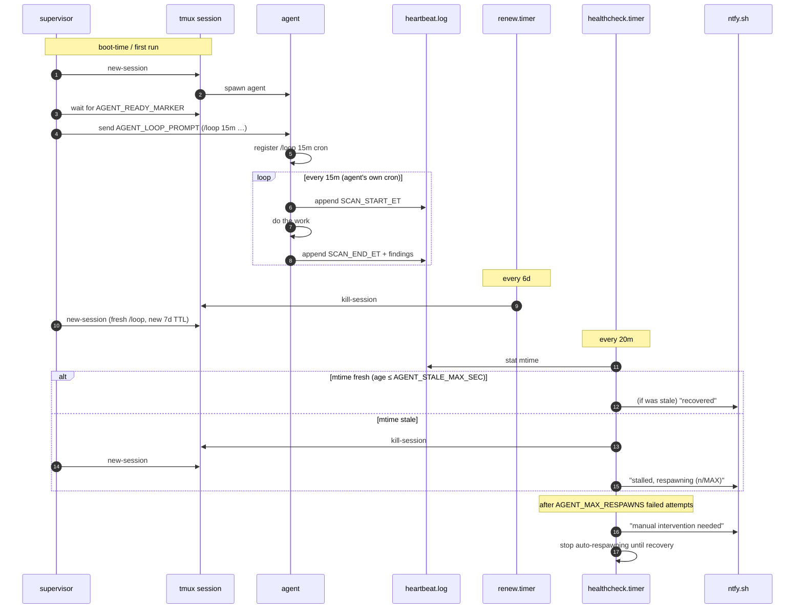
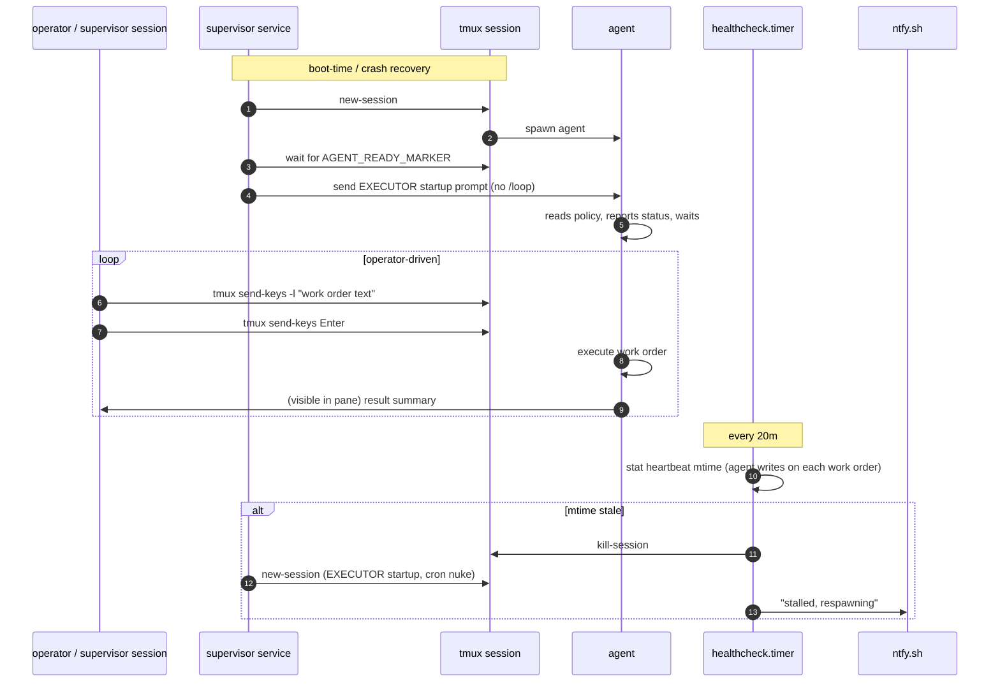

# Architecture

## Hive v2 (current)

Hive v2 runs as a **single container with three processes**:

- **Go binary** (`hive`) — orchestrates agent tmux sessions, runs the governor eval loop, serves the dashboard API, manages health checks and token tracking
- **Node.js proxy** — reverse proxy for the dashboard frontend with SSE streaming
- **ttyd** — web terminal for remote access to agent tmux sessions

Agents run inside tmux sessions managed by the Go binary, each under its own Unix UID. The **governor** evaluates queue depth on a configurable interval and switches between four modes (SURGE, BUSY, QUIET, IDLE), each with per-agent cadences. A **deterministic pipeline** of shell scripts pre-processes all GitHub data before agents are kicked, and a default-on **GitHub policy proxy** enforces each agent's ACMM mode and the repo allowlist at the network layer (see the [Security Model](security-model.md)).

All configuration lives in a single `hive.yaml`; persistent state (metrics, beads, logs, dashboard config overlay) lives on a PVC at `/data`. Agents talk to their backend via per-agent CLI processes — Claude, Copilot, Gemini, Goose — or, for self-hosted inference backends (litellm / vllm / llm-d), via an in-process Anthropic-to-OpenAI translator.

Hives can register with the **Hive Hub** (`hive.kubestellar.io`): the hub authenticates dashboard users with GitHub OAuth, proxies spoke dashboards, receives authenticated heartbeats (health, version, token counts), and can provision fully hosted hives — one namespace, pod, and PVC per hive, with zero-downtime rolling upgrades.

See the [Introduction](readme.md) for deployment options and configuration reference.

---

## Legacy v1 runtime: supervision patterns

> **Note:** the rest of this page documents the original **v1 runtime** — shell scripts driven by systemd/launchd on a host, with agents supervised in tmux (`hive supervisor`, `/etc/hive/*.env`). The v1 tooling still exists in the repository root, but v2 (above) is the current, recommended way to run hive. The supervision patterns below remain useful reading if you run agents outside the v2 container.

## Two scheduling models

hive v1 supports two fundamentally different ways to drive an agent. Choose based on how much control you want to keep.

### Model A — Self-scheduling (/loop cron)

The agent registers its own cron job (`/loop 15m …`) and fires on that cadence indefinitely. The supervisor's only job is to keep the session alive and respawn it if it crashes. Low operator involvement; the agent runs autonomously.

**Best for:** Single-agent setups, batch jobs, anything where the cadence is fixed and you trust the agent to stay on task.

### Model B — EXECUTOR MODE (supervisor-driven)

The agent starts, reads its policy, then **waits at the prompt** for the supervisor to send work orders via `tmux send-keys`. No cron, no self-scheduling. The supervisor (another Claude Code session, a script, or a human) decides when to fire and what to do.

**Best for:** Multi-agent setups where you want a single controller to prioritize across several agents, production workflows where you need to inspect output before triggering the next step, or any situation where the agent kept re-starting its own loop despite being told not to.

> **Gotcha — session restore bakes in old crons.** Claude Code restores its previous conversation context on respawn. If the agent ever registered a `/loop` cron before, that cron comes back in the restored context even if the new `AGENT_LOOP_PROMPT` says not to. The preferred fix is to enforce EXECUTOR MODE via policy files the agent re-reads on every firing — not by having the supervisor send a cron-nuke message. Supervisor should never inspect or delete crontabs; policy is the enforcement mechanism.

> **Gotcha — tmux `-l` makes Enter literal.** When dispatching work orders, always split text and Enter into **two separate** `tmux send-keys` calls:
>
> ```sh
> tmux send-keys -t session -l "do the thing"
> sleep 1
> tmux send-keys -t session Enter
> ```
>
> Combining them as `tmux send-keys -t session -l "do the thing" Enter` sends the word "Enter" as part of the literal text, leaving the agent stuck with text in its input box.

---

## Four components, four failure modes

| # | Unit | Trigger | Catches |
|---|---|---|---|
| 1 | `hive.service` | Always running; internal poll every `AGENT_POLL_SEC` (default 10s) | Agent process crash, tmux session killed, TUI-ready detection for startup prompt injection, auto-approval of a known sensitive-file prompt |
| 2 | `hive-renew.timer` | Every 6 days + 5 min after boot | Claude Code `/loop` cron auto-expires at 7 days — kills the session so the supervisor re-registers a fresh one. **Disable this in EXECUTOR MODE** — there is no cron to renew. |
| 3 | `hive-healthcheck.timer` | Every 20 min + 5 min after boot | Agent is "alive" but not making progress (auth loop, stuck prompt, model stuck thinking) — watches heartbeat-file mtime |
| 4 | ntfy push inside the healthcheck | On stall, on recovery, on escalation | Operator not watching the box — phone push |

## Reactions to each failure mode

### Model A (self-scheduling)



### Model B (EXECUTOR MODE)



---

## Multi-agent topology

When running several agents on the same machine, the EXECUTOR pattern lets a single supervisor session coordinate all of them without the agents conflicting:

```text
┌─────────────────────────────────────┐
│   supervisor session (Mac)          │
│   /loop — sweeps every 20-25 min    │
│   sends tmux work orders to agents  │
└──────┬──────────┬──────────┬────────┘
       │          │          │
       ▼          ▼          ▼
  scanner      reviewer   outreach
  (Opus 4.7)  (Sonnet)   (Sonnet)
  hive   hive  hive
  tmux         tmux        tmux
```

Each agent:
- Has its own tmux session and systemd service
- Reads its own policy file from the shared memory directory
- Writes to a shared work ledger (`bd` / beads) using `--actor <name>` to claim work
- Skips items already claimed by another actor (`bd list --actor=<other> --status=in_progress`)
- Notifies the operator via ntfy for decisions that require human judgment

Renew timers are **disabled** for all agents in EXECUTOR MODE. The supervisor sends a fresh startup + cron-nuke on every respawn automatically.

---

## What this deliberately does NOT handle

- **Remote box offline / network partition.** If the whole machine is down, there's no process left to push a stall alert. A secondary watcher outside the box (uptimerobot, healthchecks.io, your laptop) is the correct answer, and is out of scope for this repo.
- **ntfy.sh downtime.** Free tier, rare, tolerable. Self-host or swap the transport if you need SLAs.
- **Agent logic bugs.** If the agent decides to do nothing forever but remembers to write the heartbeat, the healthcheck won't catch it. The log format in your policy file should include non-trivial counts (repos scanned, actions taken) so you can spot a "no-op loop" visually.
- **Secrets management.** Don't put credentials in `agent.env`. The agent should source them from its own credential store (`~/.claude/.credentials.json` for Claude Code, vault / secrets manager for anything else).

---

## Reference deployment: hybrid local scanner + GitHub responders

Models A and B both put the AI agent on a periodic loop. A third pattern — used in production on [KubeStellar](https://kubestellar.io) — **decouples scanning from fixing**:

- A lightweight **bash scanner** runs on a fixed timer (launchd or systemd), polling GitHub for open issues/PRs and writing state to a **SQLite database**. No LLM needed.
- The **AI agent** reads the database when triggered (by skill invocation, `/loop` cron, or EXECUTOR work order) and fixes what's actionable.
- **GitHub Actions workflows** on the repo auto-file issues when workflows fail, creating a feedback loop where the scanner picks up the new issue on its next cycle.

This is not a new scheduling model — it's a **composition** of the existing patterns with a deterministic scanner in front and GitHub as an event source.

### Why this pattern exists

| Problem | How the hybrid solves it |
|---|---|
| AI session restarts / rate limits cause missed scans | Scanner runs independently — state is never lost |
| Scanning is deterministic but consumes LLM tokens | Scanner is pure bash — zero LLM cost |
| No audit trail of what was scanned | `cycles` table in SQLite records every scan |
| Workflow failures go unnoticed for days | `workflow-failure-issue.yml` auto-files issues within minutes |
| Fix attempts need backoff | `fix_attempts` counter prevents infinite retries |

### Architecture

```text
                        ┌──────────────────────┐
                        │  GitHub (source of    │
                        │  truth for issues/PRs)│
                        └──────────┬───────────┘
                                   │
                    gh issue list / gh pr list
                                   │
┌──────────────────────────────────┼──────────────────────────────┐
│  Local machine (Mac / Linux)     │                              │
│                                  ▼                              │
│  ┌─────────┐    ┌──────────┐    ┌──────────┐    ┌───────────┐  │
│  │ launchd │───▶│worker.sh │───▶│ state.db │◀───│ AI agent  │  │
│  │ / cron  │    │(scanner) │    │ (SQLite) │    │(reads DB, │  │
│  └─────────┘    └────┬─────┘    └──────────┘    │ fixes)    │  │
│                      │                           └─────┬─────┘  │
│                  ntfy push                        git push      │
│                      │                           gh pr create   │
│                      ▼                                 │        │
│                 ┌──────────┐                           │        │
│                 │  phone   │                           │        │
│                 └──────────┘                           │        │
└────────────────────────────────────────────────────────┼────────┘
                                                        │
                                   mutates GitHub state (PRs, merges)
                                                        │
                                                        ▼
                        ┌──────────────────────────────────────┐
                        │  GitHub Actions (automated responders)│
                        │                                      │
                        │  workflow-failure-issue.yml           │
                        │  → auto-files issue on failure       │
                        │                                      │
                        │  ai-fix.yml                          │
                        │  → auto-dispatches fix on label      │
                        └──────────────────────────────────────┘
```

**Data flow boundary**: GitHub Actions write to GitHub (issues, labels). The local scanner reads from GitHub and writes to SQLite. The AI agent reads SQLite and writes to GitHub. No component writes directly to another's state store.

### Reference implementation

- `examples/worker.sh.example` — the scanner script
- `examples/sqlite-state.md` — SQLite schema and query patterns
- `examples/kubestellar-fixer.md` — full case study with results
- `launchd/` — macOS plist templates for the scanner and supervisor
