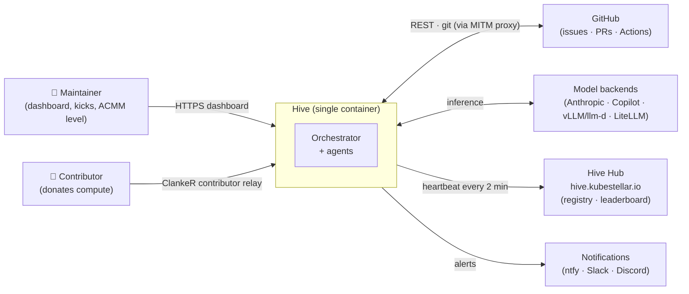
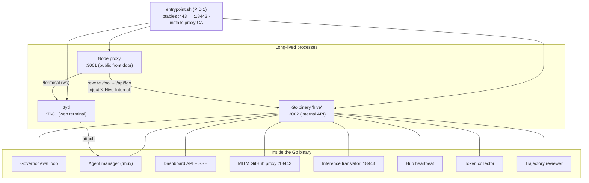
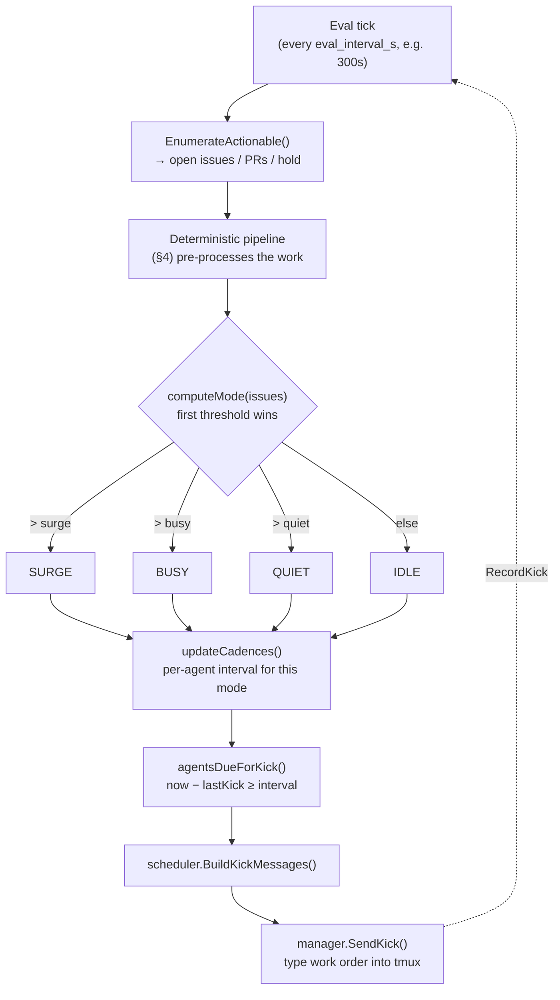
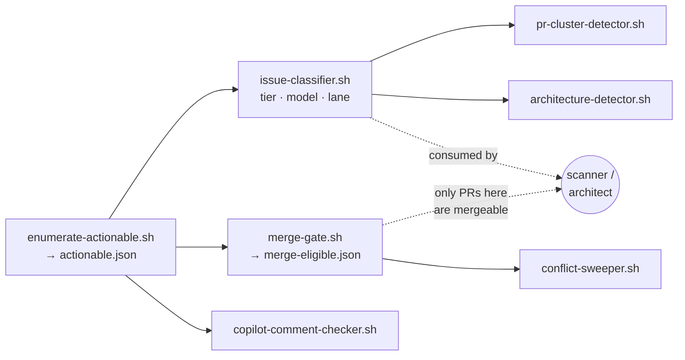
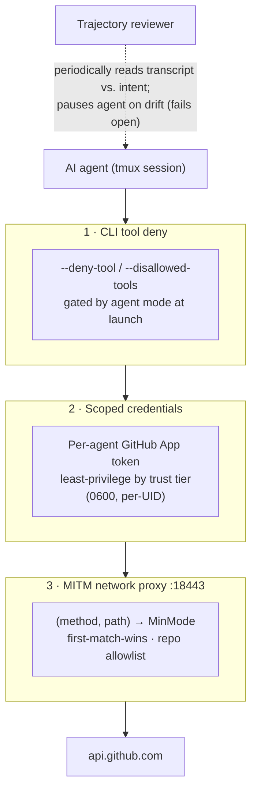
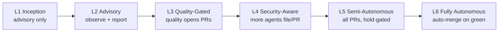
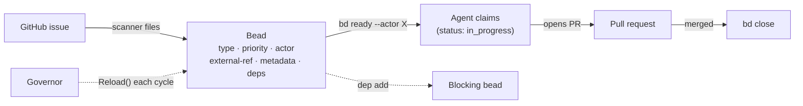
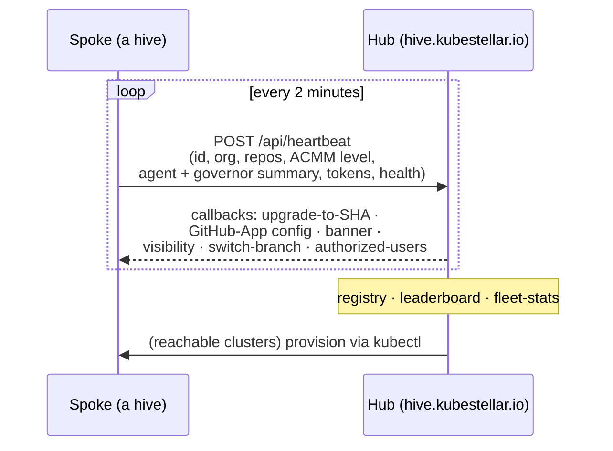
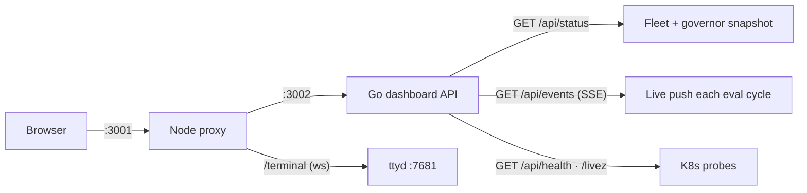
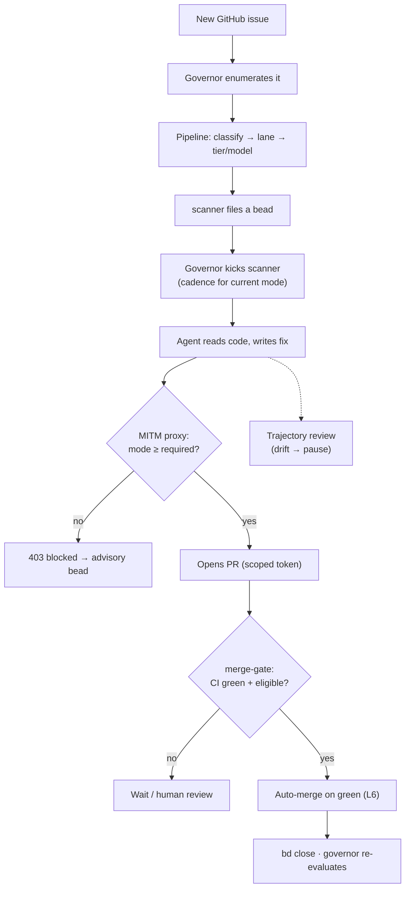

> **Synced from Hive.** This page is pulled from [kubestellar/hive@v4](https://github.com/kubestellar/hive/blob/v4/src/docs/architecture.md) during the docs build. Edit the canonical source in the Hive repository.

# Hive Reference Architecture

Hive is AI-agent orchestration for open-source projects. A single Go binary
enumerates GitHub issues and PRs, classifies them, and dispatches work to AI
coding agents (Claude, Copilot, Gemini, Goose) on adaptive cadences governed by
queue depth — with layered, technically-enforced guardrails between an agent and
the outside world.

The design separates **deterministic decisions** (filtering, classification,
merge-gating, permission enforcement) from **judgment calls** (reading code,
reasoning about a fix, writing a PR). Deterministic work runs in Go and shell
before any LLM sees the task; agents only handle the judgment.

> Goal decomposition, plan review, and stall-triggered re-planning are **not**
> covered on this page — they are the planning-intelligence lane. Plan review and
> the stall-replan lane run automatically (replan is on by default); decomposition
> is gated at ACMM **L5+**, because the architect that decomposes epics has no
> cadence below L5, and its final step — turning the architect's plan into child
> beads — currently runs through the `bd decompose` CLI rather than automatically.
> See [`planning-intelligence.md`](https://github.com/kubestellar/hive/blob/v4/src/docs/planning-intelligence.md) and
> [ADR-0006](/docs/hive/adr/0006-planning-intelligence).

---

## 1. System context

Where Hive sits between the humans who run it and the services it drives.

```mermaid
flowchart LR
    maintainer["👤 Maintainer<br/>(dashboard, kicks, ACMM level)"]
    contributor["👤 Contributor<br/>(donates compute)"]

    subgraph hive["Hive (single container)"]
        core["Orchestrator<br/>+ agents"]
    end

    github["GitHub<br/>(issues · PRs · Actions)"]
    models["Model backends<br/>(Anthropic · Copilot · vLLM/llm-d · LiteLLM)"]
    hub["Hive Hub<br/>hive.kubestellar.io<br/>(registry · leaderboard)"]
    notify["Notifications<br/>(ntfy · Slack · Discord)"]

    maintainer -->|HTTPS dashboard| hive
    contributor -->|ClankeR contributor relay| hive
    hive <-->|"REST · git (via MITM proxy)"| github
    hive <-->|inference| models
    hive -->|"heartbeat every 2 min"| hub
    hive -->|alerts| notify
```

---

## 2. Container process model

Hive ships as one container. The Docker entrypoint is PID 1 and supervises
**three long-lived processes**; the Go binary is the brain and runs most
subsystems as in-process goroutines.

```mermaid
flowchart TB
    entry["entrypoint.sh (PID 1)<br/>iptables :443 → :18443 · installs proxy CA"]

    subgraph procs["Long-lived processes"]
        direction LR
        node["Node proxy<br/>:3001 (public front door)"]
        go["Go binary 'hive'<br/>:3002 (internal API)"]
        ttyd["ttyd<br/>:7681 (web terminal)"]
    end

    subgraph goroutines["Inside the Go binary"]
        direction TB
        gov["Governor eval loop"]
        mgr["Agent manager (tmux)"]
        dash["Dashboard API + SSE"]
        mitm["MITM GitHub proxy :18443"]
        infer["Inference translator :18444"]
        hb["Hub heartbeat"]
        tok["Token collector"]
        traj["Trajectory reviewer"]
    end

    entry --> node & go & ttyd
    node -->|"rewrite /foo → /api/foo<br/>inject X-Hive-Internal"| go
    node -->|"/terminal (ws)"| ttyd
    go --- gov & mgr & dash & mitm & infer & hb & tok & traj
    ttyd -->|attach| mgr
```

| Port | Bound | Purpose |
|-----:|-------|---------|
| **3001** | node proxy | Public dashboard front door (auth, path-rewrite, SSE + ws passthrough) |
| **3002** | Go binary | Internal JSON/SSE API (`/api/*`, `/metrics`) |
| **7681** | ttyd | Web terminal onto agent tmux sessions |
| 18443 | Go (loopback) | MITM GitHub proxy — all agent egress redirected here by iptables |
| 18444 | Go (loopback) | Inference translator (Anthropic ↔ OpenAI reroute for gateway backends) |

Agents run as **tmux sessions** named `hive-<agent>`, one per agent, optionally
under per-agent OS users for UID isolation.

---

## 3. The governor loop — from queue depth to a kick

The governor is a queue-depth scheduler. Each eval cycle it enumerates
actionable GitHub work, picks a **mode** from the issue count, derives each
agent's **cadence** from that mode, and returns the agents that are due — which
the scheduler turns into kick messages the agent manager types into each tmux
session.

```mermaid
flowchart TB
    tick["Eval tick<br/>(every eval_interval_s, e.g. 300s)"]
    enum["EnumerateActionable()<br/>→ open issues / PRs / hold"]
    pipe["Deterministic pipeline<br/>(§4) pre-processes the work"]
    mode{"computeMode(issues)<br/>first threshold wins"}
    cad["updateCadences()<br/>per-agent interval for this mode"]
    due["agentsDueForKick()<br/>now − lastKick ≥ interval"]
    build["scheduler.BuildKickMessages()"]
    send["manager.SendKick()<br/>type work order into tmux"]

    tick --> enum --> pipe --> mode
    mode -->|"> surge"| SURGE
    mode -->|"> busy"| BUSY
    mode -->|"> quiet"| QUIET
    mode -->|else| IDLE
    SURGE & BUSY & QUIET & IDLE --> cad --> due --> build --> send
    send -.->|RecordKick| tick
```

**Modes** (thresholds are config/pack-driven; defaults shown):

| Mode | Trigger (open actionable issues) | Meaning |
|------|----------------------------------|---------|
| `IDLE`  | ≤ quiet threshold (0) | Nothing pressing; agents on slow cadence |
| `QUIET` | > quiet (2) | Normal load |
| `BUSY`  | > busy (10) | High load; faster cadences |
| `SURGE` | > surge (20) | Critical; fastest cadences, some agents may pause to focus fleet |

A **kick** is a work order typed into the agent's CLI prompt. If the agent has
`clear_on_kick`, the manager sends `/clear` first so each kick starts from a
clean context. A **7-day rolling token budget** gates kicks: at 90% it warns; on
exhaustion it suppresses kicks for all but explicitly-exempt agents.

---

## 4. The deterministic pipeline

Before any agent is kicked, `run-pipeline.sh` runs the `pre-kick` stages defined
in `hive-project.yaml`, topologically sorted by their declared dependencies. Each
stage is a shell script that writes a JSON artifact other stages and agents
consume — so an agent is handed pre-filtered, pre-classified, merge-gated work.
For a script-by-script index of this layer, see [`../../bin/README.md`](https://github.com/kubestellar/hive/blob/v4/bin/README.md).

```mermaid
flowchart LR
    enum["enumerate-actionable.sh<br/>→ actionable.json"]
    classify["issue-classifier.sh<br/>tier · model · lane"]
    cluster["pr-cluster-detector.sh"]
    arch["architecture-detector.sh"]
    gate["merge-gate.sh<br/>→ merge-eligible.json"]
    conflict["conflict-sweeper.sh"]
    copilot["copilot-comment-checker.sh"]

    enum --> classify --> cluster
    classify --> arch
    enum --> gate --> conflict
    enum --> copilot

    classify -.consumed by.-> scanner((scanner /<br/>architect))
    gate -.only PRs here<br/>are mergeable.-> scanner
```

- **Classification** (also mirrored in Go, `pkg/classify`) tags each issue with a
  complexity **tier** (Simple/Medium/Complex → haiku/sonnet/opus), a **lane**
  (which agent owns it), and a cluster key for bundling related work.
- **Merge-gating** produces `merge-eligible.json`; agents may merge **only** PRs
  on that list (required CI green — ignoring Playwright/Tide/visual checks — not
  draft, and either AI-authored or community-authored with an approving review).
- **Enforcement** is the always-on `gh` wrapper (`/usr/local/bin/gh`): it injects
  the scoped App token and blocks writes that exceed the agent's permission
  tier — the shell-level twin of the network-level MITM proxy (§6).

---

## 5. Layered guardrails (defense in depth)

An agent's permissions are enforced at three independent layers, all keyed off
the same per-agent **mode** (`ADVISORY` → `ISSUES_ONLY` → `ISSUES_AND_PRS` →
`ISSUES_PRS_MERGE`) that the ACMM level assigns. A bug in one layer is caught by
the next.

```mermaid
flowchart TB
    agent["AI agent (tmux session)"]

    subgraph l1["1 · CLI tool deny"]
        tools["--deny-tool / --disallowed-tools<br/>gated by agent mode at launch"]
    end
    subgraph l2["2 · Scoped credentials"]
        token["Per-agent GitHub App token<br/>least-privilege by trust tier<br/>(0600, per-UID)"]
    end
    subgraph l3["3 · MITM network proxy :18443"]
        rules["(method, path) → MinMode<br/>first-match-wins · repo allowlist"]
    end

    agent --> l1 --> l2 --> l3 --> ghapi["api.github.com"]

    traj["Trajectory reviewer"] -. "periodically reads transcript vs. intent;<br/>pauses agent on drift (fails open)" .-> agent
```

**MITM proxy rule table** (first match wins; a write below its `MinMode` gets a
`403 X-Hive-Proxy-Blocked`):

| Request | Minimum mode required |
|---------|-----------------------|
| `PUT …/pulls/{n}/merge` | `ISSUES_PRS_MERGE` |
| `POST …/pulls`, `PATCH …/pulls/{n}`, reviews, `git-receive-pack`, ref writes | `ISSUES_AND_PRS` |
| `POST/PATCH …/issues`, issue comments, labels | `ISSUES_ONLY` |
| GraphQL mutations | `ISSUES_ONLY` |
| all `GET`/`HEAD`, fetch, GraphQL queries | `ADVISORY` |

Agent **identity** is derived from the connection's owning UID (`/proc/net/tcp`
→ UID → agent name), and the agent's mode is read from a hot-reloadable file
`/tmp/.hive-mode-<agent>`. A **repo allowlist** additionally blocks writes to any
repo outside the configured set. Only `api.github.com` is inspected; `github.com`
(OAuth, git smart-HTTP) is tunneled opaquely.

---

## 6. ACMM — controlling agent autonomy

The **AI-native Capability Maturity Model** is the single dial an operator turns.
The level maps deterministically to per-agent modes via `DefaultAgentMode`, which
in turn sets the guardrails in §5. Raising the level is always a human decision.

```mermaid
flowchart LR
    L1["L1 Inception<br/>advisory only"]
    L2["L2 Advisory<br/>observe + report"]
    L3["L3 Quality-Gated<br/>quality opens PRs"]
    L4["L4 Security-Aware<br/>more agents file/PR"]
    L5["L5 Semi-Autonomous<br/>all PRs, hold-gated"]
    L6["L6 Fully Autonomous<br/>auto-merge on green"]
    L1 --> L2 --> L3 --> L4 --> L5 --> L6
```

| Level | Name | Effect on agents |
|-------|------|------------------|
| L1 | Inception (Assisted) | Advisory beads + project inception only |
| L2 | Advisory (Instructed) | Observe and report findings as beads; no GitHub writes |
| L3 | Quality-Gated (Measured) | `quality` opens hold-gated PRs about testing gaps, coverage, and CI health; others advisory. This measurement foundation is what earns automation at higher levels |
| L4 | Security-Aware (Adaptive) | All agents file issues (bugs, docs, workflows, vulns); still no PRs |
| L5 | Semi-Autonomous (Semi-Automated) | All agents open PRs — every PR carries a `hold` label for human review |
| L6 | Fully Autonomous | Agents open PRs and **auto-merge on green CI**; no hold required |

`supervisor` is always advisory. The full matrix is in
[`acmm-policy-matrix.md`](/docs/hive/acmm-policy-matrix).

---

## 7. Beads — the work ledger

Each agent has a durable, git-backed JSON ledger (`bd` CLI) that lets agents
coordinate without a central queue. Beads are typed work items with priorities,
dependencies, and free-form metadata; agents scope their view with `--actor` and
pull ready work with `bd ready`.

```mermaid
flowchart LR
    gh["GitHub issue"] -->|scanner files| bead["Bead<br/>type · priority · actor<br/>external-ref · metadata · deps"]
    bead -->|"bd ready --actor X"| claim["Agent claims<br/>(status: in_progress)"]
    claim -->|opens PR| pr["Pull request"]
    pr -->|merged| close["bd close"]
    bead -.->|"dep add"| bead2["Blocking bead"]
    gov["Governor"] -.->|"Reload() each cycle"| bead
```

- **Types:** `bug · feature · task · epic · chore · decision · advisory`
- **Status:** `open · in_progress · blocked · done · closed`
- **Location:** `/data/beads/<agent>/beads.json` (+ archived `archive.jsonl`)
- Blocked writes and other findings land as `advisory` beads that the governor
  folds into its digest — the ledger is internal state, never mirrored to GitHub.

---

## 8. Hub & spoke

Every hive is a **spoke**; one hosted instance
([hive.kubestellar.io](https://hive.kubestellar.io)) runs as the **hub**. Both
are the same image (`HIVE_MODE=hub` selects the role). Spokes push a heartbeat;
the hub answers with callbacks — the control channel that works even for spokes
the hub can't reach directly (firewalled clusters).

```mermaid
sequenceDiagram
    participant S as Spoke (a hive)
    participant H as Hub (hive.kubestellar.io)
    loop every 2 minutes
        S->>H: POST /api/heartbeat<br/>(id, org, repos, ACMM level,<br/>agent + governor summary, tokens, health)
        H-->>S: callbacks: upgrade-to-SHA ·<br/>GitHub-App config · banner ·<br/>visibility · switch-branch · authorized-users
    end
    Note over H: registry · leaderboard · fleet-stats
    H->>S: (reachable clusters) provision via kubectl
```

The hub also serves the public **registry**, cross-hive **leaderboard**, and the
**contributor** flow: community members donate compute to a spoke via **ClankeR**,
the contributor relay — starting rate-limited and auto-promoting through trust
tiers as tasks complete — their credentials never leave their machine.

---

## 9. Model backends & cost

Agents can run against Anthropic (Claude Code), GitHub Copilot, or any
OpenAI-compatible gateway (vLLM, llm-d, LiteLLM, named gateways). Gateway traffic
is routed through the in-process **inference translator** (:18444), which
reroutes Anthropic-shaped calls to OpenAI-shaped endpoints where needed.

**Cost** is a list-price estimate, not a billing feed: the token collector scans
each backend's **session JSONL** files (plus a live proxy sniff of Copilot's
usage block) and multiplies token counts by a dated per-model price table. This
feeds the dashboard's live cost, hourly spend, and per-agent/model attribution.
See [Token collection and usage tracking](https://github.com/kubestellar/hive/blob/v4/src/docs/token-tracking.md) for the data shape,
`/api/cost`, and hub `/api/saas/usage` rollups.

---

## 10. Dashboard & observability

```mermaid
flowchart LR
    browser["Browser"] -->|:3001| node["Node proxy"]
    node -->|:3002| api["Go dashboard API"]
    api -->|"GET /api/status"| status["Fleet + governor snapshot"]
    api -->|"GET /api/events (SSE)"| stream["Live push each eval cycle"]
    api -->|"GET /api/health · /livez"| probes["K8s probes"]
    node -->|"/terminal (ws)"| ttyd["ttyd :7681"]
```

- `/api/status` — full fleet + governor state (`BuildFrontendStatus`).
- `/api/audit` — recent audit entries for read-write users: dashboard config changes, logins, GitHub App setup changes, and agent lifecycle events such as start, stop, launch failure, pause/resume/kick, add/remove, backend changes, and model changes. Entries are kept in memory and, when `/data` exists, appended to `/data/audit.jsonl` with lumberjack rotation (5 MB files, 3 backups, 90 days).
- The machine-readable dashboard API reference is [dashboard/openapi.json](https://github.com/kubestellar/hive/blob/v4/dashboard/openapi.json).
- `/api/events` — Server-Sent Events; the dashboard is pushed a fresh snapshot on
  every eval cycle (and a lighter agent-only update on the fast poll).
- `/api/health`, `/api/health/deep`, `/api/livez` — readiness and liveness; the
  `livez` probe catches the "HTTP up but eval loop / heartbeat stalled" case.
- Notifications (`ntfy` / Slack / Discord) fire on budget warnings, SLA breaches,
  trajectory-drift pauses, and other governor events.
- Optional OpenTelemetry export is configured with an `otel:` block in
  `hive.yaml` and is off by default. When enabled, Hive exports OTLP/HTTP spans
  for governor eval cycles, agent kicks, and recorded lifecycle/PR events; agent spans use
  GenAI semantic convention attributes such as `gen_ai.system`,
  `gen_ai.request.model`, and token usage fields when that data is available,
  plus Hive attributes like `hive.agent`, `hive.lane`, `hive.acmm_level`, and
  `hive.governor.mode`.
- Log output is wrapped by `pkg/logscrub`, which redacts recognized GitHub token and JWT-like strings from messages and string attributes. See [Security notes](https://github.com/kubestellar/hive/blob/v4/src/docs/security.md) for guarantees and limits.
- Network exposure and TLS termination are documented in [Network and port requirements](https://github.com/kubestellar/hive/blob/v4/src/docs/network-requirements.md) and [TLS setup](https://github.com/kubestellar/hive/blob/v4/src/docs/tls-setup.md).
- `/terminal` is served by `ttyd`, which invokes `deploy/ttyd-tmux.sh` to attach to the selected `hive-<agent>` tmux session as the socket-owning UID. This is required when agents run under per-agent users and tmux rejects attaches from the proxy user.
- `deploy/hive-panes.sh` backs a read-only peer-observation workflow: it reads pluk JSONL logs from `/var/run/pluk/logs`, skips the calling agent, strips terminal escapes, and prints recent output without opening another agent's tmux socket. See [Agent peer-awareness logging](https://github.com/kubestellar/hive/blob/v4/src/docs/agent-logging.md) for the log format, attachment conditions, and retention.

---

## 11. End-to-end: an issue becomes a merged PR

Putting the pieces together for a single unit of work at L6.

```mermaid
flowchart TB
    issue["New GitHub issue"] --> enum["Governor enumerates it"]
    enum --> pipe["Pipeline: classify → lane → tier/model"]
    pipe --> bead["scanner files a bead"]
    bead --> kick["Governor kicks scanner<br/>(cadence for current mode)"]
    kick --> agent["Agent reads code, writes fix"]
    agent --> proxy{"MITM proxy:<br/>mode ≥ required?"}
    proxy -->|no| block["403 blocked → advisory bead"]
    proxy -->|yes| pr["Opens PR (scoped token)"]
    pr --> gate{"merge-gate:<br/>CI green + eligible?"}
    gate -->|no| wait["Wait / human review"]
    gate -->|yes| merge["Auto-merge on green (L6)"]
    merge --> close["bd close · governor re-evaluates"]
    agent -.-> traj["Trajectory review<br/>(drift → pause)"]
```

---

## Data stores at a glance

| Store | Path | Role |
|-------|------|------|
| Beads ledger | `/data/beads/<agent>/beads.json` | Per-agent work items (source of truth for tasks); see [SQLite state backend](https://github.com/kubestellar/hive/blob/v4/examples/sqlite-state.md) for a single-machine alternative |
| Running config | `/data/hive.yaml.dashboard` (overlay) + `/data/hive.yaml.runtime`; seed `/etc/hive/hive.yaml` | Authoritative runtime config lives on the PVC; precedence is documented in [config layering](https://github.com/kubestellar/hive/blob/v4/src/docs/config-layering.md) |
| Pipeline outputs | `/var/run/hive-metrics/{actionable,merge-eligible,pipeline-run}.json` | Deterministic pre-kick artifacts |
| Knowledge graph | `/data/graph/knowledge.db` + `/data/vaults/` | Facts, primers, inception scaffolds |
| Secrets | `/secrets/gh-app-key.pem`, `/data/gh-user-token`, `/data/proxy-ca.pem` | GitHub App key, user token, MITM CA |
| Per-agent mode | `/tmp/.hive-mode-<agent>` | Hot-reloadable proxy enforcement mode; per-agent `gh` wrapper denials are configured with [restriction files](https://github.com/kubestellar/hive/blob/v4/config/restrictions/README.md) |

---

*See also: [docs index](/docs/hive/readme) ·
[agent-configuration.md](/docs/hive/agent-configuration) ·
[acmm-policy-matrix.md](/docs/hive/acmm-policy-matrix) ·
[security-threat-model.md](/docs/hive/security-threat-model) ·
[ADR index](/docs/hive/adr/readme) ·
[roadmap.md](/docs/hive/roadmap) ·
[landscape.md](/docs/hive/landscape) ·
[manual-provisioning.md](/docs/hive/manual-provisioning) ·
[cross-cluster-migration.md](https://github.com/kubestellar/hive/blob/v4/src/docs/cross-cluster-migration.md) ·
[trajectory-review.md](https://github.com/kubestellar/hive/blob/v4/src/docs/trajectory-review.md) ·
[design/knowledge-system.md](https://github.com/kubestellar/hive/blob/v4/src/docs/design/knowledge-system.md)*
