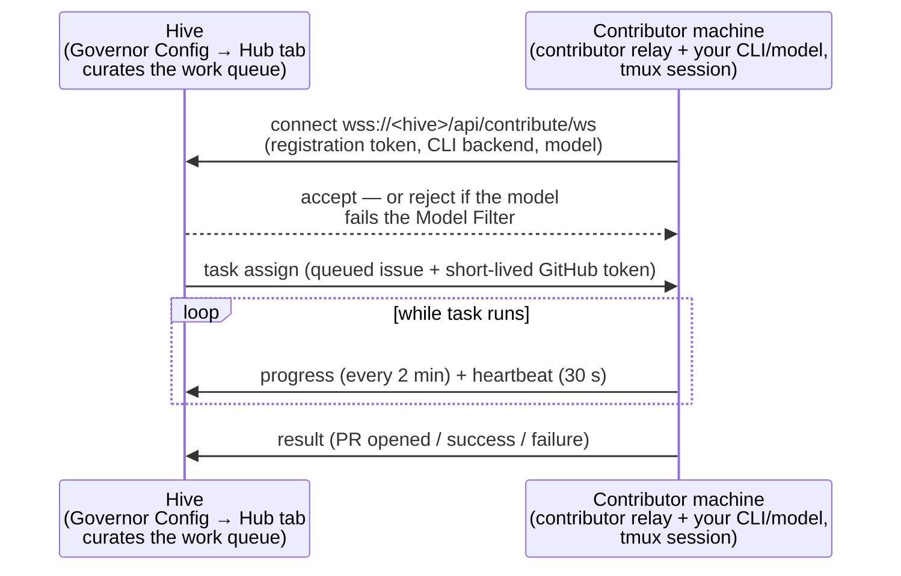

> **Synced from Hive.** This page is pulled from [kubestellar/hive@v4](https://github.com/kubestellar/hive/blob/v4/src/docs/contributor-relay.md) during the docs build. Edit the canonical source in the Hive repository.

# ClankeR contributor relay

ClankeR lets a contributor lend their local AI CLI subscription to a hive. A contributor runs a small relay process on their machine; the hive assigns it real work — issues from the project's queue — and the contributor's agent executes each task locally with the CLI and model of their choice, reporting completion/PR metadata back over a WebSocket.

The relay turns a hive from a fixed set of resident agents into an elastic swarm: the admin curates *what* is offered (which repos, which labels, which models are acceptable), and contributors decide *how* it gets done (their CLI, their model, their compute, their tokens). The relay connects to `/api/contribute/ws`, receives one task at a time, runs the selected CLI in the contributor's environment, and reports the result back.

## How it fits together



- The **work queue** is built from the hive's monitored repos: open, actionable issues that pass the admin's filters. The current depth is visible on the Hub tab and at `GET /api/contribute/status` (as `actionable_items`).
- The **relay** authenticates with a registration token, receives one task at a time, drives the local CLI inside a tmux session, injects a short-lived GitHub token for the PR, and reports the result. It heartbeats every 30 s and reconnects with exponential backoff; a task is abandoned if it exceeds 30 minutes.
- Every contributor has a **trust tier** with per-tier rate limits. See [Contributor trust tiers and delegated agent roles](https://github.com/kubestellar/hive/blob/v4/src/docs/contributor-trust-and-roles.md).

## Basic setup

From a checkout of this repository:

```bash
export HIVE_HUB=wss://hive.example.com/contribute
just contribute-setup claude
just contribute-hive
```

`compose-contributor.yaml`, `Dockerfile.contributor`, and the `just contribute-hive` recipe are the reference container path. Native mode is available through `just contribute-hive <backend> local` when a container runtime is not desired.

`contribute-setup` is one-time per hive: it registers you (your GitHub identity plus a registration token stored in `${HOME}/.config/hive/contributor.env`), authenticates `gh`, and verifies the CLI backend you chose. Every hive also serves a landing page at **`https://<hive-dashboard>/contribute`** with live queue stats and copy-paste setup commands tailored to the CLI you pick.

`contribute-hive` starts the relay in one of two modes:

```bash
just contribute-hive               # containerized (recommended) — relay + CLI in docker or podman
just contribute-hive claude local  # host mode — relay + CLI directly on your machine, in a tmux session
```

Containerized mode auto-detects the runtime — docker first, then podman — and can be forced with `export HIVE_CONTAINER_RUNTIME=podman`.

Use `just contribute-check <backend>` before registering to catch missing CLIs or obvious auth gaps.

## Docker Compose workflow

The containerized path is `src/compose-contributor.yaml` plus `src/Dockerfile.contributor`; the `just contribute-hive` recipe wraps it. From the repository root you can also run Compose directly after `just contribute-setup` has written `${HOME}/.config/hive/contributor.env`:

```bash
export AGENT_BACKEND=claude
docker compose -f src/compose-contributor.yaml up --build
```

The compose file mounts local contributor state read-only into the container:

- `${HOME}/.config/hive` for Hive registration/config.
- `${HOME}/.claude` and `${HOME}/.config/claude-code` for Claude-family CLI auth.

Important environment variables:

| Variable | Default | Meaning |
| --- | --- | --- |
| `HIVE_HUB` | value from `contributor.env`, else public hub default | WebSocket hub(s) to subscribe to. Use comma-separated URLs for multi-hub mode. Direct Compose reads the registered value from the mounted config file. |
| `HIVE_REGISTRATION_TOKEN` | value from `contributor.env` | Registration token(s), positional with `HIVE_HUB` when multiple hubs are listed. Required; run `just contribute-setup` first. |
| `AGENT_BACKEND` | `claude` | CLI/backend to run (`claude`, `copilot`, `goose`, `bob`, `codex`, `pi`, `aider`, `litellm`, `agy`, `opencode`, `kilo`, depending on image support and credentials). `agy` has no OS-level sandbox of its own, so run it containerized (`just contribute-hive agy`) — the contributor image ships the `agy` binary; local mode refuses to launch it without `HIVE_AGY_DANGEROUSLY_RUN_UNCONFINED=1`. `opencode` and `kilo` only run headless (`CONTRIBUTOR_MODE=headless`) — it has no interactive-tmux wiring. |
| `AGENT_MODEL` | unset (backend default) | Optional model override passed to the contributor agent (e.g. `claude-sonnet-4-6`, `gpt-4o`, `gemini-2.5-pro`). Declared to the hive when the relay connects. |
| `AGENT_REASONING_EFFORT` | unset | Reasoning effort override. Consumed by `codex` (`-c model_reasoning_effort`) and by `agy` (`--effort low\|medium\|high`, required whenever a model is set, else agy ignores the model). Ignored by other backends. |
| `CONTRIBUTOR_MODE` | `interactive` | `interactive` keeps a tmux/TTY session. `headless` is for one-shot/no-TTY task delivery. |
| `HIVE_AGENT_SESSION` | `contributor` | tmux session name for interactive mode. |
| `HIVE_CODEX_APPROVALS_REVIEWER` | `auto_review` | Codex reviewer for boundary requests. The default prevents Hive-delivered work from waiting on an interactive operator while retaining `workspace-write`; set `user` only for an intentionally attended contributor. Set it to the **empty string** to omit the `-c approvals_reviewer=` key entirely — the escape hatch if a Codex release rejects that config key at startup. Doing so keeps the sandbox posture; it is not the same as the dangerous bypass. |
| `HIVE_CLAUDE_DANGEROUSLY_ALLOW_HOST_STATE` | unset | Drops the defense-in-depth Claude command denylist. In local mode the native filesystem sandbox still applies, so this does not grant host writes. |
| `HIVE_CLAUDE_DANGEROUSLY_BYPASS_APPROVALS_AND_SANDBOX` | unset | Restores the pre-#4918 unconfined Claude/LiteLLM local posture. Use only on a disposable or externally sandboxed host. |
| `HIVE_COPILOT_DANGEROUSLY_BYPASS_SANDBOX` | unset | Restores the unconfined Copilot local posture. Also the automatic fallback (with a warning) when the installed `copilot` CLI predates `--sandbox` (copilot-cli < 1.0.60). |
| `HIVE_OPENCODE_DANGEROUSLY_ALLOW_HOST_STATE` | unset | Drops opencode's host-state command deny-list (`permission.bash`). opencode has no filesystem sandbox to fall back to either way — this only removes the command-name floor. |
| `HIVE_GOOSE_DANGEROUSLY_RUN_UNCONFINED` | unset | **Required** for `just contribute-hive goose local` to launch at all. goose has no sandbox, filesystem allowlist, or command deny-list hive can wire; local mode refuses to launch without this. |
| `HIVE_AGY_DANGEROUSLY_RUN_UNCONFINED` | unset | **Required** for `just contribute-hive agy local` to launch at all. Same reasoning as goose above — agy's execution modes govern approval only, not filesystem confinement. Container mode (the default) needs no such flag: it now ships the `agy` binary and runs it inside the container boundary. |
| `HIVE_BOB_DANGEROUSLY_RUN_UNCONFINED` | unset | **Required** for `just contribute-hive bob local` to launch at all. Bob Shell documents no sandbox or path-restriction mechanism of any kind. |
| `HIVE_PI_DANGEROUSLY_RUN_UNCONFINED` | unset | **Required** for `just contribute-hive pi local` to launch at all. pi ships with no sandbox by default; directory confinement exists only via a third-party extension hive does not depend on. |
| `HIVE_AIDER_DANGEROUSLY_RUN_UNCONFINED` | unset | **Required** for `just contribute-hive aider local` to launch at all. aider has no sandbox or OS isolation option of any kind. |

### Where each backend reads its instructions

The relay downloads the hive's knowledge export to a single `agent.md` and then
symlinks it under whatever filename the chosen CLI actually looks for
(`bin/contributor-agent.sh`). Getting this wrong is silent: the export is
fetched and refreshed on schedule, but the model never sees it — the failure
mode fixed for Goose in [#2393](https://github.com/kubestellar/hive/issues/2393).

| Backend | Filenames linked in `$HOME` |
| --- | --- |
| `claude`, `litellm` | `CLAUDE.md` |
| `copilot` | `copilot-instructions.md`, `COPILOT.md`, `CLAUDE.md` |
| `goose` | `AGENTS.md`, `.goosehints`, `.goose-instructions.md`, `CLAUDE.md` |
| `codex` | `AGENTS.md`, `CLAUDE.md` |
| `pi` | `AGENTS.md`, `CLAUDE.md` |
| `bob` | `.bob/AGENTS.md`, `CLAUDE.md` (compatibility) |
| `agy` | `CLAUDE.md` |
| `opencode` | `AGENTS.md`, `CLAUDE.md` |
| `kilo` | `AGENTS.md`, `CLAUDE.md` |
| anything else | `CLAUDE.md` only — the `*` fallback |

A backend that reads neither `CLAUDE.md` nor one of the names above falls into
the `*` branch and runs with no hive knowledge at all. When adding a backend,
confirm the filename its CLI reads and give it an explicit case.

For Codex, Hive also passes `--add-dir "$HIVE_WORKSPACE_DIR"`. The CLI itself
starts in the stable, credential-free `HIVE_AGENT_CWD`, while assigned checkouts
live below the separately bounded writable workspace. Automatic-review denial
or timeout remains a failure; headless mode reports the redacted terminal
diagnostic to Hive and returns the contributor to the ready pool.

`HIVE_WORKSPACE_DIR` must not contain whitespace. `backend_perm_flag` returns a
whitespace-separated flag string that the launcher word-splits, so a path with a
space cannot be expressed as a single argument — `--add-dir /work space` would
reach Codex as three separate words and grant the wrong directory. Hive detects
this, omits `--add-dir`, and warns on stderr rather than corrupting the argv;
the sandbox posture still applies, but the workspace is not granted. Move the
workspace to a path without spaces.

Claude-family local confinement: `claude` and `litellm` use Claude Code's
native OS sandbox in host mode. Hive enables it through command-line settings,
requires startup to fail when the sandbox is unavailable, disables unsandboxed
command retry, and runs in `dontAsk` mode so a request outside the declared
roots is denied instead of hanging an unattended pane. Bash subprocesses and
file edits may write only to `HIVE_AGENT_CWD` and `HIVE_WORKSPACE_DIR`.
Network domains are unrestricted because assigned third-party repositories
must be able to fetch arbitrary test/build dependencies; this is write
confinement, not a claim that the process can read or exfiltrate nothing.

On Linux/WSL2 the native sandbox requires `bubblewrap` and `socat`; macOS uses
Seatbelt. Missing dependencies are a hard launch failure, never a silent
fallback. The existing privilege-escalation and boot/deployment command
denials remain as defense in depth. `HIVE_CLAUDE_DANGEROUSLY_ALLOW_HOST_STATE=1`
drops only that command list; it does not cross the OS boundary. The distinct,
loudly named `HIVE_CLAUDE_DANGEROUSLY_BYPASS_APPROVALS_AND_SANDBOX=1` restores
the old unconfined local posture for an externally isolated/disposable host.

`just contribute-hive` still defaults to **container** mode, the stronger
backend-independent boundary. In local mode: Claude/LiteLLM and Codex use
their own OS-enforced sandboxes; Copilot now uses its own `--sandbox` (also
OS-enforced — Seatbelt/bubblewrap/ProcessContainer depending on platform),
gated on the installed CLI actually supporting the flag; opencode gets a
command-name deny-list via its own `permission.bash` config (a floor, not a
filesystem boundary — opencode has no OS sandbox); goose, agy, bob, pi, and
aider have no confinement mechanism this repo can wire at all, and local mode
for them **refuses to launch** unless the operator sets that backend's own
`HIVE_<BACKEND>_DANGEROUSLY_RUN_UNCONFINED=1`. See
[sandbox-isolation.md](https://github.com/kubestellar/hive/blob/v4/src/docs/sandbox-isolation.md)'s per-backend confinement matrix
for the authoritative, up-to-date state. The `agent_sandbox` Podman path
documented there remains **hub-side only** — nothing on the contributor path
reads it.

Codex config-key compatibility: `approvals_reviewer` is passed with `-c`, so it
depends on the installed Codex release accepting that key. If a version rejects
it at startup, set `HIVE_CODEX_APPROVALS_REVIEWER=` (empty) to drop the key
while keeping `--ask-for-approval`/`--sandbox` — prefer that over
`HIVE_CODEX_DANGEROUSLY_BYPASS_APPROVALS_AND_SANDBOX=1`, which removes the
sandbox altogether.

To change hubs for direct Compose, re-run the registration/setup flow for the target hub or edit `${HOME}/.config/hive/contributor.env` so `HIVE_HUB` and `HIVE_REGISTRATION_TOKEN` stay matched.

Backend credentials stay local to the contributor container. For example, `AGENT_BACKEND=bob` needs `BOBSHELL_API_KEY` in the container environment, while LiteLLM-style backends need their endpoint/key variables (`HIVE_LITELLM_ENDPOINT`, `HIVE_LITELLM_API_KEY` — exported locally, never sent to the hive).

## Choosing a CLI backend

The relay speaks to whatever backend you set up — pass it to `contribute-setup` and (in host mode) to `contribute-hive`:

| Backend | Notes |
| --- | --- |
| `claude` | Claude Code (`npm i -g @anthropic-ai/claude-code`) |
| `copilot` | GitHub Copilot CLI |
| `goose` | Goose, defaulting to a local model via Ollama — fully local inference (`export GOOSE_PROVIDER=ollama GOOSE_MODEL=phi4`) |
| `codex` | Codex CLI |
| `pi` | Pi |
| `aider` | Aider |
| `bob` | Bob shell (needs `BOBSHELL_API_KEY`) |
| `litellm` | Claude Code pointed at **your own LiteLLM proxy**: `export HIVE_LITELLM_ENDPOINT=… HIVE_LITELLM_API_KEY=…` (exported locally, never sent to the hive) |
| `agy` | Antigravity — no OS-level sandbox of its own, so container mode (default) is its only mode with any host boundary; local mode refuses without `HIVE_AGY_DANGEROUSLY_RUN_UNCONFINED=1`. Signs in through an interactive Google OAuth flow with no API-key mode: sign in once inside the container, or on the host first (`just contribute-hive agy` stages a signed-in `~/.gemini` into the container — unverified whether that alone re-authenticates an unattended run) |
| `opencode` | Provider-agnostic (75+ providers); `opencode auth login` writes a credential to `~/.local/share/opencode/auth.json`. Headless-only: `opencode run "<prompt>"` is its one-shot entry point, wired via `CONTRIBUTOR_MODE=headless`; there is no interactive-tmux launch path for it |
| `kilo` | Headless-only: `kilo run "<prompt>" --auto`; set `KILO_AUTH_CONTENT` / `KILO_CONFIG_CONTENT` or `KILO_API_KEY` (optional `KILO_ORG_ID`). Hive forwards only those values and never mounts a Kilo home/config directory. `--auto` is approval, not a sandbox. |

## Choosing a model

Set the model before starting the relay:

```bash
export AGENT_MODEL=claude-sonnet-4-6   # or gpt-4o, gemini-2.5-pro, …
just contribute-hive
```

(`GOOSE_MODEL` is honored for goose.) The model is declared to the hive when the relay connects. If the hive's Model Filter rejects it, the relay prints the hive's accepted patterns and exits — switch models and reconnect:

```text
This hive accepts the following models:
  - claude-opus*
  - claude-sonnet*
Set your model: export AGENT_MODEL=<model>
```

## What happens on a task

1. The hive assigns an issue that fits your trust tier's rate limits and passes the admin's filters.
2. The relay writes the task context, injects a short-lived GitHub token, and drives your CLI in a tmux session (attach to it to watch — or intervene).
3. Progress is reported back every 2 minutes; the result (PR opened, success/failure) is reported when the CLI finishes.
4. Completed tasks that open a PR count toward automatic tier promotion — and toward the hive's public `/leaderboard`.

Contributors never hold long-lived repo credentials: the relay receives short-lived GitHub tokens per task, and API keys for the contributor's own model provider never leave their machine.

## Multi-hub subscription

A single relay can subscribe to multiple hives. Register with each hive first, then provide matching comma-separated lists:

```bash
export HIVE_HUB='wss://hive-a.example.com/contribute,wss://hive-b.example.com/contribute'
export HIVE_REGISTRATION_TOKEN='token-from-hive-a,token-from-hive-b'
just contribute-hive
```

The lists are positional: the first token belongs to the first hub, the second token belongs to the second hub, and so on. If the counts differ, the relay refuses to start rather than sending a token to the wrong hub.

The relay keeps a WebSocket and heartbeat for each subscribed hub, but shares one CLI/tmux session and works on only one task at a time. It rotates to another hub when the active hub has no assignable work. A task that is blocked on human action stays with its owning hub; the relay does not mix task state across hubs.

## Moving the relay to another machine

Nothing binds a contributor identity to a machine. Authentication is a plain token-hash lookup — no device binding, no IP pinning, no session affinity — so the same `contributor.env` authenticates from anywhere. Only one relay should run at a time per identity, but *which* machine it runs on is yours to choose: a desktop today, a VM or a sandbox tomorrow, and back again.

What you cannot do is re-run `contribute-setup` on the new machine. `POST /api/contribute/register` is unauthenticated and identifies you by a self-asserted GitHub username, so it will never hand back an existing contributor's token — otherwise POSTing someone else's username would be an account takeover. It answers "already registered" and stops. That is correct; the two supported ways round it are below.

### Option 1 — copy the credential (keeps the old machine working)

Copy both files. `contribute-hive` hard-requires each of them and refuses to start without either:

```bash
scp old-machine:~/.config/hive/contributor.env ~/.config/hive/
scp old-machine:~/.config/hive/gh-auth.env     ~/.config/hive/
chmod 600 ~/.config/hive/contributor.env ~/.config/hive/gh-auth.env
```

**Copying is the only way to *reuse* a registration token.** The hive stores only a SHA-256 hash of it and clears the plaintext after the first read, so no endpoint can print it again — not the dashboard, not the API, not the hive administrator.

Use this when you want to switch back and forth, or to try the VM before committing to it. The cost is that the credential now exists in two places: delete both files on the machine you are moving off once the new one works.

### Option 2 — reissue the credential (`just contribute-move`)

```bash
export HIVE_HUB=wss://hive.example.com/contribute
just contribute-move claude
```

`contribute-move` does everything `contribute-setup` does — backend preflight, `gh auth`, `gh-auth.env`, CLI config staging — except that instead of registering it calls `POST /api/contribute/reissue-token`, which authenticates with your GitHub token and therefore *can* prove you own the identity. It then writes `contributor.env` for you.

**This rotates the credential.** Reissuing overwrites the stored hash, so a relay still running on the old machine stops authenticating the moment this succeeds. That is the point when you are moving off a machine you no longer want holding the token — but it means this is not the way to switch back and forth.

Three things it does that a hand-rolled rotation makes easy to get wrong:

- **It preserves every hub, in order.** For more than one hive, list them comma-separated and it reissues against each, writing the positional `HIVE_HUB` / `HIVE_REGISTRATION_TOKEN` / `CONTRIBUTOR_ID` lists aligned in the same order. Doing this by hand means rotating per hub and rebuilding three lists without transposing them; the relay refuses to start when the lengths disagree, and sends the wrong token to the wrong hive when the order is wrong.

  ```bash
  export HIVE_HUB='wss://hive-a.example.com/contribute,wss://hive-b.example.com/contribute'
  just contribute-move claude
  ```

  Re-run it later with `HIVE_HUB` unset and it reuses the hub list already in `contributor.env`.

- **A partial failure keeps what it got.** If the second hive is unreachable, the first one's rotation has already happened on that hive and its new token can never be reprinted — so every token it did receive is written, the failures are named, and the exit status is non-zero. Re-run to retry the rest.

- **It asks before sending your GitHub token.** It prints every host that will receive it and requires confirmation, and it refuses any non-loopback `http://` hub outright. (`contribute-setup` deliberately never sends your GitHub token, because it derives the hub URL from a public registry entry that a poisoned registry would control. `contribute-move` takes the URL from *you* and reissue-token authenticates by GitHub token by design — hence the prompt.) Set `HIVE_MOVE_ASSUME_YES=1` for scripted runs.

Keys `contribute-move` does not manage — `HIVE_LITELLM_ENDPOINT`, for instance — are carried across from the previous file rather than dropped, and the previous file is kept at `contributor.env.bak`.

### Adding another hive to an existing setup

That is not a move: run `contribute-setup` against the new hive with `HIVE_HUB` pointing at it. It appends to the hub, token, and id lists already in `contributor.env` rather than replacing them, so a working multi-hive setup survives. The previous file is kept at `contributor.env.bak`.

## Acting as a spoke agent role

Set `HIVE_AGENT_ROLE` to request a delegated role, or use the **Acting as** control in `/contribute` where available:

```bash
export HIVE_AGENT_ROLE=quality
just contribute-hive
```

The hive may override the request with an owner-assigned role. See [Contributor trust tiers and delegated agent roles](https://github.com/kubestellar/hive/blob/v4/src/docs/contributor-trust-and-roles.md) for tier, grant, and allow-list requirements.

## Admin: configuring the queue (Governor Config → Hub)

Everything an admin controls lives on one tab: **Governor Config → Hub**, below the hub registration settings. A queue-count badge shows how many issues currently qualify. These settings persist on the hub configuration (`PUT /api/config/governor/hub`).

### Kill switch

| Control | Config key | Effect |
|---|---|---|
| **Suspend Contributions** | `contribute_suspended` | Stops assigning tasks immediately. Connected contributors stay online but idle. Use this instead of revoking people when you need a pause (release freeze, incident). |

### What gets queued

Only issues that pass **all** of these filters are offered to contributors:

| Control | Config key | Behavior |
|---|---|---|
| **Repos for Contribute** | `disabled_repos` | Per-repo toggle. A monitored repo serves work unless it is listed in `disabled_repos`; newly added repos default to **on**. |
| **Label filter** | `contribute_labels_mode` + `contribute_deny_labels` | Set `contribute_labels_mode` to `deny` (default) so listed labels exclude an issue (e.g. `hold`, `wontfix`, `duplicate`), or to `allow` so an issue must carry one of the listed labels to queue (e.g. `good-first-issue`, `help-wanted`). |
| **Deny Titles** | `contribute_deny_titles` | Title patterns to exclude. Supports `*`-wildcards (`*dashboard*`, `epic:*`) and slash-delimited regex (`/renovate/`, always case-insensitive). |
| **Deny Authors** | `contribute_deny_authors` | Issues opened by these authors are excluded (e.g. `dependabot*`, `renovate[bot]`). Same wildcard/regex syntax as Deny Titles. |

The legacy `contribute_allow_labels` field is retained only for one-time migration into `contribute_deny_labels` + `contribute_labels_mode`; configure the label filter through those two keys.

### Which models are acceptable

Contributors declare their CLI backend and model when the relay connects. The **Model Filter** decides whether that connection is accepted:

| Control | Config key | Behavior |
|---|---|---|
| **Allowed Models** | `contribute_allow_models` | Patterns for acceptable models — presets (`claude-opus*`, `claude-sonnet*`, `gpt-4o*`, `gemini*`, `deepseek*`, …) or custom wildcards/regex. **Empty list = all models accepted.** |
| **Reject Unknown Models** | `contribute_reject_unknown_models` | When on (and the allowlist is non-empty), a contributor whose model matches nothing on the list is rejected **at connect time**. The rejection message echoes the accepted patterns, so the contributor knows what to switch to. |

This is the admin's quality floor: a hive doing subtle refactors can require `claude-opus*`/`claude-sonnet*`, while a hive full of `good-first-issue` label work can accept anything, including local Ollama models.

### Trust tiers and individual controls

Each trust tier can be toggled on/off and given its own rate limits (`0` = unlimited); tiers promote automatically as contributors complete tasks that open PRs. Admins can also promote, demote, or revoke individual contributors from the dashboard's contributor list (`GET /api/contributors`, with `PUT /api/contributors/{id}/trust` and `POST /api/contributors/{id}/revoke`); revoked contributors cannot reconnect. Completed-task counts and standings are public on the hive's `/leaderboard`. Tier names, promotion thresholds, and delegated roles are documented in [Contributor trust tiers and delegated agent roles](https://github.com/kubestellar/hive/blob/v4/src/docs/contributor-trust-and-roles.md).

### Filter timing

- **Queue-time vs. connect-time.** Repo, label, title, and author filters apply when the queue is next built, so tightening them affects the *next* queue build. The Model Filter applies at connect time, so tightening it affects the *next* connection, not agents already mid-task.
- **Suspending vs. revoking.** Suspension idles everyone and is instant to undo; revocation is per-contributor and blocks reconnection.

## Kubernetes contributor workload

`just contribute-k8s` emits a complete Kubernetes workload for a long-lived contributor relay: Namespace, ConfigMap, Secret, and Deployment. It prints YAML to stdout by default, or writes a file when an output path is supplied:

```bash
just contribute-setup claude
just contribute-k8s                          # default namespace hive-contributor
just contribute-k8s my-namespace relay.yaml  # write a manifest
just contribute-k8s my-namespace relay.yaml v4  # pin image tag
kubectl apply -f relay.yaml
kubectl -n my-namespace rollout status deploy/hive-contributor
```

The generated pod sets `CONTRIBUTOR_MODE=headless` because Kubernetes pods have no TTY; interactive tmux mode would stall. Headless mode is currently verified for `claude`, `litellm`, `copilot`, `codex`, `goose`, and `agy` (`agy -p`, verified on 1.1.13) — but **`agy` stays out of `just contribute-k8s`'s `HEADLESS_BACKENDS` allowlist regardless**: it signs in through an interactive Google OAuth flow with no API-key mode, and a pod has no way to complete that sign-in even once (unlike the container path, where an operator can attach and run `agy` interactively, or the relay can stage an already-signed-in `~/.gemini`). Headless `agy` is verified only on a host that has already signed in. `opencode` has a verified one-shot invocation (`opencode run "<prompt>"`, [#4970](https://github.com/kubestellar/hive/issues/4970)) but is **not yet** in `just contribute-k8s`'s `HEADLESS_BACKENDS` allowlist: whether `opencode auth login`'s credential file supports non-interactive, unattended use in a fresh pod is unverified, so it currently runs headless on a host that has already signed in, the same posture as `agy`. The Deployment has one replica per registered contributor identity and uses readiness/liveness probes that read the relay's headless status file (`waiting`, `working`, `done` pass; missing/failed state fails).

The generated Secret contains the registration token and `GH_TOKEN` as Kubernetes Secret data. Treat it as sensitive cluster-readable material and prefer a pinned image tag/digest for repeatable operation.

## How the hub picks work for contributors

Two admission behaviors are worth knowing when your relay seems idle:

- **Issues already claimed by any open PR are skipped.** The hub's claim ledger records every open PR that references an issue with a closing keyword (`fixes #N`, `closes owner/repo#N`, …) — including PRs from external authors, not just hive agents ([#3792](https://github.com/kubestellar/hive/pull/3792)). A claimed issue is silently dropped from the contribute candidate set; if nothing else is admissible the relay receives `task_unavailable` with reason `no_matching_work` (there is no per-issue "claimed by PR #N" message). External claims — like the weaker non-closing `Refs #N` references — now DEFER the hive's own agents for a bounded 72h window from when the claim was first observed, then release the issue even while the PR stays open ([#4929](https://github.com/kubestellar/hive/issues/4929)). They previously never suppressed agent work at all, which let an agent that cannot check for existing PRs re-implement an issue a live PR already covered. Nothing is frozen: the window is a bound, and a red+stale claiming PR defers nothing.
- **Claims expire.** Ledger entries live 72 hours (refreshed while the PR stays open); a claiming PR that goes red on a required check and stale releases the issue back to the queue.

## Capability declaration (DECLARE)

Since protocol 1.2 the relay self-reports coarse client facts on connect — container runtime (docker/podman/none), OS/arch, agent CLI version, relay protocol version, and credential *type* (app/pat/oauth; never the credential itself). The hub records these and shows them on the Operations tab as a `declares: …` sub-line.

This is **display-only and untrusted**: the hub never routes, gates, or trusts work based on a declared capability — server-side policy still governs everything a contributor may do. Empty declarations render nothing, and older relays that don't declare behave exactly as before.

**How each fact is obtained.** All of it is probed once at relay startup, before the first hub connection, and cached for the life of the process — nothing here runs during the handshake. The container runtime is a `command -v docker || command -v podman` presence check. The agent CLI version comes from running the resolved backend binary with `--version` (the same binary `backends.conf` maps your `AGENT_BACKEND` to, so `litellm` reports the `claude` CLI's version), with stdin closed and a short timeout. Every probe is best-effort: if the binary is missing, the flag is unsupported, or the call times out, that one field is simply **omitted**, which reads as unknown. Declaring nothing is always a valid answer and never costs you work.

**Both sides bound it.** The relay reduces a CLI's output to one short printable line — CLIs append update nudges and colour escapes — and the hub independently truncates every declared field to 64 characters and strips control characters when it stores them. A declaration is unverified client text, so the hub does not rely on the client having limited it. Sanitizing never rejects: an over-long or messy declaration still authenticates and still receives work, it just cannot spill past its field on the Operations row.

### Failure attribution

The same DECLARE rule applies to failures. A `task_failed` may carry an optional `failure_kind`:

| `failure_kind` | Meaning |
|---|---|
| `environment` | This client's own runtime could not run the work — the agent CLI never started or crashed, the backend has no headless mode. The work item itself is unjudged. |
| `task` | The work was attempted and failed on its merits. |
| *(absent)* | Normalized to `unspecified`. This is what every relay written before protocol 1.2 sends, and it is treated exactly as it is today. |

The hub records the reason and kind on the connection and shows the most recent one on the Operations tab, so an operator can tell "this client cannot run the work" from "the agent got the work wrong" instead of inferring it from a tmux tail.

The shipped relay declares `environment` only where the cause is unambiguous (CLI never became ready, CLI process died, backend has no headless mode) and omits the field everywhere else — an honest `unspecified` is better than a guess, because operators read this to attribute failures.

**It changes nothing about dispatch.** The kind is self-reported, so acting on it would be routing on a value the client controls: a relay could keep an issue permanently hot by tagging every failure `environment`. The work item's failure cooldown and quarantine weight (#2435) are computed exactly as before, from the repo, number and `permanent` flag alone — never from the declared kind. That separation is pinned by tests (`TestSelectionPathsDoNotReadFailureKind`, `TestRecordTaskFailure_IgnoresFailureKind`).

Whether the hub should ever *act* on client declarations — the ROUTE half of [#2547](https://github.com/kubestellar/hive/issues/2547) — remains an open maintainer decision, and needs task-side requirements metadata that does not exist yet.

## Reconnecting without losing in-flight work

The relay heartbeats every 30 s and reconnects with exponential backoff (1 s to 60 s). A drop inside that window is meant to be invisible to the agent: the relay keeps its task locally, re-asserts it on the new socket, and carries on typing into the same tmux pane.

Three things have to line up for that to work.

**The hub keeps the lease across a disconnect.** Every release path — `task_complete`, `task_failed`, a `ready` that abandons, an operator requeue or yank, the wedged-task backstop — revokes the server-issued lease, and a revoked lease is terminal. A plain socket drop deliberately does not, which is what leaves something for the returning relay to re-adopt.

**The relay proves it owns the task.** On reconnect it sends `task_accepted` followed by a `task_progress` carrying the `task_gen` the hub issued in `task_assign`. The hub honours the resume only when that claim matches the lease it recorded, exactly, on identity, task id, repo, number and generation, and only while the lease is unexpired. Ownership is never rebuilt from the relay's own fields, so a client cannot assert a task it was never given. A relay too old to echo a generation sends `0` and is asked to `ready` for fresh work instead.

**The lease has to still be alive.** The window is `leaseTTL` (30 minutes, the same as the wedged-task timeout) measured from the last accepted `task_progress` — not from assignment. This is the part [#4260](https://github.com/kubestellar/hive/issues/4260) fixed: the expiry used to be stamped once at assignment and never moved, so a task that had been reporting progress for more than 30 minutes was correctly never reclaimed as wedged, yet its lease had quietly expired. The next drop, however brief, produced this:

```
Reconnected while working on kubestellar/hive#4203 — resuming
Task revoked: ct-kubestellar/hive-4203-… — no active lease for this task
Task assigned: issue kubestellar/hive#4203 — …
Task prompt sent to CLI
```

That last line types a fresh prompt into a pane whose CLI is still mid-turn, interrupting it. Renewing the lease on every progress report keeps the two clocks together: a task the hub still considers alive is a task the relay can still resume.

A resume that is genuinely refused — an operator yanked the task, or the relay stopped reporting for longer than the lease window — still ends in `task_revoke`, and that is correct. The relay clears its task and asks for new work.

**A dropped socket is not a failed issue.** The disconnect books a short cooldown on the issue so a second session cannot pick it up during the reconnect window and file a duplicate PR ([#2356](https://github.com/kubestellar/hive/issues/2356)). That cooldown no longer counts toward the consecutive-failure quarantine: three drops on a flaky connection used to park a perfectly workable issue for six hours with nothing having actually failed. Real failures — `task_failed`, the relay's own 30-minute watchdog giving up, the wedged-task backstop — still count, and still quarantine.

## Troubleshooting: the backend dies seconds after every task

Symptom: the CLI starts fine and sits at its prompt, the relay reports `CLI ready` and `Task prompt sent to CLI`, and then the backend exits a few seconds later with a non-zero status — no crash, no log, no message. The pane falls back to a shell, and (on a relay without the liveness fix) subsequent task prompts get typed into that shell.

Check the pane's working directory:

```bash
tmux display-message -p -t <session> '#{pane_current_path}'
```

If it ends in `(deleted)` — or the pane's shell printed `shell-init: error retrieving current directory` when it started, or your prompt shows the directory as `.` — the tmux **server** is holding a working directory that no longer exists, and every pane it forks inherits it. This happens when the server was started from a directory that was later removed (for example a nested clone's `v2/pkg/agent`, orphaned when the repo renamed `v2/` to `src/`).

Backends differ here: `agy` refuses to run without a resolvable working directory and exits `2`; `claude`, `codex` and `goose` tolerate it, so the same server looks fine for them.

`just contribute-hive` now `cd`s into the repo as part of the launch command, which works around a poisoned server, and warns when it detects one. To clear it properly:

```bash
tmux kill-server    # ends ALL tmux sessions, then start the relay again
```

Note that `tmux new-session -c <path>` does **not** fix this on an already-poisoned server: the pane is still forked into the deleted directory.

## Protocol compatibility

Both sides state a contributor-protocol version: the hub advertises its own on `auth_ok`, and the relay declares `relay_protocol_version` in `auth_response`. Since [#2547](https://github.com/kubestellar/hive/issues/2547) both sides also **compare** them, so an old relay against a new hub is something you are told about rather than something you infer from misbehaviour:

- **On the relay** — a mismatch prints one line on the contributor's own terminal (`Protocol older: hub 1.3 is behind this relay 1.2 …`), once per hub.
- **On the hub** — the Operations tab shows a `protocol: client 1.1 · hub 1.2 · older than this hub` line under the clanker row, and the hub log records the verdict at connect.

Versions are `MAJOR.MINOR`. A MINOR difference is purely additive — the older side simply doesn't know about features added since. A MAJOR difference means the wire contract changed and behaviour is undefined; update the relay.

**Nothing is gated on this, in either direction.** A drifted or even majorly-incompatible relay authenticates, is admitted, and receives exactly the work it received before; a relay that sees a hub version it doesn't recognise keeps working normally. A version is self-reported client text, so acting on it would mean routing on a value the client controls. The comparison is a diagnostic, not a control — if you need to keep a client away from work, use the server-side controls (trust tiers, `contribute_allow_models`, the allow/deny filters), which are enforced rather than declared.

A relay that declares no version at all reads as `unknown` and is **not** treated as incompatible — that is what every relay written before the versioned handshake sends.

Both surfaces render nothing when the versions agree, so a healthy fleet stays quiet. The in-tree relay and hub always match (a test fails the build if they drift); the comparison exists for third-party relays and for deployments running a hub and relay from different releases.

## Custom stylesheets

The contributor leaderboard and spoke dashboard accept a shareable custom stylesheet parameter, letting a hive brand its public surfaces from a public GitHub repo. See [Custom stylesheets](https://github.com/kubestellar/hive/blob/v4/src/docs/custom-stylesheets.md) for the accepted `owner/repo/path.css@ref` form, the server-side sanitizer rules, scoping, and the size cap.
