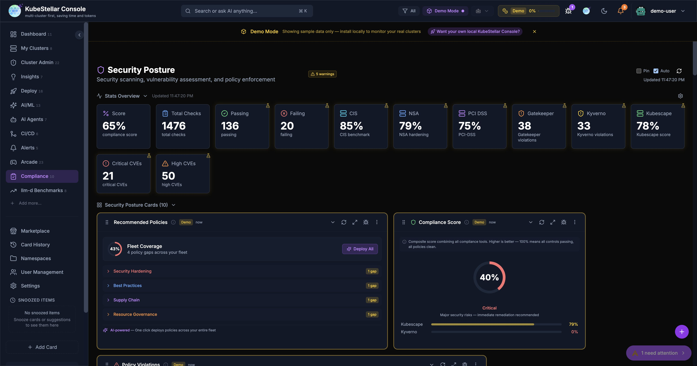
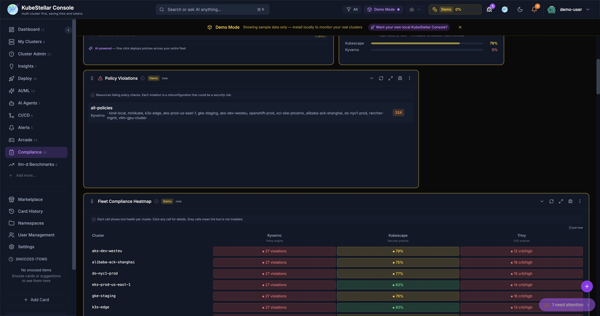
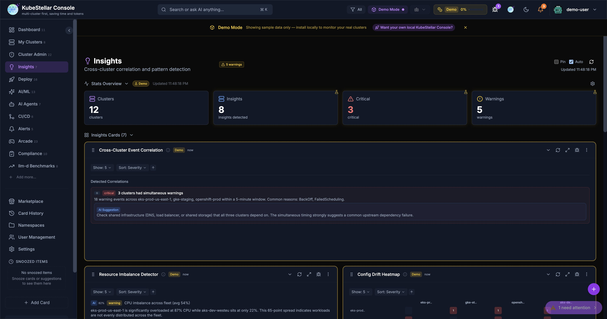
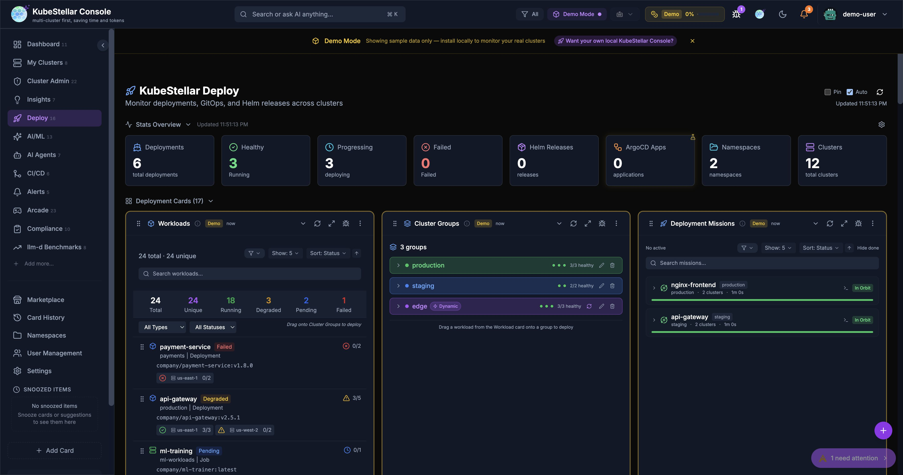

# Compliance Excellence: Recommended Policies, Framework Context, and Drill-Down Modals

*March 2026*

This week's updates transform the Compliance and Insights dashboards from passive viewers into active fleet management tools. Here's what's new.

---

## Recommended Policies Card

The new **Recommended Policies** card is the centerpiece of the Compliance dashboard. It analyzes policy gaps across your entire fleet and recommends 7 curated policies across 4 categories:

- **Security Hardening** — disallow privilege escalation, require non-root containers
- **Best Practices** — require resource limits, liveness probes
- **Supply Chain** — restrict image registries
- **Resource Governance** — require namespace resource quotas

Each policy shows a fleet coverage bar indicating how many clusters are protected. A circular **Fleet Coverage** gauge provides an at-a-glance compliance posture score.

One click on **Deploy All** triggers an AI Mission to deploy Kyverno audit-mode policies fleet-wide. Individual policies can be deployed one at a time.

---

## Framework Descriptions and Context

All compliance cards now include **contextual banners** explaining what they measure and why it matters:

- **Kubescape Scan** — shows framework descriptions (NSA-CISA, MITRE ATT&CK, CIS Kubernetes Benchmark), score context labels (Excellent/Good/Needs Attention/Critical), and per-control pass/fail summaries
- **Trivy Scan** — explains each severity level with actionable guidance
- **Compliance Score** — displays per-tool progress bars with score interpretation
- **Policy Violations**, **Compliance Drift**, **Cross-Cluster Policy Comparison**, and **Fleet Compliance Heatmap** — all get context banners explaining what the card monitors

---

## Five New Drill-Down Detail Modals

Clicking on any card row now opens a rich detail modal with tabs, actions, and AI-powered remediation:

### Insights Dashboard
- **Insight Detail Modal** — 3 tabs (Overview / Evidence / Remediation), with Acknowledge and Dismiss actions, plus a **Create Mission** button to spawn an AI Mission directly from an insight

### Compliance Dashboard
- **Compliance Score Breakdown Modal** — per-tool tabs (Kubescape / Kyverno) with score gauges and framework-level scores
- **Policy Violation Detail Modal** — violation details, affected clusters, and a **Fix with AI Mission** button

### Deploy Dashboard
- **GitOps Drift Detail Modal** — resource diff details with a **Sync with AI Mission** button
- **Helm History Detail Modal** — revision details with a **Rollback with AI Mission** button

All interactive card rows now have consistent hover states with a chevron icon indicating they are clickable.

---

## Progressive Streaming for Compliance

All three compliance hooks (Kyverno, Trivy, Kubescape) now **stream data progressively per cluster**. Each cluster's compliance data renders immediately as it finishes scanning, so you see results within seconds rather than waiting 20+ seconds for the slowest cluster to complete.

---

## KB Submit Enhancement

The **Submit to KB** dialog in AI Mission resolutions now **auto-detects the relevant CNCF project** from context (title, namespace, operators, steps) using keyword matching against 50+ CNCF projects. The project field is pre-populated, saving time when contributing mission resolutions to the knowledge base.

---

## Bug Fixes

- **Cluster name badges** now always appear on compliance cards (previously hidden with single-cluster setups)
- **Empty states** no longer flash during compliance hook loading — cards show "Scanning clusters..." with a spinner
- **Kyverno violations** correctly back-populate per-policy violation counts from PolicyReport results
- **Analytics page** — removed an errant TODO banner

---

## Links

- **Try it:** [console.kubestellar.io](https://console.kubestellar.io)
- **Source PRs:** [#2163](https://github.com/kubestellar/console/pull/2163), [#2165](https://github.com/kubestellar/console/pull/2165), [#2166](https://github.com/kubestellar/console/pull/2166), [#2167](https://github.com/kubestellar/console/pull/2167), [#2168](https://github.com/kubestellar/console/pull/2168), [#2169](https://github.com/kubestellar/console/pull/2169), [#2170](https://github.com/kubestellar/console/pull/2170), [#2172](https://github.com/kubestellar/console/pull/2172)
- **Documentation:** [kubestellar.io/docs/console/readme](https://kubestellar.io/docs/console/readme)
