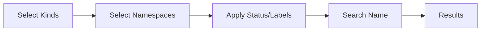
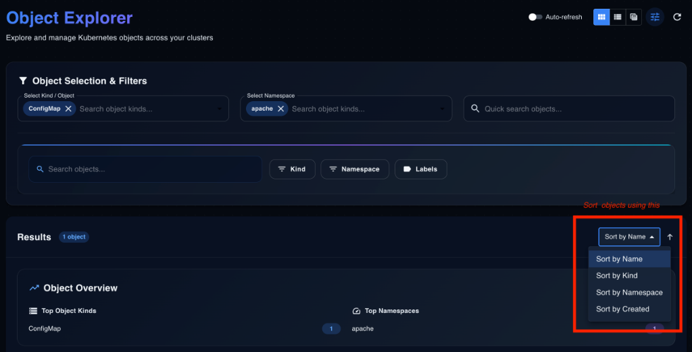
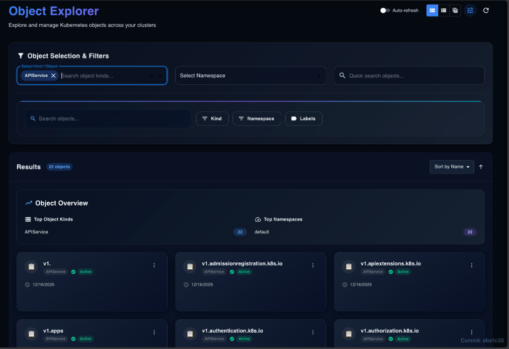
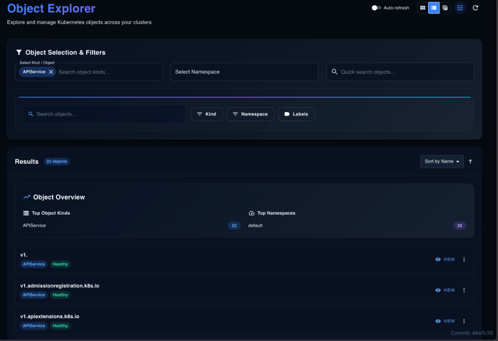
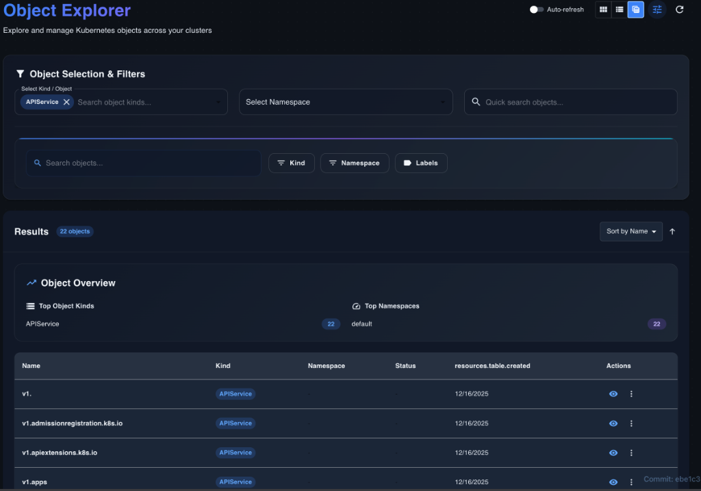
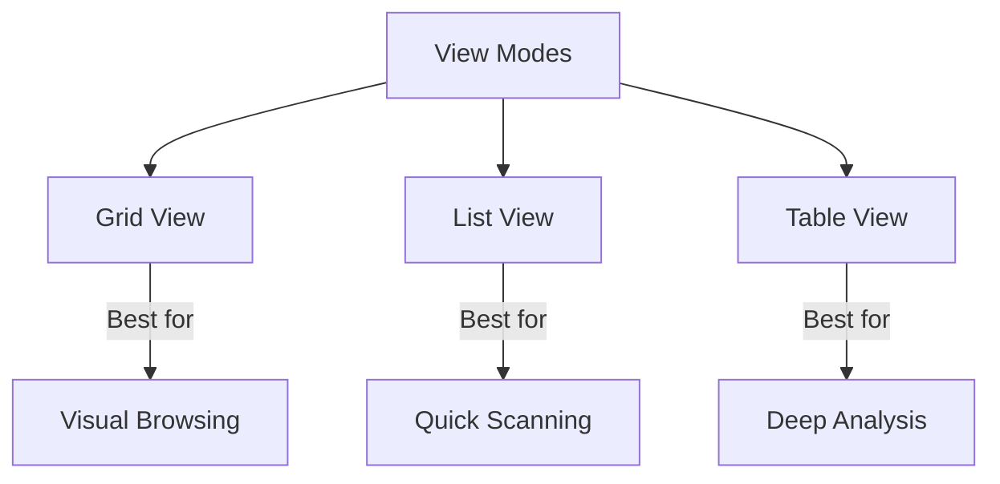
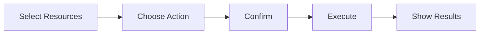
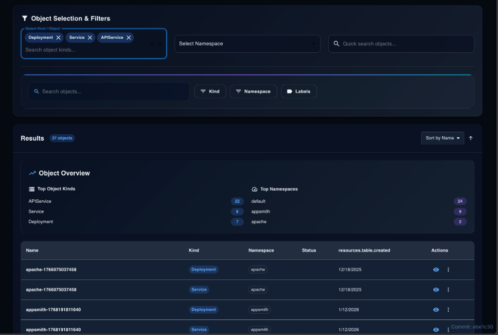

# Object Explorer

## 1. Introduction

The **Object Explorer** is a universal resource browser designed to provide a single pane of glass for all Kubernetes resources across your clusters. Whether you are finding, browsing, or managing resources, the Object Explorer offers a unified interface to handle any resource type with ease.

**Key Benefits:**
- **Access all resource types**: Native and Custom Resources (CRDs) are fully discoverable.
- **Powerful filtering**: Drill down by kind, namespace, status, age, and labels.
- **Multiple view modes**: Visualize data via Grid or List views.
- **Bulk operations**: Manage resources at scale with ease.

## 2. Prerequisites

Before using the Object Explorer, ensure you have:
- **Kubernetes Cluster Access**: An active connection to your target cluster.
- **Proper RBAC Permissions**: Sufficient rights to list, get, and watch the resources you intend to manage.
- **KubeStellar UI Access**: Authenticated access to the web interface.

## 3. Feature Overview

The Object Explorer is built on three core philosophies: universal resource auto-discovery, smart filtering, and adaptable visualization.

### 3.1 Universal Resource Browser
The browser provides access to **all** Kubernetes resources, supporting auto-discovery of API groups and versions.

**Supported Built-in Types:**
- **Workloads**: Pods, Deployments, StatefulSets, DaemonSets, Jobs, CronJobs, ReplicaSets.
- **Network**: Services, Ingresses, NetworkPolicies.
- **Config & Storage**: ConfigMaps, Secrets, PersistentVolumes, PersistentVolumeClaims.
- **Access Control**: ServiceAccounts, Roles, RoleBindings.
- **Custom Resources**: Full support for all Custom Resource Definitions (CRDs).

**Capabilities:**
- Auto-discovery of available resource types.
- Dynamic key listing based on API group detection.
- Full support for both namespaced and cluster-scoped resources.

### 3.2 Smart Filtering System
A robust multi-variable filtering system helps you isolate resources quickly.

**Filter Categories & Features:**
- **Multi-Kind Selection**: Select multiple resource types (e.g., Deployments + Services) via a multi-select dropdown with search and recently used highlights.
- **Multi-Namespace Selection**: Filter across "All Namespaces" or specific sets, with search and count indicators.
- **Status Filter**: `Running`, `Pending`, `Failed`, `Succeeded`, `Unknown`.
- **Label Filter**: Add multiple key-value pairs with AND/OR logic and auto-suggestions.
- **Age Filter**: Presets (Last hour, 24h, 7d, 30d) and custom ranges.

**Quick Search:**
- Real-time, case-insensitive search by resource name with partial match support.
- Search history and easy "Clear" controls.

**Diagram: Filter Flow**

### 3.3 View Modes 👁️
Switch between modes to suit your workflow. Preferences are persisted locally.

**Grid View (Card Layout)**
*Best for: Visual browsing and health checks.*
- **Card Design**: Prominent name, icon/type badge, status indicator, action menu (⋮), and quick stats (replicas, ports).
- **Features**: Responsive columns, hover effects, and skeleton loading.

**List View (Compact)**
*Best for: Scanning large datasets.*
- **Row Design**: Type icon, status dot, age, label count, and action menu.
- **Features**: Condensed spacing, keyboard navigation, and double-click to view details.

**Table View (Future)**
*Best for: Deep analysis.*
- Sortable/resizable columns and CSV export.

**Diagram: View Modes Comparison**

### 3.4 Resource Operations ⚙️
Perform actions on single or multiple resources.

**Individual Actions:**
- **View Details**: Opens the detail panel.
- **Edit Manifest**: In-place YAML editor with validation and save capability.
- **View Logs**: Live streaming for Pods with container selection.
- **Delete**: With grace period and cascade options.
- **Additional**: Describe, Copy Name/YAML, View Events.

**Bulk Operations:**
- **Selection**: "Select All" page or matching filters.
- **Actions**: Bulk delete, bulk export (zip), bulk label update.
- **Progress**: Real-time progress bar with success/error counts.

**Diagram: Bulk Operations Flow**

### 3.5 Resource Detail Panel
A comprehensive slide-out panel for deep inspection.

- **Summary View**: Metadata, Owner References, Labels/Annotations (editable), and Status Conditions.
- **Full Manifest Tab**: Complete YAML/JSON with copy/download/edit controls and syntax highlighting.
- **Related Resources**: Navigable links to Owners (Controllers), Owned resources (Pods), and referencing Services/Ingresses.
- **Events Tab**: Chronological list of warning and normal events.

### 3.6 Additional Features
- **Auto-Refresh**: Toggleable (5s, 10s, 30s, 60s) with pause-on-hover/open.
- **Pagination**: Configurable page size (25, 50, 100) and jump-to-page.
- **Error Handling**: Network notifications, permission warnings, and retry options.
- **Loading States**: Skeleton screens and optimistic UI updates.
- **Empty States**: Illustrative graphics with action suggestions (e.g., "Create your first resource").

## 4. Step-by-Step Guides

### Guide 1: Browsing Pods Across Namespaces
1.  Navigate to `/resources`.
2.  Select **Pods** from the specific Kind dropdown.
3.  Choose **All Namespaces** in the namespace selector.
4.  (Optional) Apply a **Status Filter** for `Failed` to identify issues.

### Guide 2: Finding Resources by Labels
1.  Open the filters panel.
2.  Add a **Label Filter**.
3.  Enter key `app` and value `frontend`.
4.  Results will filter to matching resources immediately.

### Guide 3: Using Multi-Kind Filtering
1.  Open the Kind dropdown.
2.  Select **Deployments**, **Services**, and **API Service**.
3.  View the combined list to see the full footprint of your application.

### Guide 4: Bulk Deleting Resources
1.  Filter for the resources you wish to remove (e.g., by label `env=test`).
2.  Check the **Select All** box.
3.  Click **Bulk Actions** > **Delete**.
4.  Confirm the action in the dialog.

### Guide 5: Editing Resource Manifests
1.  Click the **Action Menu** (⋮) on a resource.
2.  Select **Edit Manifest**.
3.  Modify values in the Monaco Editor.
4.  Click **Save**.

### Guide 6: Viewing Resource Details
1.  Click the resource name or card.
2.  The **Detail Panel** opens.
3.  Switch to **Events** to see recent activity or **Manifest** to see the live config.

## 5. Use Cases

### Use Case 1: Debugging Across Namespaces
**Scenario:** An application is failing, but the specific namespace is unknown.
**Solution:** Filter Kind to `Pod`, Namespace to `All`, and Status to `Failed`. Use Quick Search for the app name.

### Use Case 2: Auditing ConfigMaps and Secrets
**Scenario:** You need to audit configuration resources created in the last month.
**Solution:** Filter Kinds to `ConfigMap` + `Secret`. Set Age Filter to `Last 30 days`.

### Use Case 3: Cleaning Up Unused Resources
**Scenario:** A development environment needs to be torn down.
**Solution:** Filter by Namespace `dev-env`. Select all resources. Perform Bulk Delete.

### Use Case 4: Discovering Custom Resources
**Scenario:** Exploring a newly installed Operator.
**Solution:** Open Kind dropdown. Search for the Operator's group. Select the new CRDs to explore instances.

## 6. API Reference

**Endpoints:**
- `GET /api/v1/resources`: List resources. Supports `kind`, `namespace`, `labelSelector`, `fieldSelector`.
- `GET /api/v1/resources/{kind}/{namespace}/{name}`: Get single details.
- `PUT /api/v1/resources/{kind}/{namespace}/{name}`: Update resource.
- `DELETE /api/v1/resources/{kind}/{namespace}/{name}`: Delete resource.

## 7. Troubleshooting

| Problem | Possible Cause | Solution |
| :--- | :--- | :--- |
| **Permission Errors** | Missing RBAC. | Request `list/watch` permissions from admin. |
| **Slow Loading** | Large dataset. | Filter by namespace or reduce page size. |
| **Filter Not Working** | Typo in label. | Check label syntax `key=value`. |
| **Empty Results** | No matches. | Clear filters and retry. |

## 8. Related Features
- **WECS**: Use Object Explorer to verify WECS deployments.
- **ITS & WDS**: Integrated monitoring of inventory and workload descriptions.
