# WECS (Workload Execution Cluster Space) Remote Monitoring

## 1. Introduction

### What is WECS?
**WECS (Workload Execution Cluster Space)** is a comprehensive monitoring interface designed for visualizing and managing remote workloads across multiple Kubernetes clusters. It provides a unified view of your distributed infrastructure, allowing operations teams and developers to inspect resources, view live logs, and troubleshoot issues without needing direct access to each cluster's API server.

### Purpose
The primary purpose of WECS is to facilitate **remote cluster monitoring**. It bridges the gap between centralized management and distributed execution, ensuring that users have full visibility into the state of their applications regardless of where they are running.

### When to use
Use WECS when you need to:
- **Monitor** workloads deployed via the **Binding Policy (BP)** mechanism.
- **Debug** application failures in remote clusters.
- **Verify** that resources are correctly propagated and running.
- **Access** container logs in real-time.

### Key Benefits
-  **Real-time Visibility**: Instant updates on resource status and cluster health.
-  **Live Logs**: Stream logs directly from remote containers via WebSocket.
-  **Hierarchical Organization**: Intuitive tree view for navigating complex multi-cluster environments.
-  **WebSocket-based Efficiency**: Low-latency data transmission for immediate feedback.

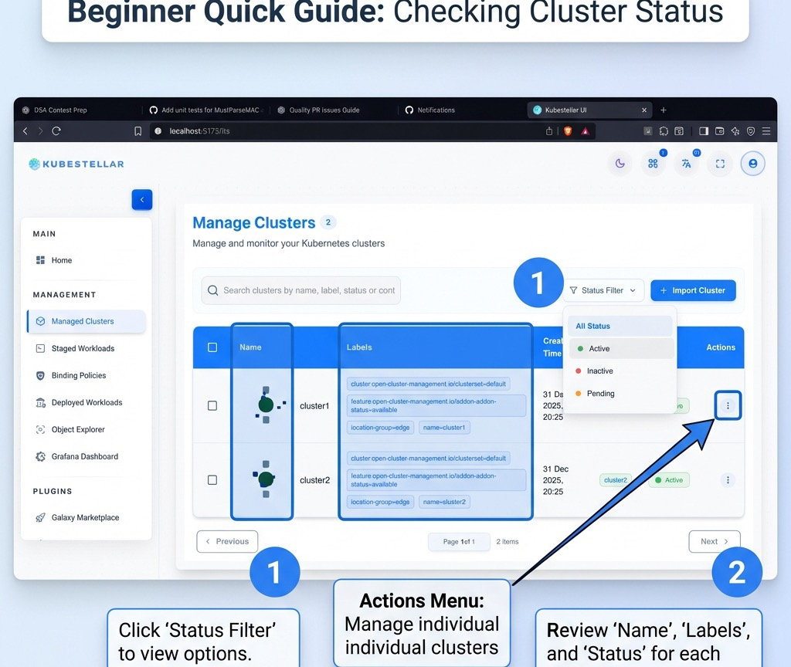

### 📖 Terminology for Beginners
To get the most out of this guide, it's helpful to understand a few key terms:
- **ITS (Inventory Transform Service)**: The central "phonebook" where KubeStellar keeps track of all your managed clusters.
- **WECS (Workload Execution Cluster Space)**: The monitoring engine that lets you see and touch remote resources in real-time.
- **Binding Policy (BP)**: A set of rules you define to tell KubeStellar which workloads should go to which clusters.
- **Staged Workloads**: A "pre-flight" area where you can inspect workloads before they are actually deployed to remote clusters.

### ✅ Readiness Checklist
Before you begin, ensure you have:
- [ ] Your management cluster (KubeFlex) running.
- [ ] At least one remote cluster (e.g., `cluster1`) joined via ITS.
- [ ] A Binding Policy created to target your workloads.

---

## Beginner Quick Guide

If you are new to KubeStellar, follow these steps to get your remote monitoring up and running quickly:

### 1. Import your Clusters
Before monitoring, ensure your clusters are imported into the Inventory Transform Service (ITS). 
Navigate to **Infrastructure** > **Managed Clusters** to see your fleet.


### 2. Verify Cluster Status
Check the status of your clusters. You can filter by **Active**, **Inactive**, or **Pending** to ensure everything is healthy.

> [!TIP]
> If a cluster is stuck in "Pending", click on the cluster to view the **Import Logs** for real-time debugging of the join process.

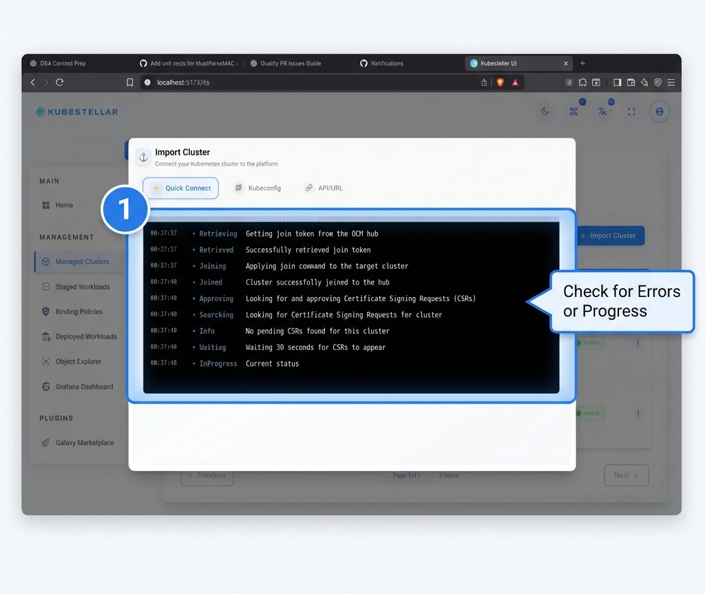

### 3. Monitor Cluster Capacity
Understand the resource limits and health of your clusters at a glance. The **Cluster Details** view provides essential metadata and resource metrics.

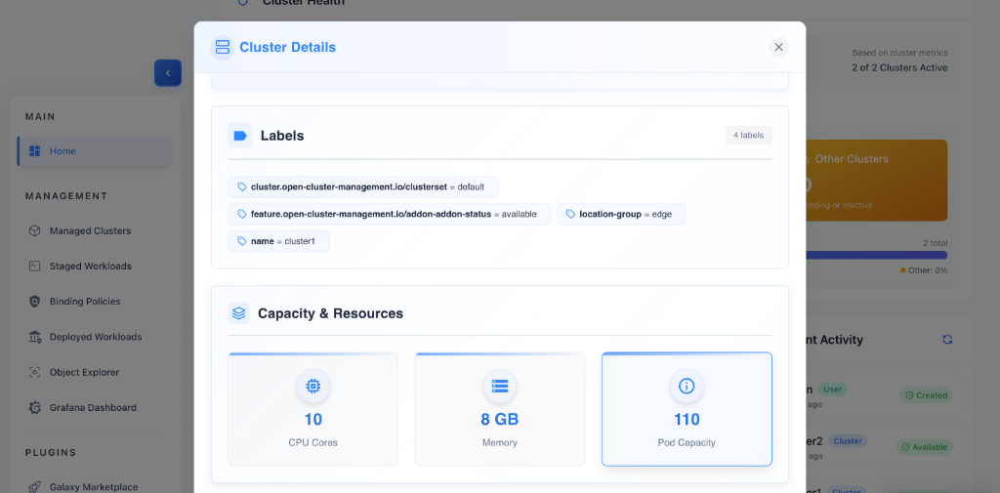

#### Quick Guide: Understanding Cluster Health
1.  **Identify Labels**: Check the top section for cluster-specific metadata. This helps you identify cluster roles, regions, and settings (e.g., `location-group`).
2.  **Monitor CPU Cores**: View the total computational power available for your remote workloads.
3.  **Check Memory (GB)**: Keep an eye on the RAM capacity to ensure memory-intensive applications have sufficient head-room.
4.  **Verify Pod Capacity**: See the maximum number of pods the cluster can support, which is critical for scaling assessments.

### 4. Inspect Staged Workloads & Namespaces
Before diving into live remote resources, use the **Staged Workloads** view to inspect your configurations and metadata at the namespace level.

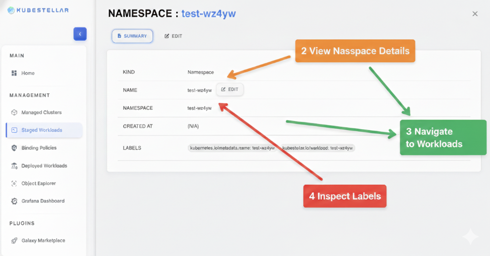

#### Quick Guide: Namespace Exploration
1.  **View Namespace Details (2)**: Gain an immediate overview of the resource **Kind**, **Name**, and **Namespace** to verify staging accuracy.
2.  **Navigate to Workloads (3)**: Transition from metadata overview to granular workload management by clicking the workload associations.
3.  **Switch to Edit Mode (3)**: Jump directly into the configuration by clicking the **Edit** tab or the inline edit icon to make quick adjustments.
4.  **Inspect Labels (4)**: Review and audit the **Labels** assigned to the namespace, which are critical for proper Binding Policy application.

### 5. Deploy and Manage Workloads
WECS streamlines the lifecycle of your distributed workloads. Use the **Manage Workloads** interface to visualize cross-cluster deployments and perform granular management actions.

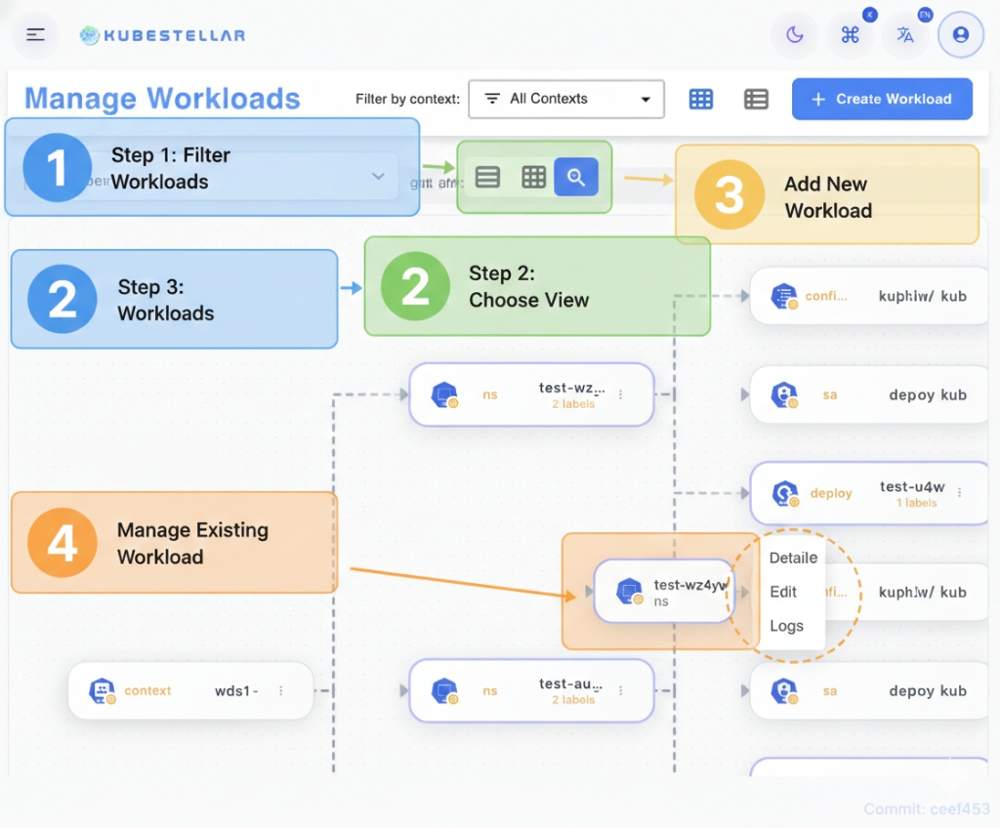

#### Quick Guide: Workload Operations
1.  **Filter Workloads (1)**: Use the context and namespace filters to focus on specific segments of your infrastructure.
2.  **Choose View (2)**: Toggle between **Grid**, **List**, and **Tree** views to find the most effective visualization for your current task.
3.  **Browse Workloads (3)**: Inspect the health and configuration of all workloads managed by your Binding Policies.
4.  **Manage Resources (4)**: Hover over any workload node to access the **Actions Menu**, where you can jump directly to **Details**, **Edit** the manifest, or view **Logs**.
5.  **Create New (5)**: Click **+ Create Workload** to define and deploy new resources directly from the UI.

### 6. Explore Remote Resources
Once workloads are deployed, go to **Deployed Workloads** (WECS) to start exploring the live state of your clusters using the hierarchical tree view.

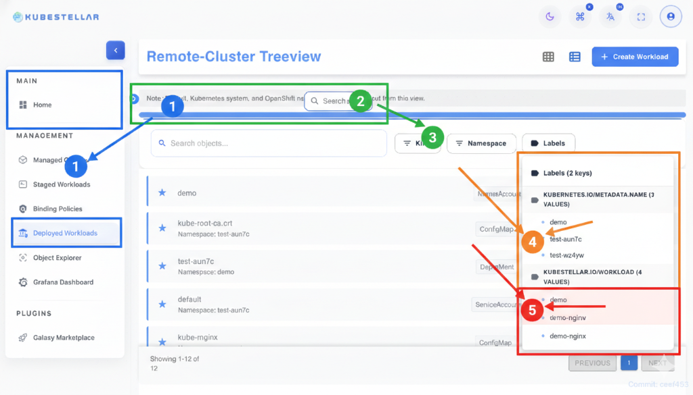

#### Quick Guide: Tree View Mastery
1.  **Navigate (1)**: Click **Deployed Workloads** in the sidebar to enter the tree view.
2.  **Search (2)**: Use the inline search to find specific objects across all namespaces.
3.  **Refine (3)**: Use the **Kind** and **Namespace** filters to focus on your target resources.
4.  **Audit (4/5)**: Inspect **Labels** and **Keys** in the right panel to verify resource properties.

---

## 2. Prerequisites

Before using the WECS remote monitoring features, ensure the following prerequisites are met:

- **Clusters Imported**: Target clusters must be imported into the Inventory Transform Service (ITS).
- **Workloads Deployed**: Workloads should be deployed and managed via Binding Policies (BP).
- **WECS Agent**: The WECS agent must be running on the remote clusters (if required for your specific architecture).
- **Network Connectivity**: Ensure network connectivity between the WECS backend and the remote clusters.
- **WebSocket Support**: The client browser and network path must support WebSocket connections for real-time streaming.

---

## 3. Feature Overview

### WECS Architecture
The WECS architecture is designed for real-time, bi-directional communication:

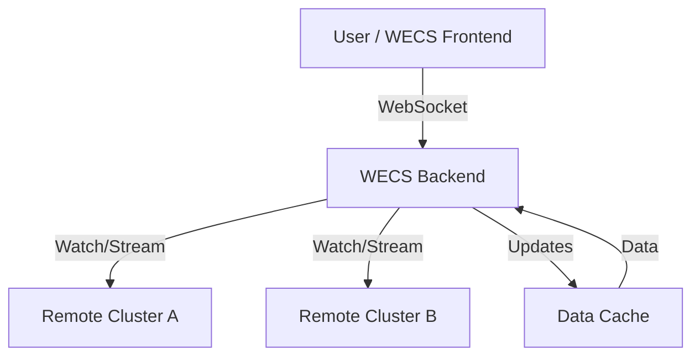

**Data Flow**:
1.  **Cluster → WebSocket → Backend**: Agents or API watchers on remote clusters stream changes to the backend.
2.  **Backend → Cache**: Data is cached for performance and quick retrieval.
3.  **Backend → Frontend**: The frontend receives real-time updates via a WebSocket connection.

### WebSocket Connection Model
- **Live Connection**: Maintains a persistent WebSocket connection to selected clusters.
- **Automatic Reconnection**: Automatically attempts to reconnect if the connection is dropped, featuring a smart backoff retry strategy.
- **Connection Indicators**:
    - 🟢 **Connected**: Real-time stream active.
    - 🟡 **Connecting**: Attempting to establish connection.
    - 🔴 **Disconnected**: Connection lost, click to reconnect.
- **Connection Pooling**: Efficiently manages connections to multiple clusters simultaneously.
- **Data Updates**: Incremental updates for resource changes (Created, Updated, Deleted).

### Resource Hierarchy
WECS organizes resources in a logical, drill-down tree structure:

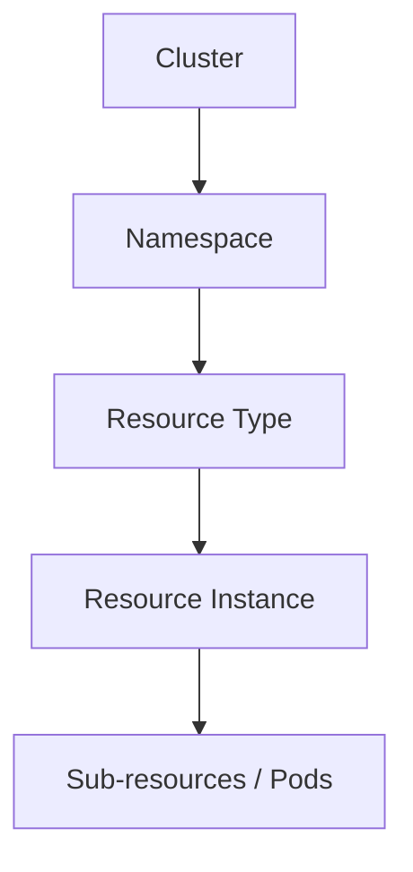

- **Cluster** (Top Level): Displays cluster name, status, and total resource count.
    - **Namespace**: Groups resources logically, color-coded by status.
        - **Resource Type** (e.g., Deployments, Pods): Grouped by Kind.
            - **Resource Instance**: Specific named resource with status icons (Running/Pending/Failed).
                - **Sub-resources**: e.g., individual Pods within a Deployment.

---

## 4. Step-by-Step Guides

### Guide 1: Navigating the WECS Tree

1.  **Open WECS Page**: Navigate to the WECS section of the application.
2.  **View Monitored Clusters**: You will see a list of top-level nodes for each monitored cluster.
    *   *Visual Indicator*: Check the connection status dot (🟢 Connected, 🟡 Connecting, 🔴 Disconnected).
3.  **Expand Cluster**: Click the arrow or name of a cluster to reveal its Namespaces.
    *   *Info*: Shows resource counts per cluster.
4.  **View Namespaces**: Browse the list of Namespaces containing managed resources.
    *   *Filter*: Only namespaces with resources are displayed.
5.  **Expand Namespace**: Click a Namespace to see the grouped Resource Types (e.g., Deployments, Services).
6.  **Select Resource Type**: Click on a type (e.g., "Pods") to expand and list individual resources.
7.  **View Details**: Click on a specific resource name to open the **Resource Details Panel**.

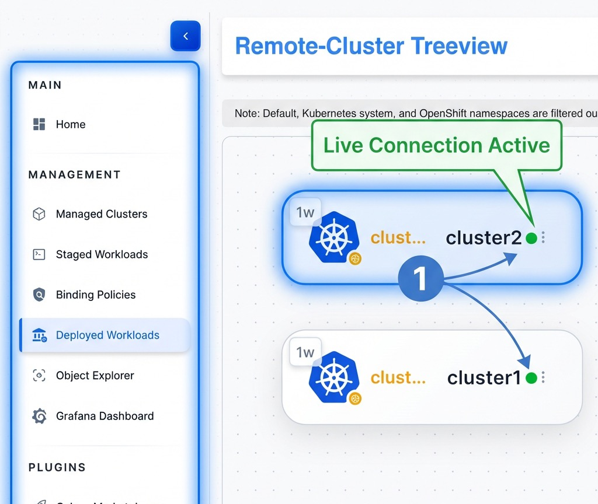

### Guide 1.1: Viewing and Editing Cluster Summary

1.  **Select Cluster Node**: Click on the top-level cluster node (e.g., `cluster1`) in the tree view.
2.  **View Summary**: The right panel will display the **Cluster Summary**, including:
    *   **Kind**: Resource kind (Cluster).
    *   **Name**: Name of the cluster.
    *   **Context**: The context used for connection.
    *   **Created At**: Timestamp of creation.
    *   **Labels**: Associated labels.

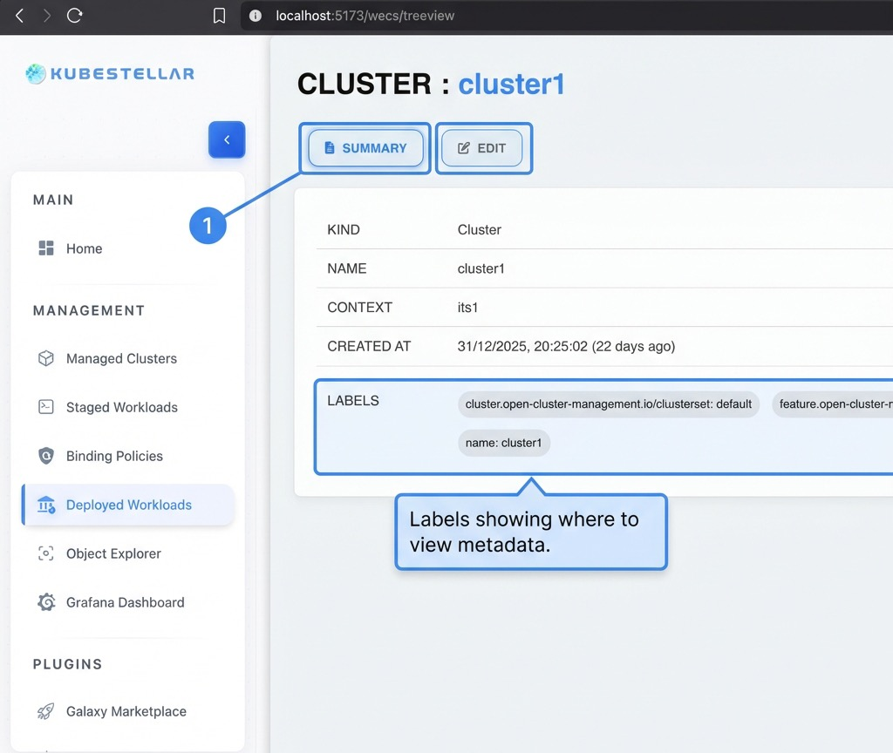

3.  **Edit Configuration**: Switch to the **Edit** tab to view or modify the cluster's YAML/JSON configuration.
    *   Toggle between **YAML** and **JSON** views.
    *   Make changes and click **Update** to apply.


### Guide 2: Viewing Resource Details

1.  **Navigate to Resource**: Use the tree view to find the specific resource you want to inspect.
2.  **Click Resource Name**: This opens the detail panel on the right side.
3.  **Resource Details Tabs**:

    ```mermaid
    graph LR
        Panel[Resource Details] --> Summary
        Panel --> Edit
        Panel --> Logs
        Panel --> Events
    ```

    *   **Summary**:
        *   **Basic Info**: Resource Name, Namespace, Kind, Cluster, Creation Timestamp, UID, Resource Version, API Version.
        *   **Status**: Overall status (Ready/Not Ready), Replicas (Desired/Available), Conditions (Type/Status/Reason/Message).
        *   **Labels/Annotations**: Complete key-value pairs with copy functionality.
        *   **Spec**: Selector, Images, Ports, Env Variables, Volume Mounts, Requests/Limits.
    *   **Edit**: Full YAML/JSON manifest editor with syntax highlighting, line numbers, and copy/download/save options.
    *   **Logs**: Live multi-container log streaming with search, filter, and tail controls.
    *   **Events**: History of events with timestamps, types (Normal/Warning), and messages.

### Quick Guide: Mastering Resource Management
WECS provides a unified interface for inspecting and modifying resources across all clusters. Use the **Actions Menu** and **Detail Panels** to manage your infrastructure.

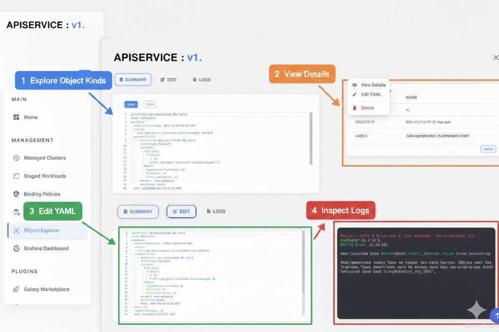

1.  **Summary View**: Monitor the resource's health, labels, and metadata in real-time without inspecting raw YAML.
2.  **Live Editing**: Switch to the **Edit** tab for a full-featured YAML/JSON editor to make instant updates.
3.  **Real-time Logs**: Stream container logs directly within the management panel for rapid troubleshooting.
4.  **Event Audit**: Track the history of normal and warning events associated with each resource.


---

### Guide 3: Streaming Live Logs

1.  **Open Resource Details**: Navigate to a Pod or a controller (like a Deployment) that manages pods.
2.  **Go to Logs Tab**: Click the **Logs** tab in the details panel.
3.  **Select Container**: Dropdown to select container (supports multi-container, init, and sidecar).
4.  **Configure View**:
    *   **Tail Lines**: Select number of previous lines to load (50, 100, 500, All).
    *   **Follow Mode**: Toggle to auto-scroll as new logs arrive.
5.  **Watch Real-time Logs**: Observe the log stream.
    *   *Visual Aid*: **ERROR** logs in red, **WARN** in yellow, **INFO** in blue.
    *   *Features*: Line numbers, word wrap toggle, timestamp display.
6.  **Controls**:
    *   **Search**: Filter logs by keyword.
    *   **Download**: Export logs to file.
    *   **Clear/Refresh**: Manage the current view.

> [!TIP]
> Use the **Search** bar within the logs view to quickly find error patterns or specific transaction IDs across large log streams.

### Guide 4: Using Search and Filters

1.  **Locate Filter Bar**: Found at the top of the WECS interface or within specific views.
2.  **Search by Name**: Type a resource name (e.g., `redis`) in the global search bar to jump to it.
3.  **Filter by Status**:
    *   Click the **Status** dropdown.
    *   Select **Running**, **Pending**, or **Failed** to narrow down the visible resources.
4.  **Filter by Namespace**: Use the namespace dropdown to focus on a specific environment (e.g., `production`).
5.  **Clear Filters**: Click the **Clear All** button to reset the view to default.

---

## 5. Interactive Features

- **Navigation**:
    - **Breadcrumbs**: Use top navigation to jump back levels.
    - **Back Button**: Close detailed views to return to the tree.
- **Search and Filter**:
    - **Search**: Find resources by name globally.
    - **Filter**: Narrow down by **Type**, **Namespace**, or **Status** (Running/Pending/Failed).
- **Actions**:
    - **Refresh**: Manually refresh cluster or resource data.
    - **Delete**: Remove a resource (requires confirmation).
    - **Edit**: Modify resource YAML directly.
    - **Export**: Copy resource name or export YAML.
- **Auto-Refresh**:
    - Toggle auto-refresh with configurable intervals (5s, 10s, 30s, 60s).
    - View **Last Updated** timestamp.

---

## 6. Use Cases

### Use Case 1: Troubleshooting Failed Deployments
**Scenario**: A deployment is showing `0/3` pods ready.
**Solution**:
1.  Navigate to the **Deployment** in the WECS tree.
2.  Check the **Summary** tab for **Conditions**. Look for "False" status on Availability.
3.  Switch to the **Events** tab. Look for "Warning" events (e.g., `FailedScheduling`, `ImagePullBackOff`).
4.  If the issue is application-related, find the child **Pod**.
5.  Open the **Logs** tab to see stack traces or errors.

### Use Case 2: Live Log Monitoring
**Scenario**: Monitoring application rollout errors.
**Solution**:
1.  Open the main **Pod** for your application.
2.  Go to the **Logs** tab and select the app container.
3.  Enable **Follow** mode.
4.  Use **Search** to highlight "Exception" or specific error codes.
5.  **Download** logs for offline analysis.

### Use Case 3: Multi-Cluster Health Check
**Scenario**: Verifying critical service health across regions.
**Solution**:
1.  In the tree view, collapse all clusters to top-level.
2.  Verify the **Status Indicator** is green for all clusters.
3.  Compare **Resource Counts** to ensure symmetry across regions.
4.  Click on the service in each cluster to verify "Active" or "Ready" status.

---

## 7. Resource Type Coverage

WECS supports monitoring a wide range of Kubernetes resources:

| Category | Resources |
| :--- | :--- |
| **Workloads** | Deployments, StatefulSets, DaemonSets, ReplicaSets, Jobs, CronJobs, Pods |
| **Discovery & LB** | Services, Endpoints, Ingresses |
| **Config** | ConfigMaps, Secrets |
| **Storage** | PersistentVolumes, PersistentVolumeClaims, StorageClasses |
| **Custom** | CRDs and dynamic resource type detection |

---

## 8. Troubleshooting

> [!WARNING]
> If you cannot establish a connection, please ensure your network allows WebSocket traffic (WSS).

### Common Issues and Solutions

| Issue | Symptoms | Potential Solutions |
| :--- | :--- | :--- |
| **WebSocket disconnects** | Indicator flashes red/yellow; logs stop. | Check local network; verify firewall rules; check backend timeouts. |
| **Logs not streaming** | Empty logs tab or indefinite spinner. | Verify Pod is **Running**; check container selection; verify WECS Agent health. |
| **Resources missing** | Tree view is empty or incomplete. | Verify cluster is **Connected**; check namespace permissions; click **Refresh**. |
| **Slow loading** | Expanding nodes takes a long time. | Increase **Auto-refresh** interval; use filters to reduce load; reduce **Tail Lines**. |

---

## 9. API/Integration Reference

WECS exposes several internal endpoints for its operation:

- `GET /api/wecs/clusters` - List monitored clusters
- `GET /api/wecs/:cluster/resources` - Get all resources for a cluster
- `GET /api/wecs/:cluster/:namespace/:kind/:name` - Get specific resource details
- `GET /api/wecs/:cluster/logs` - Stream logs
- `GET /api/wecs/:cluster/events` - Get resource events

---

## 10. Related Features

- **ITS Integration**: WECS retrieves the list of clusters from the Inventory Transform Service.

- **Binding Policy (BP)**: WECS focuses on monitoring workloads that were deployed via Binding Policies.

- **Object Explorer**: For a broader, non-cluster-specific view of resources across all managed clusters, use the Object Explorer. 

### Quick Guide: Advanced Object Discovery


1.  **Explore (1)**: Browse through all cluster namespaces and object kinds.
2.  **View Details (2)**: Click on any object to open a detailed summary overlay.
3.  **Edit YAML (3)**: Modify resource configurations directly with the integrated manifest editor.
4.  **Inspect Logs (4)**: Stream live logs from your remote objects to troubleshoot in real-time.

---
